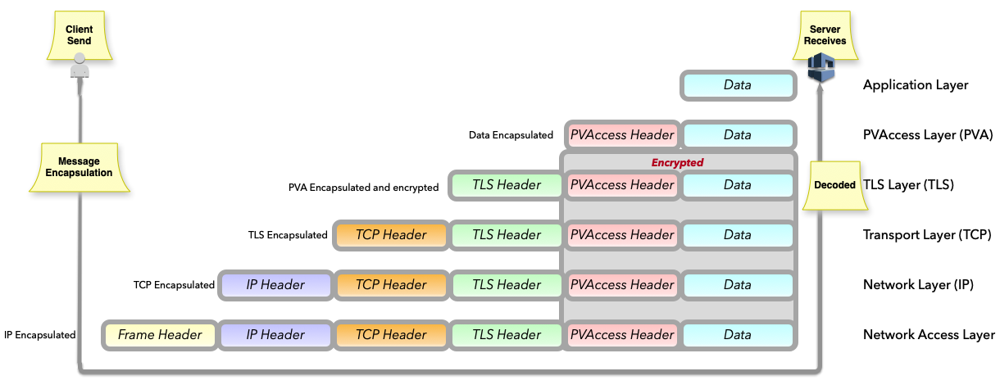

.. _secure_pvaccess:

Secure PVAccess - SPVA
=====================

Note: This release includes unmerged changes to epics-base that are required for Secure PVAccess.


Secure PVAccess (SPVA) enhances the existing PVAccess protocol by integrating :ref:`transport_layer_security_tls`
with comprehensive :ref:`certificate_management`, including approval and revocation processes, while maintaining
full backward compatibility. This upgrade enables encrypted communication channels and authenticated connections
between EPICS clients and servers (EPICS agents), bolstering the overall security of data exchange within EPICS environments.

In the context of SPVA, the term `EPICS Agent` refers to a network client or server that supports SPVA.

.. _transport_layer_security_tls:

Transport Layer Security (TLS)
------------------------------

By configuring EPICS agents appropriately, TLS connections will be established. Both client and server
will be able to authenticate their peer using certificates.  The communication will be secure and encrypted.


.. _secure_pvaccess_configuration:

Secure PVAccess Configuration
^^^^^^^^^^^^^^^^^^^^^^^^^^^^^

+--------------------------+----------------------------+-------------------------------------+---------------------------------------------------------------+
| Name                     | Key                        | Value                               | Description                                                   |
+==========================+============================+=====================================+===============================================================+
| EPICS_PVA_TLS_KEYCHAIN   | {fully qualified path  to keychain file}                         | This is the string that determines the fully qualified path   |
+--------------------------+                                                                  | to the PKCS#12 keychain file that contains the certificate,   |
| EPICS_PVAS_TLS_KEYCHAIN  | e.g. ``~/.epics/client.p12``                                     | and private keys used in the TLS handshake.                   |
|                          | e.g. ``~/.epics/server.p12``                                     | Note: If not specified then TLS is disabled                   |
+--------------------------+------------------------------------------------------------------+---------------------------------------------------------------+
| EPICS_PVA_TLS_KEYCHAIN   | {fully qualified path to keychain password file}                 | This is the string that determines the fully qualified path   |
| _PWD_FILE                |                                                                  | to a file that contains the password that unlocks the         |
+--------------------------+ e.g. ``~/.epics/client.pass``                                    | TLS KEYCHAIN file.  This is optional.  If not specified, the  |
| EPICS_PVAS_TLS_KEYCHAIN  | e.g. ``~/.epics/server.pass``                                    | TLS KEYCHAIN file contents will not be encrypted. It is not   |
| _PWD_FILE                |                                                                  | recommended to not specify a password file.                   |
+--------------------------+------------------------------------------------------------------+---------------------------------------------------------------+
| EPICS_PVA_TLS_KEY        | {fully qualified path to key file}                               | This is the string that determines the fully qualified path   |
+--------------------------+                                                                  | to the PKCS#12 keychain file that contains the private key    |
| EPICS_PVAS_TLS_KEY       | e.g. ``~/.ssh/clientkey.p12``                                    | used in the TLS handshake with peers.  Note: This is optional |
|                          | e.g. ``~/.ssh/serverkey.p12``                                    | and if not specified the TLS_KEYCHAIN file is used.           |
+--------------------------+------------------------------------------------------------------+---------------------------------------------------------------+
| EPICS_PVA_TLS_KEY_PWD    | {fully qualified path to key password file}                      | This is the string that determines the fully qualified path   |
| _FILE                    |                                                                  | to a file that contains the password that unlocks the TLS KEY |
+--------------------------+ e.g. ``~/.ssh/clikey.pass``                                      | file.  This is optional.  If not specified, the TLS KEY file  |
| EPICS_PVAS_TLS_KEY_PWD   | e.g. ``~/.ssh/servkey.pass``                                     | contents will not be encrypted. Recommended to not specify a  |
| _FILE                    |                                                                  | password file.                                                |
+--------------------------+----------------------------+-------------------------------------+---------------------------------------------------------------+
| EPICS_PVA_TLS_OPTIONS    | ``client_cert``            | ``optional`` (default)              | Require client certificate to be presented.                   |
|                          |                            |                                     |                                                               |
|                          | Determines whether client  +-------------------------------------+---------------------------------------------------------------+
| Sets the TLS options     | certificates are required  | ``require``                         | Don't require client certificate to be presented.             |
| for clients and servers. +----------------------------+-------------------------------------+---------------------------------------------------------------+
| A string containing      | ``on_expiration``          | ``fallback-to-tcp``  (default)      | For servers only tcp search requests will be responded to.    |
| key/value pairs          |                            |                                     | For clients then no client certificate will be presented      |
| separated by commas,     | Determines what to do when |                                     | in the TLS handshake (but searches will still offer both tls  |
| tabs or newlines         | an EPICS agent's           |                                     | and tcp as supported protocols)                               |
|                          | certificate has expired,   +-------------------------------------+---------------------------------------------------------------+
|                          | and a new one can't be     | ``shutdown``                        | The process will exit gracefully.                             |
|                          | automatically provisioned  +-------------------------------------+---------------------------------------------------------------+
|                          |                            | ``standby``                         | Servers will not respond to any requests until a new          |
|                          |                            |                                     | certificate is successfully provisioned.  It will keep        |
|                          |                            |                                     | retrying the keychain file periodically.  When a valid        |
|                          |                            |                                     | certificate is available it will continue as normal.          |
|                          |                            |                                     |                                                               |
|                          |                            |                                     | For a client standby has the same effect as shutdown.         |
|                          +----------------------------+-------------------------------------+---------------------------------------------------------------+
|                          | ``stop_if_no_cert``        | ``yes``, ``true``, ``1``            | Stop if no certificate is provided                            |
|                          |                            |                                     |                                                               |
|                          | Determines whether server  +-------------------------------------+---------------------------------------------------------------+
|                          | stops if no cert           | ``no``, ``false``, ``0`` (default)  | Don't stop if no certificate is provided                      |
|                          +----------------------------+-------------------------------------+---------------------------------------------------------------+
|                          | ``disable_stapling``       | ``yes``, ``true``, ``1``            | Servers won't staple certificate status, clients won't        |
|                          |                            |                                     | request stapling information during TLS handshake             |
|                          | Determines whether         +-------------------------------------+---------------------------------------------------------------+
|                          | stapling is enabled        | ``no``, ``false``, ``0`` (default)  | Don't disable stapling                                        |
+--------------------------+----------------------------+-------------------------------------+---------------------------------------------------------------+
| EPICS_PVA_TLS_PORT       | {port number} default 5076                                       | This is a number that determines the port used for the Secure |
|                          |                                                                  | PVAccess, either as the port on the Secure PVAccess server    |
+--------------------------+ e.g. 8076                                                        | for clients to connect to - PVA, or as the local port number  |
| EPICS_PVAS_TLS_PORT      |                                                                  | for Secure PVAccess servers to listen on - PVAS.              |
|                          |                                                                  |                                                               |
+--------------------------+------------------------------------------------------------------+---------------------------------------------------------------+
| SSLKEYLOGFILE            | {fully qualified path to key log file}                           | This is the path to the SSL key log file that, in conjunction |
|                          |                                                                  | with the build-time macro PVXS_ENABLE_SSLKEYLOGFILE,          |
|                          | e.g. ~/.epics/keylog                                             | controls where and whether we store the session key for TLS   |
|                          |                                                                  | sessions in a file.  If it is defined, then the code will     |
|                          |                                                                  | contain the calls to save the keys in the file specified      |
|                          |                                                                  | by this variable.                                             |
+--------------------------+------------------------------------------------------------------+---------------------------------------------------------------+

API Support for Secure PVAccess
^^^^^^^^^^^^^^^^^^^^^^^^^^^^^^^

New APIs for reconfiguration and testing.

- `pvxs::client::Context::reconfigure`, and `pvxs::server::Server::reconfigure`
    - have been introduced to allow the client and server to be reconfigured at runtime.

.. code-block:: c++

    // setup the server
    ...

    // setup client with initial certificate filename
    auto cli_conf(serv.clientConfig());
    cli_conf.tls_cert_filename = "client1.p12";

    auto cli(cli_conf.build());

    // start the server
    serv.start();

    // Do something with the client
    // ...

    // reconfigure the client with new certificate filename and password
    cli_conf = cli.config();
    cli_conf.tls_cert_filename = "client2.p12";
    cli_conf.tls_cert_password = "pwd";
    cli.reconfigure(cli_conf);


- `pvxs::client::Context::forCMS`
    - to create a client context to connect to a Certificate Management System (:ref:`pvacms`). i.e. disabled TLS, and totally isolated from other TLS related environment settings.

.. code-block:: c++

    Value getPVAStatus(const std::string cert_status_uri) {
        // Build and start network operation
        // use a socket that doesn't monitor status
        auto client(client::Context::forCMS());
        // Wait for status
        Value result = client.get(cert_status_uri).exec()->wait();
        client.close();
        return result;
    }

- `pvxs::impl::CommonConfig::isTlsConfigured`
    - to check if TLS is configured call this method.

- `pvxs::server::SharedWildcardPV`
    - A subclass of SharedPV where the PV name is a wildcard that matches any ``SEARCH`` request of the given pattern.

      - ``?`` matches any single character
      - ``*`` matches one or more characters

    - Used to support certificate status monitoring - each certificate has its own unique status PV
    - The server will respond to ``SEARCH`` requests for PVs that match the wildcard.
    - Each of the methods in the base class have
      - an extra parameter (`pv_name`) to specify the actual PV name that was searched for, and 
      - where appropriate, a vector parameter (`parameters`) that extracts the values of the wildcard sections of the pv_name into strings.

.. code-block:: c++

    SharedWildcardPV wildcard_pv(SharedWildcardPV::buildMailbox());
    wildcard_pv.onFirstConnect([](SharedWildcardPV &pv, const std::string &pv_name, const std::list<std::string> &parameters) {
        Value value;

        // get id (????)  and name (*) from URI parameters
        auto it = parameters.begin();
        const std::string &id = *it;
        const std::string &name = *++it;

        // Do processing with id and name to get `value` to post to the client

        // Post the value to the client if the PV is already open
        // otherwise open the PV with the initial value
        if ( pv.isOpen(pv_name) ) {
            pv.post(pv_name, value);
        } else {
            pv.open(pv_name, value);
        }
    });
    wildcard_pv.onLastDisconnect([](SharedWildcardPV &pv, const std::string &pv_name, const std::list<std::string> &parameters) { pv.close(pv_name); });

    // setup the server
    ...

    // add the wildcard PV to the server
    serv.addPV("WILDCARD:PV:????:*", wildcard_pv);

    // start the server
    serv.run();


- new common configuration options
    - `pvxs::impl::CommonConfig::tls_port`
        - to set the port number an EPICS agent will use for Secure PVAccess.
    - `pvxs::impl::CommonConfig::tls_disabled`
        - to disable TLS for an EPICS agent.
    - `pvxs::impl::CommonConfig::tls_cert_filename` and `pvxs::impl::CommonConfig:tls_cert_password`
        - to set the certificate filename (**TLS KEYCHAIN** file) and password for a EPICS agents.
    - `pvxs::impl::CommonConfig::tls_private_key_filename` and `pvxs::impl::CommonConfig:tls_private_key_password`
        - to set the private key filename and password for a EPICS agents.  If this is not specified then the private key will be 
          taken from the **TLS KEYCHAIN** file.
    - `pvxs::impl::CommonConfig::tls_client_cert_required` 
        - ``Default``: Equivalent to ``Optional``
        - ``Optional``: Don't require a client certificate to be presented.
        - ``Require``: Require a client certificate to be presented.
    - `pvxs::impl::CommonConfig::expiration_behaviour` 
        - ``FallbackToTCP``: Clients only, will reconfigure the connection so that it will fall-back to ``tcp`` as the certificate won't be available.
        - ``Shutdown``: Stop the process.
        - ``Standby``: For servers only, will not respond to any requests until a new certificate is successfully provisioned.
    - `pvxs::impl::CommonConfig::tls_disable_status_check`
        - to disable the certificate status checking irrespective of the presence of certificate status monitoring extension in the certificate.
    - `pvxs::impl::CommonConfig::tls_disable_stapling`
        - to disable the stapling of the certificate status in the TLS handshake.  For clients this has the effect of not requesting the stapled 
          certificate status in the TLS handshake.
    - `pvxs::impl::CommonConfig::tls_throw_if_cant_verify`
        - to throw an exception if the certificate can't be verified, otherwise we downgrade to ``tcp``.


- new server configuration options
    - `pvxs::server::Config::tls_stop_if_no_cert`
        - to stop the server if no certificate is found or if any certificate in the chain is not valid.
    - `pvxs::server::Config::tls_throw_if_no_cert`
        - to throw an exception if no certificate is found or if any certificate in the chain is not valid.  Without this the server will 
          continue to operate using ``tcp``.
  

Certificate Status Monitoring
^^^^^^^^^^^^^^^^^^^^^^^^^^^

SPVA introduces a new certificate extension for status monitoring.

If the certificates presented contain the EPICS custom certificate status monitoring extension, 
then the user of the certificate must subscribe to the status updates before accepting the claims of 
the certificate. Usually a PV named `CERT:STATUS:fedcba98:765432109876543210` which is the prefix followed
by the first 8 hex digits of the Subject Key Identifier of the certificate issuer followed by the 
certificate's serial number.

.. _spva_status_monitoring_extension:

SPVA status monitoring extension
~~~~~~~~~~~~~~~~~~~~~~~~~~~~~~~    

.. _certificate_usage:


TLS encapsulation of the PVAccess protocol
^^^^^^^^^^^^^^^^^^^^^^^^^^^^^^^^^^^^^^^^^^^^

In network protocols, encapsulation is used to transport a higher layer protocol over a lower layer protocol, e.g., TCP over IP.
In the context of TLS, PVAccess messages are encapsulated within TLS records for secure transport.

Encapsulation typically involves wrapping the higher-level protocol's data within the lower-level protocol's format. For TLS, this means 
PVAccess messages are wrapped in TLS records that include headers specifying content type, protocol version, and length, followed by the 
encrypted PVAccess data as the payload.

The following diagram shows the TLS encapsulation of the PVAccess protocol to create the Secure PVAccess protocol.



Note: We use TLS version 1.3 for Secure PVAccess.  This version deprecates support for conection renegotiation which is a security risk.  So any 
connections that are established using Secure PVAccess will not be renegotiated but will be closed if a certificate is revoked or needs to be renewed.


.. _certificate_status_verification:

Certificate Status Verification
^^^^^^^^^^^^^^^^^^^^^^^^^^^^^^^

Connections are established using TLS if at least the server side is configured for TLS.
During the TLS handshake, certificates will be exchanged
and both sides will verify their peer certificate against a trusted root certificate.
Clients may optimise this verification by leveraging the OCSP stapling of the server's certificate status
in the TLS handshake.

The exact mechanism by which the certificate statuses are verified is described in the following state machines.


.. _tls_context_state_machine:

Server TLS Context State Machine
~~~~~~~~~~~~~~~~~~~~~~~~~~~~~~~

The Server TLS Context State Machine is used to manage the state of the TLS Context for a Secure PVAccess server. 

.. image:: spva_tls_context_state_machine.png
   :alt: SPVA Server TLS Context State Machine
   :align: center

- When the server starts up it will be in the ``INIT`` state and will immediately:

  - detect the TLS configuration and if found then:

    - load the certificates and keys and
    - check the certificate validity and
    - check the CA certificate validity and
    - check the CA certificate chain certificate validities and
    - check that the CA is trusted

The server can be configured to only work in TLS mode by setting the ``stop_if_no_cert`` option to ``true`` in the ``EPICS_PVA_TLS_OPTIONS`` environment variable. 
If this option is set then the server will exit if it is not able to load the certificates and keys or the TLS configuration is invalid or not found.

To get to the ``TCP_READY`` state where the server will respond to ``SEARCH`` requests with protocol ``tcp`` it must:
- have all certificates valid and the CA being trusted

It will enter the ``DEGRADED`` state if:

- the ``stop_if_no_cert`` option is not set or is set to ``false`` and

  - no TLS configuration is found or is invalid or
  - the TLS configuration is valid and

    - any certificate is not valid or
    - the CA is not trusted

In the ``TCP_READY`` state the server will respond to ``SEARCH`` requests with protocol list not containing ``tls``, but will also start monitoring 
the status of its own certificate and that of its certificate chain where the certificate status monitoring extension is present.


To move from the ``TCP_READY`` state to the ``TLS_READY`` state the server must:

- receive a ``GOOD`` status for all certificates that are being monitored

In the ``TLS_READY`` state the server will respond to ``SEARCH`` requests with protocol ``tls`` as well as 
those with protocol ``tcp``.  It will keep monitoring the status certificate statuses to see if they 
change to being not ``GOOD`` and if so the TLS context will be recongigured by setting the state back to ``INIT``. 

.. _client_tls_context_state_machine:

Client TLS Context State Machine
~~~~~~~~~~~~~~~~~~~~~~~~~~~~~~~

The Client TLS Context State Machine is used to manage the state of the TLS Context for a Secure PVAccess client. 

.. image:: spva_tls_client_context_state_machine.png
   :alt: SPVA Client TLS Context State Machine
   :align: center


The only real difference between the client and server TLS context state machines is that the client will not exit 
if TLS is not configured or any certificate is not valid or the CA is not trusted.  Instead it will move to the ``DEGRADED``
state and will continue to try to connect to the server using the ``tcp`` protocol. 


.. _tls_context_search_state_machine:

Server TLS Context Search Handler State Machine
~~~~~~~~~~~~~~~~~~~~~~~~~~~~~~~~~~~~~~~~~~~~~~~

The Server TLS Context Search Handler State Machine is a sub-state machine of the Server TLS Context State Machine.  It shows what
client messages can be processed in the ``DEGRADED``, ``TCP_READY``, and ``TLS_READY`` states. 


.. image:: spva_tls_context_search_states.png
   :alt: SPVA Server TLS Context Search Handler State Machine
   :align: center

In the ``DEGRADED`` state the server will respond only to ``SEARCH`` requests containing the protocol ``tcp`` in the set of protocols provided and will reply with a ``SEARCH_RESPONSE`` message containing protocol ``tcp``.

In the ``TCP_READY`` state the server will respond only to ``SEARCH`` requests that contain only the protocol ``tcp`` as set of protocols provided and will 
respond with a ``SEARCH_RESPONSE`` messages containing protocol ``tcp``.  SEARCH messages containing the protocol ``tls`` will be ignored so that 
the client will retry at a time when the server is in the ``TLS_READY`` state.

In the ``TLS_READY`` state the server will respond to ``SEARCH`` requests with protocol ``[tcp,tls]``, ``[tls]`` and ``[tcp]`` and will reply with a ``SEARCH_RESPONSE`` messages 
containing protocol ``tls`` if the SEARCH message contains the protocol ``tls`` and with protocol ``tcp`` if not.

Once a ``SEARCH_RESPONSE`` message has been sent the server will receive a connection on the port specified in the ``SEARCH_RESPONSE`` message which will
trigger either the ``TCP_LISTENER`` or ``TLS_LISTENER`` state machines to be started to handle the connection depending on whether a TLS handshake is successful. 

**Unilaterally (server-only) authenticated TLS Connections**

A TLS capable client (new SPVA client) will always attempt a TLS handshake even if it hasn't been configured for TLS or if its certificates are invalid, 
and the server will execute the ``TLS_LISTENER`` state machine to handle a connection after a successful TLS handshake, 
otherwise the server will revert to the ``TCP_LISTENER`` state machine.  
Note that a server can execute a successful TLS handshake even when the client does not present a certificate.
Legacy clients will not send the ``Client Hello`` :ref:`tls_handshake` 
message and so the server will default to the ``TCP_LISTENER`` state machine.


Client TLS Context Search Handler State Machine
~~~~~~~~~~~~~~~~~~~~~~~~~~~~~~~~~~~~~~~~~~~~~~~

The Client TLS Context Search Handler State Machine is a sub-state machine of the Client TLS Context State Machine.  It shows what
client messages can be processed in the ``DEGRADED``, ``TCP_READY``, and ``TLS_READY`` states. 


.. image:: spva_tls_client_context_search_states.png
   :alt: SPVA Client TLS Context Search Handler State Machine
   :align: center

This state machine is very similar to the Server TLS Context Search Handler State Machine except that it is from the client's perspective.
Here it is the client that sends the ``SEARCH`` requests and makes the connection to the server.  
The client will always execute the ``TLS_CONNECTOR`` state machine if a TLS handshake is successful, otherwise it will execute the ``TCP_CONNECTOR`` state machine.

.. _connection_state_machine:

Connection State Machines
~~~~~~~~~~~~~~~~~~~~~~~~~

The Connection State Machine is used to manage the state of the connection to a client.  It is initiated when a client establishes a connection to the server.

For TCP connections the connection state machine is relatively simple as there are no certificates to verify.

For TLS connections the server's certificates need to be stapled to the TLS handshake and the peer's 
certificates must be validated and the status of those certificates monitored as needed.

Only once the peer's certificates have been validated and the status of those certificates monitored, and determined ``GOOD`` will the connection continue as normal.

.. image:: spva_connection_state_machines.png
   :alt: SPVA Connection State Machines
   :align: center


Client Connection State Machine
~~~~~~~~~~~~~~~~~~~~~~~~~~~~~~~

The Client Connection State Machine is used to manage the state of the connection to a server.  It is initiated when a client 
makes a connection to the server.  It differs only slightly from the Server Connection State Machine in that it destroys the connection
when the communication is complete and it verifies any stapled certificates instead of doing the stapling.

.. image:: spva_client_connection_state_machines.png
   :alt: SPVA Client Connection State Machine
   :align: center


.. _tls_handshake:

TLS Handshake
~~~~~~~~~~~~~

**The Simplified TLS Handshake Sequence Diagram**

The following diagram shows the sequence of messages exchanged during the TLS handshake.  It is simplified by showing 
only the messages exchanged between the server and client to do with the TLS handshake and not the PVAccess protocol excepting 
the initial ``SEARCH`` and subsequent ``SEARCH_RESPONSE`` message.

.. image:: spvaseqdiag.png
   :alt: SPVA Sequence Diagram
   :align: center


1. Each agent will use an `X.509 certificate` to authenticate itself to its peer.  
2. During the TLS handshake, certificates will be exchanged and both sides will verify their peer's certificate(s) against a trusted root certificate.
    -  There may be multiple certificates to verify as all certificates in the chain of certificates leading back to a trusted CA must be verified.
    -  Certificate verification is performed locally on the agent side, by verifying that the certificate has been signed by the issuer
       (and issuer chain) by simply decoding the signature using the public key in the issuer's certificate and verifying it against a hash of the certificate's data.
    -  If the initial verification succeeds then the certificate data is verified, by checking the expiration date, 
       and start dates, and other fields of the certificate including usage flags.
3. In SPVA a certificate may have an :ref:`spva_status_monitoring_extension` which mandates that the peer subscribe to the status 
   of the certificate from the issuing CA's certificate status service, in our case :ref:`pvacms`, and recieve a ``GOOD`` status before trusting it.

    -  This is a relatively expensive operation as it requires a round trip to PVACMS as well as decoding the OCSP response received.
4. As well as subscribing to the peer's certificate status, the agent will also subscribe to its own certificate status and certificate chain.
5. For servers the cached status of its own certificate and that of the chain leading back to the CA will be stapled into the 
   TLS handshake to allow the peer to verify the server's certificate without a round trip to PVACMS.


.. _online_certificate_status_protocol_OCSP:

Online Certificate Status Protocol (OCSP)
^^^^^^^^^^^^^^^^^^^^^^^^^^^^^^^^^^^^^

.. _ocsp_stapling:

OCSP Stapling
^^^^^^^^^^^^^

Leverages the TLS handshake extension called "OCSP Stapling", also known as the TLS Certificate Status Request extension.
OCSP Stapling is designed to improve the efficiency of the OCSP by reducing the need for a separate round trip from the client to the OCSP responder.

The following sequence diagram shows how OCSP Stapling works in the context of a PVAccess connection.

.. figure:: images/ocsp_stapling.png
    :width: 800px
    :align: center
    :name: ocsp-stapling


- Stapling is enabled by default in Secure PVAccess as long as a status monitoring extension is present in the server certificate.
- It can be disabled by setting the ``EPICS_PVAS_TLS_OPTIONS`` environment variable to "disable_stapling".

Cached Certificate Status and Status Validity
^^^^^^^^^^^^^^^^^^^^^^^^^^^^^^^^^^^^^^^^^^^^^

EPICS agents always subscribe to the peer's certificate and the peer certificate's certificate chain as long as they
contain the :ref:`spva_status_monitoring_extension`.  All certificate statuses that are received are cached, and any that transition between
`GOOD` and `BAD` status trigger a re-evaluation of the peer's connection status.  OCSP certificate statuses have a validity period
that is encoded in the OCSP response.  If an EPICS agent has already received a certificate status (even if it was stapled in the TLS handshake)
then it will use it as long as it is still within its validity period.  This reduces the number of RTTs to PVACMS.

EPICS Agents may optimise this verification by leveraging the OCSP stapling of the server's certificate status
in the TLS handshake. An EPICS agent will always request that a server staple its OCSP status response in the TLS handshake.
A server will always staple the OCSP response it has cached for its own certificate to the TLS handshake.  In this way the
client may avoid waiting for the initial round trip to PVACMS before validating the peer certificate and creating a connection.


.. _protocol_debugging_with_network_packet_capturing_tools:

Protocol Debugging with Network Packet Capturing Tools
^^^^^^^^^^^^^^^^^^^^^^^^^^^^^^^^^^^^^^^^^^^^^^^^^^^^^

As the SPVA protocol is encapsulated in TLS, it is not possible to view raw SPVA packets without decrypting the TLS layer.
In order to do this the viewer, e.g. `Wireshark`, must be configured with the session key established during the TLS handshake.
This is done by configuring the EPICS agent to export the session keys using the `SSLKEYLOGFILE` environment variable.
By setting this environment variable to a file name, the EPICS agent will write the session keys to this file in plain text.
The viewer can then be configured to use this file for decryption.

On Linux the command to set SSLKEYLOGFILE when starting the EPICS agent is:

.. code-block:: sh

    export SSLKEYLOGFILE=/tmp/sslkeylog.log

To configure `Wireshark` to use the SSLKEYLOGFILE environment variable, use
the `Edit` > `Preferences` > `Protocols` > `TLS` > `(Pre)-Master-Secret log filename` option.  Sometimes the `TLS`
option may be called `SSL` in older versions of the Wireshark.


.. _keylogging:

Key Logging
^^^^^^^^^^^

SSL Key Logging is a feature that allows the session keys to be exported to a file in plain text.
This is useful for debugging SSL/TLS related issues as it allows the captured network traffic to be decrypted using a tool like Wireshark.

It is enabled by setting the SSLKEYLOGFILE environment variable to the path of the file where the session keys will be exported.
The file format is compatible with Wireshark.

e.g.

.. code-block:: sh

    export SSLKEYLOGFILE=/tmp/sslkeylog.log


In Wireshark use the `Edit` > `Preferences` > `Protocols` > `TLS` > `(Pre)-Master-Secret log filename` option to point to the SSLKEYLOGFILE.


.. _certificate_file_monitoring:

Certificate File Monitoring
^^^^^^^^^^^^^^^^^^^^^^^^^^^

In addition to monitoring the certificates for validity and status, the EPICS agents also watch for changes to the certificate files they are using.
If a new certificate file is detected then the EPICS agent will reconfigure any existing TLS connections to use the new certificates.


.. _authentication_and_authorization:

Authentication and Authorization
-------------------------------

- Authentication is the process of determining and verifying the identity of a client or server. 
  - see :ref:`capturing_identity` below to see how identity is captured and transited through the network components to the authorization systems in both legacy and Secure PVAccess.
- Authorization is the process of determining what access rights a client or server has to a PV resource. 
  - see :ref:`enhanced_epics_security` below for details of the new mechanisms for authorization.

We have enhanced EPICS Security to allow more fine-grained control over access to PVs based on the method used to authenticate the client, 
the certificate authority that has signed the client's certificate, whether the connection is encrypted using TLS, and whether the client 
is requesting access via an RPC message.

We have also modified the ways in which identity is determined and verified for all EPICS agents.

Authentication Modes
^^^^^^^^^^^^^^^^^^^

The following list shows the authentication modes for legacy and Secure PVAccess.

- `Mutual` authentication mode - **Secure PVAccess**
- `Server-only` (`unilateral`) authentication mode - **Secure PVAccess**
- `Un-authenticated` mode - credentials supplied in AUTHZ message - **legacy PVAccess**
- `Unknown` authentication mode - no credentials - **legacy PVAccess**

.. _capturing_identity:

Capturing Identity
^^^^^^^^^^^^^^^^^


Capturing Identity in Legacy PVAccess
~~~~~~~~~~~~~~~~~~~~~~~~~~~~~~~~~~~~~

.. image:: pvaident.png
   :alt: Identity in PVAccess
   :align: center

1. In PVAccess the identity of a connected client is established using the optional ``AUTHZ`` message sent from the client.
   If not provided then the client method is ``anonymous`` and the user is empty.

.. code-block:: sh

    AUTHZ method: ca
    AUTHZ user: george
    AUTHZ host: McInPro.level-n.com 

When clients provide an AUTHZ message with an arbitrary ``user`` then the framework sets the ``method`` field 
to ``ca``.  Server identity cannot be determined by a client.

2. A Server will use the ``PeerInfo`` structure to provide information about the client, copying the
   ``authority`` and ``account`` fields from the ``AUTHZ`` message's ``method`` and ``user`` fields.

.. code-block:: c++

    struct epicsShareClass PeerInfo {
        std::string peer;      // network address of remote peer.  eg. "192.168.1.1:5075".
        std::string transport; // transport protocol used          eg. "pva".  Must not be empty.
        std::string authority; // authentication mechanism used.   eg. "anonymous" or "gssapi".  Must not be empty.
        std::string realm;     // scope of authority.              eg. "mylab.gov"
        std::string account;   // aka. user name
    }

3. The `PeerInfo` ``authority`` and ``account`` fields are concatenated to fill in the ``user`` field 
   in the epics-base ``asAddClient()`` and ``asChangeClient()`` calls that provide 
   client information to the EPICS authorization system to verify access rights on a PV by PV basis.

.. code-block:: c++

    LIBCOM_API long epicsStdCall asAddClient(ASCLIENTPVT *asClientPvt,
            ASMEMBERPVT asMemberPvt, int asl,const char *user,char *host);

    LIBCOM_API long epicsStdCall asChangeClient(ASCLIENTPVT asClientPvt,
            int asl,const char *user,char *host);

- The server relies on the client to provide an authentic user in the AUTHZ message.
- The client cannot determine the server's identity.
- The server must trust that the client's AUTHZ message is authentic

4. The EPICS authorization system uses the ``asAddClient()`` call to provide client information when determining access rights.  
   The ``user`` parameter is set to a concatenation of the ``PeerInfo`` ``authority`` and ``account`` fields.

5. A rule in an ACF file can authorize ``NONE``, ``READ``, or ``WRITE`` access to a PV.  If the rule contains a ``UAG`` 
   field then the ``user`` parameter must match one of the users listed in the defined ``UAG`` group.  Note here that 
   the user listed in the ``UAG`` group will be a concatenation of authority and account for e.g. ``ca/greg``.  In the following
   example if a client is specified as ``ca/greg`` in the user parameter of the ``asAddClient()`` call then that client
   is authorized to write to the PVs that are protected by the ``ASG(SPECIAL)`` access group as ``ca/greg`` is listed
   in the ``ADMINS`` ``UAG`` group.

.. code-block:: sh

    UAG(ADMINS) {
        "ca/greg"
    }

    ASG(RO) {
        RULE(1,READ,TRAPWRITE)
    }

    ASG(SPECIAL) {
        RULE(1,WRITE,TRAPWRITE) {
            UAG(ADMINS)
        }
    }


Capturing Identity in Secure PVAccess
~~~~~~~~~~~~~~~~~~~~~~~~~~~~~~~~~~~~~

.. image:: spvaident.png
   :alt: Identity in Secure PVAccess
   :align: center


1. In Secure PVAccess the identity of a connected peer is established using the X.509 certificate that is sent during the TLS handshake.


.. code-block:: sh

    CN: greg
    O: SLAC.stanford.edu
    OU: SLAC National Accelerator Laboratory
    C: US

2. The EPICS agent verifies the peer's certificate using the trust chain so that the peer's identity is authenticated by the CA.  
   This means that the EPICS agent does not have to trust the peer message's authenticity.


3. The EPICS agent uses the `PeerCredentials` structure to provide information about the peer, copying the ``account`` field 
   from the ``X.509`` certificate's ``subject (CN)`` field.  The ``method`` field is set to ``"x509"`` if the connection has been provided 
   a ``VALID`` certificate from the peer and set using the ``AUTHZ`` message as with PVAccess otherwise.  
   The authority field is left empty if there is no certificate or the certificate is not ``VALID`` and set 
   to the Common Name (CN) of the CA otherwise.

.. code-block:: c++

    struct PVXS_API PeerCredentials {
        std::string peer;           // network address of remote peer
        std::string iface;          // network interface peer is connected on
        std::string method;         // "anonymous", "ca", or "x509"
        std::string authority;      // Empty for "anonymous" and "ca" methods.  For "x509" method, common name of the root CA.
        std::string account;        // Remote user account name - CN field of the X.509 certificate.  
        bool isTLS = false;         // True if the connection is over a secure transport
    #endif
    };

4. The EPICS agent calls the new extended `asAddClientX()` and `asChangeClientX` functions to provide client information 
   to the EPICS authorization system to verify access rights on a PV by PV basis, mapping the ``PeerCredentials`` structure to the ``user``, ``method``, ``authority``, and ``isTLS`` fields to the corresponding parameters.


.. code-block:: c++

    LIBCOM_API long epicsStdCall asAddClientX(ASCLIENTPVT *asClientPvt,
                ASMEMBERPVT asMemberPvt, int asl,const char *user,char *method,
                char *authority,bool isTLS,char *host);

    LIBCOM_API long epicsStdCall asChangeClientX(ASCLIENTPVT asClientPvt,
                int asl,const char *user,char *method,char *authority,bool isTLS,
                char *host);


5. The EPICS authorization system uses the ``asAddClientX()`` call to provide client information when determining access rights.  
   The ``user``, ``method``, ``authority`` and ``isTLS`` parameters are used as follows:

   - user : if a ``RULE`` contains a ``UAG`` that references this user then that rule condition passes
   - method : if the ``RULE`` contains a ``METHOD`` that references this method then that rule condition passes
   - authority : if the ``RULE`` contains an ``AUTHORITY`` that references this authority then that rule condition passes
   - isTLS : if the ``RULE`` header contains ``ISTLS`` then the rule condition passes

6. A rule in an ACF file can authorize ``NONE``, ``READ``, ``WRITE``, or ``RPC`` access to a PV.  In the following
   example if a user is ``george``, method is ``x509``, authority is ``EPICS Root CA`` and isTLS is ``true`` in ``asAddClientX()`` call then that client
   is authorized to write to the PVs that are protected by the ``ASG(SPECIAL)`` access group.  Any other client that does not have 
   a `VALID` certificate, but establishes a unilaterally (server-only) authenticated TLS connection will be authorized to only read 
   from PVs protected by the ``ASG(READONLY)`` access group.


.. code-block:: sh

    UAG(ADMINS) {
        "george"
    }

    ASG(RO) {
        RULE(1,READ,TRAPWRITE)
    }

    ASG(READONLY) {
        RULE(1,READ,ISTLS)
    }

    ASG(SPECIAL) {
        RULE(1,WRITE,TRAPWRITE) {
            UAG(DEFAULT)
            AUTHORITY("EPICS Root CA")
            METHOD("x509")
        }
    }

Note that for this release of EPICS Secure PVAccess ``RPC`` access will act as ``WRITE`` access.  It is intended in the future to control access to PVs by RPC.


.. _enhanced_epics_security:

Enhanced EPICS Security
^^^^^^^^^^^^^^^^^^^^^^^

**New AUTHORIZATION mechanisms**

Integration with EPICS Security has been expanded by introducing four new access control mechanisms: METHOD, AUTHORITY, RPC, and ISTLS.

- METHOD

  - This new rule type allows defininition of access permissions based on the method used to authenticate the client.
    - ``x509`` for certificates
    - ``ca`` for legacy PVAccess AUTHZ messages containing a user specified `account` field.
    - ``anonymous`` for access without any name specified.  

- AUTHORITY

  - This new rule type allows defininition of access permissions based on the certificate authority that has signed the certificate used to authenticate the client.
  - The string value is the name of the CA as specified in the ``CN`` field of the CA certificate's subject.
  - Only applicable if the client is using an X.509 certificate for authentication.

A new RULE permision is supported:

- RPC
  - This new rule permission allows definition of access permissions based on whether the client is requesting access via an `RPC` PVAccess message.
  - Prior to this only ``NONE`` (no access), ``READ`` (`GET` message), and ``WRITE`` (`PUT` message) were supported.

Finally a new rule option is supported:

- ISTLS
  - This new rule option allows definition of access permissions based on whether the client connection is encrypted using TLS which requires at 
    least a Server certificate.
  - This allows an access permission to be defined to allow `READ` access only to certified PVs, by requiring a TLS connection to the server which must
    have a certificate signed by a trusted CA and therefore be trusted provider of the PVs it serves.


These enhancements necessitate updates to the :ref:`access_control_file_ACF` format, allowing the
inclusion of the new `METHOD` and `AUTHORITY` parameters within Access Security Group (ASG) rules.
Support for the new :ref:`epics_yaml` version of the ACF file has been added to make the more complex ACF files more readable and manageable.


.. _access_control_file_ACF:

Access Control File (ACF)
^^^^^^^^^^^^^^^^^^^^^^^^^^^

The following is an example of an ACF file showing the use of the new ``METHOD`` and ``AUTHORITY`` rule types as well as the new ``RPC`` rule permission.

.. code-block:: text

    UAG(bar) {boss}
    UAG(foo) {testing}
    UAG(ops) {geek}
    
    # Default Access Security Group with no access
    ASG(DEFAULT) {
        RULE(0,NONE,NOTRAPWRITE)
    }
    
    # Read only access for users from the `foo` or `ops` user access groups, with a legacy PVAccess AUTHZ message 
    # containing a user-specified `account` field containing the value `boss` or `geek`
    # the `ISTLS` rule option further requires that the server side of the connection be authenticated using an X.509 certificate
    # signed by a CA that is trusted by the client thus ensuring the authenticity of the PV data.
    ASG(ro) {
        RULE(0,NONE,NOTRAPWRITE)
        RULE(1,READ,ISTLS) {
            UAG(foo,ops)
            METHOD("ca")
        }
    }
    
    # Write access for users from the `foo` user access group with a secure connection authenticated by
    # an X.509 certificate signed by the `Epics Org CA`
    ASG(rw) {
        RULE(0,NONE,NOTRAPWRITE)
        RULE(1,WRITE,TRAPWRITE) {
            UAG(foo)
            METHOD("x509")
            AUTHORITY("Epics Org CA")
        }
    }
    
    # RPC access for users from the `bar` user access group with a secure connection authenticated by
    # an X.509 certificate signed by the `Epics Org CA` or `ORNL Org CA`
    ASG(rwx) {
        RULE(0,NONE,NOTRAPWRITE)
        RULE(1,RPC,NOTRAPWRITE) {
            UAG(bar)
            METHOD("x509")
            AUTHORITY("Epics Org CA","ignored","ORNL Org CA")
        }
    }


.. _new_epics_yaml_acf_file_format:

New EPICS YAML ACF file format
^^^^^^^^^^^^^^^^^^^^^^^^^^^^^^^

The following is an example of the new EPICS YAML ACF file format showing the use of the new `METHOD`, `AUTHORITY`, `RPC`, and `ISTLS` rule types.

.. code-block:: yaml

    # EPICS YAML
    version: 1.0

    # user access groups
    uags:
    - name: bar
        users:
        - boss
    - name: foo
        users:
        - testing
    - name: ops
        users:
        - geek

    # host access groups
    hags:
    - name: local
        hosts:
        - 127.0.0.1
        - localhost
        - 192.168.0.11
    - name: admin
        hosts:
        - admin.intranet.com

    ASG(ro) {
        RULE(0,NONE,NOTRAPWRITE)
        RULE(1,READ,ISTLS) {
            UAG(foo,ops)
            METHOD("ca")
        }
    }
    

    # Access security group definitions
    asgs:
    # read only access for users from the foo or ops user access groups, with a legacy PVAccess `ca` 
    # method and a secure TLS connection authenticated by a server side X.509 certificate signed by a CA that is trusted by the client
    - name: ro
        rules:
        - level: 0
            access: NONE
            trapwrite: false
        - level: 1
            access: READ
            isTLS: true
            uags:
            - foo
            - ops
            methods:
            - ca
 
    # read write access for users from the foo group with a secure connection authenticated by SLAC CA
    - name: rw
        links:
        - INPA: ACC-CT{}Prmt:Remote-Sel
        - INPB: ACC-CT{}Prmt:Remote-Sel
        rules:
        - level: 0
            access: NONE
            trapwrite: false
        - level: 1
            access: WRITE
            trapwrite: true
            calc: VAL>=0
            uags:
            - foo
            methods:
            - x509
            authorities:
            - SLAC Certificate Authority

    # RPC access for localhost from the bar group with a secure SLAC or ORNL CA authenticated connection
    - name: rwx
        rules:
        - level: 0
            access: NONE
            trapwrite: false
        - level: 1
            access: RPC
            trapwrite: true
            uags:
            - bar
            hags:
            - local
            methods:
            - x509
            authorities:
            - SLAC Certificate Authority
            - ORNL Org CA


Beacons
^^^^^^^

PVAccess Beacon Messages have not been upgraded to TLS support. Historically, clients used the Beacon Messages to 
trigger resend of previously unanswered Search Messages.  
However, this practice is discouraged as there are other ways to determine the server status.
Servers will broadcast any port they want to for the Beacon messages.  It is assumed that clients will not be using the ports 
directly but will just use the messages as an indication of server availability.


.. _certificate_management:

Certificate Management
----------------------

`Secure PVAccess` introduces a new Certificate Management service, :ref:`pvacms`, that provides certificate status over
PVAccess by encoding :ref:`online_certificate_status_protocol_OCSP` payloads in ``PKCS#7`` format. This service supports both
publish-subscribe (`MONITOR`) and synchronous `GET` models, enabling real-time monitoring and retrieval of certificate statuses.
:ref:`ocsp_stapling` is also incorporated into the :ref:`tls_handshake`, optimizing :ref:`certificate_status_verification`
and reducing latency. For debugging and analysis purposes, :ref:`keylogging` features have
been added to allow capture and inspection of packet data securely.

It will check that the requester of a certificate matches the
identity in the certificate request by using :ref:`site_specific_authentication_mechanisms` such as `Kerberos`, `LDAP` or
`JWT` before issuing `VALID` certificates.  If no site specific authentication mechanisms are configured
then it will issue a `STATUS_CHECK` certificate that must be approved by a human operator before becoming `VALID`.

The identity of an EPICS agent is encoded in an `X.509` certificate as the `Subject` field
e.g. `CN=greg;O=SLAC.STANFORD.EDU` or `CN=archive;O=ornl.gov`.  The certificate can be shared with anyone,
without compromising security, to assert the identity of the agent.


The identity will have been authenticated by the `Certificate Authority (CA)` when it signed the certificate.
Normally, for Secure PVAccess, the CA will be :ref:`pvacms` and it will sign the certificate
using the CA Certificate that it manages.  


A new network component :ref:`pvacms` is provided to serve status requests as well as managing creation, revocation, approval, notifications, and other certificate management tasks.

New component PVACMS is provided to serve status requests as well as managing creation, revocation, approval, notifications, and other certificate management tasks.


All certificates are X.509 certificates.

In Secure PVAccess certificates are used by EPICS agents in the following ways:

- As an EPICS server, to provide a public key to a client as part of the asymmetric key exchange in the TLS handshake
- In conjunction with a private key, certificates are used by an EPICS agent to assert its identity to its peer.  The identity is specified in the `Subject Common Name (CN)` field
- To assert the validity period of the certificate, and the allowed usage of the certificate and private key
- To share the PV on which the certificate status is published so that peers can subscribe to the status of the certificate
- As an EPICS Certificate Manager (PVACMS), to sign PKCS#7 structures encapsulating the OCSP status of a certificate
- As an EPICS Certificate Manager (PVACMS), to issue certificates for use by EPICS agents


.. _certificates_and_private_keys:

Certificates and Private Keys
^^^^^^^^^^^^^^^^^^^^^^^^^^^

EPICS Agents must keep a public / private key pair that will identify them when they create, or use certificates.
The public key is a way of identifying the agent to its peers and is often simply transmitted as an 8 character string
that is referred to as the `Subject Key Identifier (SKID)`.

EPICS Agents assert their identity as follows:

- By presenting their certificate to the peer
- Then signing some data (usually a hash of handshake messages) with their private key
- The peer trusts the agent's certificate because it can decode the encrypted data with the agent's 
  public key and trusts that asserted identify is valid because its decoded hash was the signed by the CA or a chain of
  certificates leading back to the CA - therefore the public key in the certificate must be that of
  the agent who has the corresponding private key.
- The peer has previously trusted the CA root certificate which signed the agent's certificate.
- The agent's identity is verified by the peer by decoding the data using the public key in the 
  agent's certificate, proving that it must have been signed by the agent's private key.

As you can see here the security of the private key is paramount.  It must be protected as if it were a password.


Certificate Management Tools
^^^^^^^^^^^^^^^^^^^^^^^^^^^^

To assist in certificate management, :ref:`certificate_management_tools` have been developed to manage and create certificates based on site-specific
authentication methods such as Kerberos (krb), LDAP, and JWT. These tools also enable the generation
of certificates that require approval, embedding user-specific information like usernames,
process names, device names, and hostnames. This capability enhances security by ensuring that certificates
are issued and managed according to organizational policies and user roles.  :ref:`certificate_file_monitoring` allows EPICS agents
to trigger a reconfiguration of connections when new certificates are delivered by any of the certificate management tools.

Keys and Certificates
^^^^^^^^^^^^^^^^^^^^^

A public / private key pair is required for TLS operation.  The EPICS_PVA_TLS_KEY environment variable can be used to specify the location of the
keychain file containing the private key.

Alternatively, the EPICS_PVA_TLS_KEYCHAIN and EPICS_PVAS_TLS_KEYCHAIN environment variables can be used
to specify the location of a combined certificate and private key file.  This is not recommended practice as it is less secure than storing the private key separately.

It is also not recommended practice to set a password on the keychain files.  The private key needs to be kept secure and if a user has gained access to
it then a password file will not make it any more secure.  The certificate is not secret and can be freely distributed, so there is no need to protect it with a password.

Creating a root CA.
^^^^^^^^^^^^^^^^^^^

You can create the initial root CA using PVACMS simply by starting it up for the first time having configured the appropriate environment variables.


You can also create a root CA manually using openssl commandline tools. 


Creating Certificate Chains
^^^^^^^^^^^^^^^^^^^^^^^^^^^

CA ==> Int. CA ==> Certificate

CA ==> Certificate

In order to use Certificate chains with PVACMS you need to create them manually and pass them in when starting PVACMS.  
They must correspond to the rules specified in :ref:`certificate_creation_rules`.  Assuming you have an root CA Certificate, you 
can manually create an intermediate certificate using the openssl commandline use the following procedure.

```bash
# 1. Generate private key (RSA 2048)
openssl genrsa -out root-ca.key 2048

# 2. Create config file for the certificate
cat > root-ca.conf << 'EOF'
[req]
distinguished_name = req_distinguished_name
x509_extensions = v3_ca
prompt = no

[req_distinguished_name]
# Customize these fields as needed
CN = Your Root CA Name

[v3_ca]
basicConstraints = critical,CA:TRUE
keyUsage = critical,keyCertSign,cRLSign
extendedKeyUsage = OCSPSigning
subjectKeyIdentifier = hash
1.3.6.1.4.1.37427.1 = ASN1:UTF8String:CERT:STATUS:$(SKID):0000000000000000000
EOF

# 3. Generate certificate
openssl req -new -x509 -key root-ca.key -sha256 -days 3650 -config root-ca.conf -out root-ca.crt

# 4. Get SKID and update config with actual values
SKID=$(openssl x509 -in root-ca.crt -noout -text | grep -A1 "Subject Key Identifier" | tail -n1 | tr -d ' ' | cut -c1-8)
SERIAL=$(openssl x509 -in root-ca.crt -noout -serial | cut -d'=' -f2)
SERIAL_PADDED=$(printf "%019d" $((16#$SERIAL)))
sed -i "s/\$(SKID):0000000000000000000/$SKID:$SERIAL_PADDED/" root-ca.conf

# 5. Regenerate certificate with correct OID value
openssl req -new -x509 -key root-ca.key -sha256 -days 3650 -config root-ca.conf -out root-ca.crt

# 6. Export private key to p12
openssl pkcs12 -export -inkey root-ca.key -name "Root CA Key" -out root-ca-key.p12

# 7. Export certificate to p12
openssl pkcs12 -export -in root-ca.crt -nokeys -name "Root CA Certificate" -out root-ca-cert.p12
```

The first time that PVACMS starts up with a CA or intermediate certificate that is not already in its database it will add it before continuing.


Protection of Private Keys
^^^^^^^^^^^^^^^^^^^^^^^^^

Private keys must be protected using the filesystem to restrict read access to only the owner of the key.   Any user that has read access to the private key can impersonate 
the identity asserted by the subject of any certificate that contains the associated public key.


.. _certificate_creation_rules: 

Certificate Creation Rules
^^^^^^^^^^^^^^^^^^^^^^^^^

Various types of certificates are used in Secure PV Access networks.  DeSTATUS_CHECK on their intended role they must be
created based on the following rules.  

Note: If you are planning to use a single certificate for multiple uses
you need to make sure that the combined required attributes are mutually compatible and coherent.


+-------------+-----------------------------------+--------------------------+-----+---------+---------+---------+---------+
| Attribute                                       | OID                      | CA  | Int. CA | PVA CMS | Ser-ver | Cli-ent |
+=============+===================================+==========================+=====+=========+=========+=========+=========+
|| Public Key                                                                                                              |
+-------------+-----------------------------------+--------------------------+-----+---------+---------+---------+---------+
||            | ``RSA 2048 bits``                                            ||   ||       ||       ||       ||       |
+-------------+-----------------------------------+--------------------------+-----+---------+---------+---------+---------+
|| Signature Algorithm                                                                                                     |
+-------------+-----------------------------------+--------------------------+-----+---------+---------+---------+---------+
||            | ``SHA-256 with RSA``                                         ||   ||       ||       ||       ||       |
+-------------+-----------------------------------+--------------------------+-----+---------+---------+---------+---------+
|| Basic Contraints                               || ``2.5.29.19``           ||                                            |
+-------------+-----------------------------------+--------------------------+-----+---------+---------+---------+---------+
||            | ``Is CA``                         ||                         ||   ||       ||        ||        ||        |
+-------------+-----------------------------------+--------------------------+-----+---------+---------+---------+---------+
|| Key Usage                                      || ``2.5.29.15``           ||                                            |
+-------------+-----------------------------------+--------------------------+-----+---------+---------+---------+---------+
||            | ``Digital Signature``             ||                         ||    ||       ||       ||       ||       |
+-------------+-----------------------------------+--------------------------+-----+---------+---------+---------+---------+
||            | ``Key Encipherment``              ||                         ||    ||        ||       ||       ||        |
+-------------+-----------------------------------+--------------------------+-----+---------+---------+---------+---------+
||            | ``Certificate Signing``           ||                         ||   ||       ||        ||        ||        |
+-------------+-----------------------------------+--------------------------+-----+---------+---------+---------+---------+
||            | ``CRL Signing``                   ||                         ||   ||       ||        ||        ||        |
+-------------+-----------------------------------+--------------------------+-----+---------+---------+---------+---------+
|| Extended Key Usage                                                                                                      |
+-------------+-----------------------------------+--------------------------+-----+---------+---------+---------+---------+
||            | ``TLSWebServerAuthentication`` || ``1.3.6.1.5.5.7.3.1``   ||    ||        ||       ||       ||        |
+-------------+-----------------------------------+--------------------------+-----+---------+---------+---------+---------+
||            | ``TLSWebClientAuthentication`` || ``1.3.6.1.5.5.7.3.2``   ||    ||        ||       ||        ||       |
+-------------+-----------------------------------+--------------------------+-----+---------+---------+---------+---------+
||            | ``OCSP Signing``                  || ``1.3.6.1.5.5.7.3.9``   ||   ||       ||        ||        ||        |
+-------------+-----------------------------------+--------------------------+-----+---------+---------+---------+---------+
|| Other Extensions                                                                                                        |
+-------------+-----------------------------------+--------------------------+-----+---------+---------+---------+---------+
||            | ``Authority Key Identifier``      || ``2.5.29.35``           ||   ||       ||       ||       ||       |
+-------------+-----------------------------------+--------------------------+-----+---------+---------+---------+---------+
||            | ``Subject Key Identifier``        || ``2.5.29.14``           ||   ||       ||       ||       ||       |
+-------------+-----------------------------------+--------------------------+-----+---------+---------+---------+---------+
||            | ``EPICS Status Monitoring``       || ``1.3.6.1.4.1.37427.1`` ||   ||       ||        ||       ||       |
+-------------+-----------------------------------+--------------------------+-----+---------+---------+---------+---------+


parameter in CCR controls whether EPICS status monitoring extension is included. status_monitoring_extension yes/no
PVACMS generates certificates with extensions based on defaults.
PVACMS uses flag EPICS_PVACMS_CMS_OPTIONS status_monitoring_extension=force,default,none to control whether CCR parameters are overridden


Trusting Certificates
^^^^^^^^^^^^^^^^^^^^^

EPICS agents must trust their peer's CA certificate for secure communication. 
This trust is established through the certificate chain.

If your organization's CA is signed by a well-known public CA (like DigiCert), 
no additional trust store configuration is needed because the certificate
chain verification process:

1. Verifies that the peer's certificate is signed by your organization's CA (e.g., SLAC CA)
2. Verifies that your organization's CA is signed by DigiCert
3. Finds DigiCert's certificate in the system's pre-existing trust store
4. Therefore establishes a chain of trust from the peer all the way to a trusted root

For example:
* DigiCert (Root CA, pre-trusted)
    * SLAC CA (Organization's CA)
        * CN="SLAC CA"
        * O="SLAC.stanford.edu"
        * OU="Certificate Authority"
        * EPICS IOC Certificate (Peer)
            * CN="ioc-li20-pm01"
            * O="SLAC.stanford.edu"
            * OU="LCLS Controls"

The instructions below are only needed when using CA certificates that are NOT signed by a well-known public CA.

You can obtain such a CA certificate in two ways:

1. Direct download using `pvxcert`: The pvxcert command will provide instructions for adding the CA certificate to your system's trust store

.. code-block:: sh

    pvxcert --ca-cert epics_ca.pem

2. As part of certificate creation: When using authentication daemons (like authstd) to create an EPICS agent's X.509 certificate, they will check if the signing CA's certificate is trusted. If not, they will download the CA certificate and provide trust store installation instructions:

.. code-block:: sh

    authstd -N    # Creates new X.509 certificate using logged-in credentials


Below are detailed instructions for adding certificates to trust stores on different operating systems.

Linux
~~~~~

To add a CA certificate to an EPICS agent's trust store on Linux, there are two methods:

1. Direct copy method:

.. code-block:: sh

    sudo cp epics_ca.pem /etc/ssl/certs/epics_ca.pem
    sudo update-ca-certificates    # On Debian/Ubuntu systems
    # OR
    sudo rehash /etc/ssl/certs    # On other Linux distributions

2. Using hash-based symbolic links:

.. code-block:: sh

    # Get the certificate hash
    HASH=$(openssl x509 -in epics_ca.pem -noout -subject_hash)
    
    # Create symbolic link
    sudo ln -s /path/to/epics_ca.pem /etc/ssl/certs/${HASH}.0


Windows
~~~~~~~

To add a CA certificate to an EPICS agent's trust store on Windows, you can use either the GUI or command line approach:

1. Using Command Line (requires Administrator privileges):

   To open an Administrator command prompt:
   
   * Press Windows key + X
   * Select "Windows PowerShell (Admin)" or "Command Prompt (Admin)"
   * Click "Yes" when prompted by User Account Control

   Then run one of these commands:

.. code-block:: sh

    # Using Command Prompt (cmd.exe)
    certutil -addstore "Root" epics_ca.pem
    
    # OR using PowerShell
    Import-Certificate -FilePath epics_ca.pem -CertStoreLocation Cert:\LocalMachine\Root

2. Using GUI:
   
   * Double-click the certificate file
   * Click "Install Certificate"
   * Select "Local Machine"
   * Choose "Place all certificates in the following store"
   * Select "Trusted Root Certification Authorities"
   * Click "Next" and "Finish"

After adding the certificate, you may need to restart applications or services that use the certificate.

MacOS
~~~~~

To add a CA certificate to an EPICS agent's trust store on MacOS, two steps are required:

1. Create a symbolic link with a special hash-based filename:

.. code-block:: sh

    # Get the certificate hash
    HASH=$(openssl x509 -in epics_ca.pem -noout -subject_hash)
    
    # Create symbolic link
    sudo ln -s /path/to/epics_ca.pem /Library/Security/Trust\ Settings/${HASH}.0

2. Add the certificate to the System Keychain:

.. code-block:: sh

    sudo security add-trusted-cert -d -r trustRoot -k /Library/Keychains/System.keychain epics_ca.pem

After completing these steps, you may need to restart applications or services that use the certificate.


Java Applications
~~~~~~~~~~~~~~~~~~

Java applications maintain their own trust store, separate from the operating system. To add a CA certificate to a Java trust store:

1. Locate your Java installation's cacerts file. Common locations are:
   
   * Linux/MacOS: ``$JAVA_HOME/lib/security/cacerts``
   * Windows: ``%JAVA_HOME%\lib\security\cacerts``

2. Add the certificate using keytool (the default password is 'changeit'):

.. code-block:: sh

    # Add certificate to Java trust store
    keytool -importcert -alias epics_ca \
            -file epics_ca.pem \
            -keystore $JAVA_HOME/lib/security/cacerts \
            -storepass changeit

    # Verify the certificate was added
    keytool -list -alias epics_ca \
            -keystore $JAVA_HOME/lib/security/cacerts \
            -storepass changeit

Alternatively, you can specify a custom trust store for your Java application using system properties:

.. code-block:: sh

    java -Djavax.net.ssl.trustStore=/path/to/custom/truststore.jks \
         -Djavax.net.ssl.trustStorePassword=changeit \
         YourApplication

Note: Java applications will need to be restarted to recognize trust store changes.

RTEMS
~~~~~

RTEMS systems typically use a read-only file system image that is built during development. 
RTEMS is typically used in diskless PVAccess IOCs where the file system image is loaded from a network file server.
To add a CA certificate to an RTEMS system:

1. Using the filesystem image (standard approach):
   
   Add the CA certificate and its hash-based link to your RTEMS filesystem configuration:

.. code-block:: sh

    # Get the certificate hash
    HASH=$(openssl x509 -in epics_ca.pem -noout -subject_hash)
    
    # In your RTEMS filesystem specification
    file /etc/ssl/certs/epics_ca.pem epics_ca.pem
    link /etc/ssl/certs/${HASH}.0 /etc/ssl/certs/epics_ca.pem

2. Using network-mounted storage (runtime management):

.. code-block:: sh

    # Get the certificate hash
    HASH=$(openssl x509 -in epics_ca.pem -noout -subject_hash)
    
    # Create symbolic link in network-mounted directory
    ln -s /path/to/epics_ca.pem /net/ssl/certs/${HASH}.0

Note: While RTEMS IOCs are typically diskless and require rebuilding the filesystem image for certificate changes,
you can alternatively use a writable filesystem area on a network file server to support runtime certificate management.


X.509 Certificates, and PEM and PKCS#12 storage formats
^^^^^^^^^^^^^^^^^^^^^^^^^^^^^^^^^^^^^^^^^^^^^^^^^^^^^

X.509 `RFC 5280 <https://datatracker.ietf.org/doc/html/rfc5280>`_ standard defines the format for X.509 certificates, CRLs, and certificate 
revocation lists (CRLs). We use this format for all certificates in Secure PV Access.  We use OCSP 
`RFC 6960 <https://datatracker.ietf.org/doc/html/rfc6960>`_ to verify the status of certificates.  OCSP is encapsulated in the EPICS Secure 
PVAccess status message if the EPICS Secure PVAccess status monitoring extension is present in a certificate.  
Secure PV Access supports only X.509 version 3 certificates for added security.

We use `PKCS#12 <https://datatracker.ietf.org/doc/html/rfc7292>`_ format for storing certificates and private keys.  
PKCS#12 is a binary format for storing and transporting certificates and private keys. It is supported by most modern operating systems including Linux, MacOS, and Windows. 
Also Java supports PKCS#12 format for storing certificates and private keys. 

PEM is a text format for storing and transporting certificates and private keys. It is supported by most modern operating systems including Linux, MacOS, and Windows. 
PEM format is also supported by Java.

In Secure PV Access we use PKCS#12 format for CA certificates and keys used by all EPICS agents.
We use PEM format for CA certificates that are sent to EPICS agents to establish trust.

For a brief look at the PKCS#12 file format see :ref:`pkcs12`.

Certificate States
^^^^^^^^^^^^^^^^^

The following diagram shows the possible states of a certificate and the transitions between them:

.. figure:: certificate_states.png
    :alt: Certificate States
    :width: 800px
    :align: center
    :name: certificate-states


- PENDING_APPROVAL: 

  - The certificate is PENDING administrative approval before it can be used.
  - Certificates created using the basic authentication daemon (authnstd) are created in this state by default.

- PENDING:

  - The certificate is pending.  
  - This happens if the certificate is not yet valid according to the ``notBefore`` field in the certificate.

- VALID:

  - The certificate is valid and can be used. 
  - This means that the certificate is currently valid according to the ``notBefore`` and ``notAfter`` fields in the certificate

- EXPIRED:

  - The certificate is expired. 
  - This happens if the certificate has expired according to the ``notAfter`` field in the certificate.

- REVOKED:

  - The certificate is revoked. 
  - This happens if the certificate has been revoked by an administrator.


Certificate Status Request
^^^^^^^^^^^^^^^^^^^^^^^^^^^

A certificate status request is sent by an EPICS agent to the PVACMS to request the status of a certificate.

It consists of a call to the ``CERT:STATUS`` PV with the serial number of the certificate and the issuer's Subject Key Identifier (first 8 hex digits of the issuer's SKID).
The prefix may be overriden using the ``EPICS_PVACMS_STATUS_PV_ROOT`` environment variable before starting the EPICS server.

e.g. ``CERT:STATUS:fedcba98:765432109876543210``

This retrieves status for the certificate with serial number ``765432109876543210`` issued by the CA with Subject Key Identifier ``fedcba98``.


.. _certificate_status_message:

Certificate Status Message 
^^^^^^^^^^^^^^^^^^^^^^^^^

A certificate status message is sent by the PVACMS to an EPICS agent to inform it of the status of a certificate. 
This is the body of all certificate status responses.

.. code-block:: console

    Structure
        enum_t     status
        UInt64     serial
        string     state
        enum_t     ocsp_status
        string     ocsp_state
        string     ocsp_status_date
        string     ocsp_certified_until
        string     ocsp_revocation_date
        UInt8A     ocsp_response

- ``status``
    - the Secure PVA status of the certificate
    - ``PENDING_APPROVAL``
    - ``PENDING``
    - ``VALID``
    - ``EXPIRED``
    - ``REVOKED``

- ``serial``
    - the serial number of the certificate
- ``state``
    - the string representation of the state of the certificate
- ``ocsp_status``
    - the OCSP status of the certificate
    - ``GOOD``
    - ``REVOKED``
    - ``UNKNOWN``
- ``ocsp_state``
    - the OCSP state of the certificate
- ``ocsp_status_date``
    - the date of the OCSP status
- ``ocsp_certified_until``
    - the date of the certificate validity period
- ``ocsp_revocation_date``
    - the date of the certificate revocation
- ``ocsp_response``
    - the OCSP response.  A signed PKCS#7 encoded byte array containing the OCSP response.


.. _certificate_creation_request_CCR:

Certificate Creation Request (CCR)
^^^^^^^^^^^^^^^^^^^^^^^^^^^^^^^^^

.. code-block:: console

    Structure
        string     type
        string     name
        string     country     	         : optional
        string     organization	         : optional
        string     organization_unit	 : optional
        UInt16     usage
        UInt32     not_before
        UInt32     not_after
        string     pub_key
        enum_t     embed_status_monitoring_extension
        structure  verifier
        verifier_fields		            : optional


- ``type``
    - ``std`` - use logged-in user name and hostname
    - ``krb`` - use Kerberos identity
    - ``ldap`` - use LDAP identity
    - ``jwt`` - use JWT identity
- ``name``
    - the name of the certificate Subject
    - e.g. ``greg@centos01``, ``archiver@192.168.3.2``, ``KLYS:LI16:21``
- ``country``
    - the country of the certificate Subject
    - optional
    - e.g. ``US``
- ``organization``
    - the organization of the certificate Subject
    - optional
    - e.g. ``SLAC.STANFORD.EDU``
- ``organization_unit``
    - the organizational unit of the certificate Subject
    - optional
    - e.g. ``PEP-II``
- ``usage``
    - bitmask of certificate usage flags

      - ``0x01`` : `kForClient`          - client certificate
      - ``0x02`` : `kForServer`          - server certificate
      - ``0x03`` : `kForClientAndServer` - client and server certificate
      - ``0x04`` : `kForIntermediateCa`  - intermediate CA certificate
      - ``0x08`` : `kForCMS`             - CMS certificate
      - ``0x0A`` : `kAnyServer`          - any server certificate
      - ``0x10`` : `kForCa`              - CA certificate

- ``not_before``
    - the start date of the certificate validity period in seconds since the epoch
- ``not_after``
    - the end date of the certificate validity period in seconds since the epoch
- ``pub_key``
    - the public key of the certificate subject.  The private key is not transmitted in the CCR.
- ``embed_status_monitoring_extension``
    - if ``true`` then the PVACMS will embed the certificate status monitoring extension in the issued certificate.
    - Default: ``true`` - overrides ``EPICS_PVACMS_SUBSCRIPTION_REQUIRED_BY_DEFAULT`` environment variable.
- ``verifier``
    - Stores a structure containing the information needed to verify the certificate of the specified ``type``.
    - The ``std`` type is not verified so does not include a verifier structure.
    - For other types the ``verifier`` structure contains implementation-specific data needed to verify the certificate.


Certificate Approvals
^^^^^^^^^^^^^^^^^^^^

To approve a certificate you can use the ``pvxcert`` tool:

.. code-block:: sh

    pvxcert -A <certid> 


This will send a PUT message to the ``PVACMS`` server to approve the certificate with the given ``certid``.

Behind the scenes the pvxcert tool will format a certificate approval message body as shown below:

.. code-block:: yaml

    state: APPROVED
    reason: "Certificate approved by pvxcert tool"  

If the certificate is not yet valid according to the ``notBefore`` field in the certificate then the certificate status will be set to ``PENDING``.
If the certificate expires before the APPROVAL request then the certificate status will be set to ``EXPIRED``.
If not then the certificate status will be set to ``VALID``.


Certificate Denial
^^^^^^^^^^^^^^^^

To deny a certificate you can use the ``pvxcert`` tool:

.. code-block:: sh

    pvxcert -D <certid>

This will send a PUT message to the ``PVACMS`` server to deny the certificate with the given ``certid``.  

Behind the scenes the pvxcert tool will format a certificate approval message body as shown below:

.. code-block:: yaml

    state: DENIED
    reason: "Certificate denied by pvxcert tool"  
    
Denying a certificate approval request will set its status to ``REVOKED``.  This is irreversible.


Certificate Revocation
^^^^^^^^^^^^^^^^^^^^^

To revoke a certificate you can use the ``pvxcert`` tool:

.. code-block:: sh

    pvxcert -R <certid>     

This will send a PUT message to the ``PVACMS`` server to revoke the certificate with the given ``certid``.    

Behind the scenes the pvxcert tool will format a certificate revocation message body as shown below:

.. code-block:: yaml

    state: REVOKED
    reason: "Certificate revoked by pvxcert tool"  

Once a certificate is revoked its status becomes immutable.

.. _pvacms:

PVACMS
^^^^^^

The PVACMS is the Certificate Authority Service for the EPICS Secure PVAccess Network.


.. _pvacms_configuration:

PVACMS Configuration
~~~~~~~~~~~~~~~~~~~

**Usage**


Usage: pvacms -a <acf> <opts>

 -a <acf>             Access Security configuration file
 -c <CA P12 file>     Specify CA certificate file location
                      Overrides EPICS_CA_TLS_KEYCHAIN
                      environment variables.
                      Default ca.p12
 -e <CA key file>     Specify CA private key file location
                      Overrides EPICS_CA_TLS_PKEY
                      environment variables.
 -d <cert db file>    Specify cert db file location
                      Overrides EPICS_CA_DB
                      environment variable.
                      Default certs.db
 -h                   Show this message.
 -k <P12 file>        Specify certificate file location
                      Overrides EPICS_PVACMS_TLS_KEYCHAIN
                      environment variable.
                      Default server.p12
 -l <P12 file>        Specify private key file location
                      Overrides EPICS_PVACMS_TLS_PKEY
                      environment variable.
                      Default same as P12 file
 -n <ca_name>         To specify the CA's name if we need
                      to create a root certificate.
                      Defaults to the CA
 -m <pvacms org>      To specify the pvacms organization name if
                      we need to create a server certificate.
                      Defaults to the name of this executable (pvacms)
 -o <ca_org>          To specify the CA's organization if we need
                      to create a root certificate.
                      Defaults to the hostname.
                      Use '-' to leave unset.
 -p <password file>   Specify certificate password file location
                      Overrides EPICS_PVACMS_TLS_KEYCHAIN_PWD_FILE
                      environment variable.
                      '-' sets no password
 -q <password file>   Specify private key password file location
                      Overrides EPICS_PVACMS_TLS_PKEY_PWD_FILE
                      environment variable.
                      '-' sets no password
 -s <CA secret file>  Specify CA certificate password file
                      Overrides EPICS_CA_KEYCHAIN_PWD_FILE
                      environment variables.
                      '-' sets no password
 -t <CA secret file>  Specify CA private key password file
                      Overrides EPICS_CA_PKEY_PWD_FILE
                      environment variables.
                      '-' sets no password
 -u <ca_org_unit>     To specify the CA's organizational unit
 -v                   Make more noise.
 -V                   Print version and exit.
 -XX                   

**Environment Variables**

The environment variables in the following table configure the PVACMS at runtime.

.. note::
   There is also an implied hierarchy to their applicability such that PVACMS
   supersedes the PVAS version which in turn, supersedes the PVA version.
   So, if a PVACMS wants to specify its PKCS#12 keychain file location it can simply
   provide the ``EPICS_PVA_TLS_KEYCHAIN`` environment variable as long as neither
   ``EPICS_PVACMS_TLS_KEYCHAIN`` nor ``EPICS_PVAS_TLS_KEYCHAIN`` are configured.

+---------------------+---------------------------------------------------+---------------------------------------------------------------------------------------+
| Name                | Keys and Values                                   | Description                                                                           |
+=====================+===================================================+=======================================================================================+
|| EPICS_AUTH_JWT     || {string format for verification request payload} ||                                                                                      |
|| _REQUEST_FORMAT    || e.g. ``{ "token": "#token#" }``                  || request while substituting the string #token# for the token value, and #kid# for the |
||                    || e.g. ``#token#``                                 || key id. This is used when the verification server requires a formatted payload for   |
||                    ||                                                  || the verification request.                                                            |
+---------------------+---------------------------------------------------+---------------------------------------------------------------------------------------+
|| EPICS_AUTH_JWT     || {string format for verification response value}  || A pattern string that we can use to decode the response from a verification          |
|| _RESPONSE_FORMAT   ||                                                  || endpoint if the response is formatted text. All white space is removed in the        |
||                    ||                                                  || given string and in the response. Then all the text prior to #response# is matched   |
||                    ||                                                  || and removed from the response and all the text after the response is likewise        |
||                    ||                                                  || removed, what remains is the response value. An asterisk in the string matches       |
||                    ||                                                  || any sequence of characters in the response. It is converted to lowercase and         |
||                    ||                                                  || interpreted as valid if it equals valid, ok, true, t, yes, y, or 1.                  |
+---------------------+---------------------------------------------------+---------------------------------------------------------------------------------------+
|| EPICS_AUTH_JWT     || {uri of JWT validation endpoint}                 || Trusted URI of the validation endpoint  the substring that starts the URI           |
|| _TRUSTED_URI       ||                                                  || including the http://, https:// and port number.                                     |
+---------------------+---------------------------------------------------+---------------------------------------------------------------------------------------+
|| EPICS_AUTH_JWT_USE || case insensitive: ``YES``, ``TRUE``, or ``1``    || If set this tells PVACMS that when it receives a 200 HTTP-response code from         |
|| _RESPONSE_CODE     ||                                                  || the HTTP request then the token is valid, and invalid for any other response code.   |
+---------------------+---------------------------------------------------+---------------------------------------------------------------------------------------+
|| EPICS_AUTH_JWT     || {``POST`` (default) or ``GET``}                  || This determines whether the endpoint will be called with HTTP GET or POST.           |
|| _REQUEST_METHOD    ||                                                  ||                                                                                      |
+---------------------+---------------------------------------------------+---------------------------------------------------------------------------------------+
|| EPICS_PVACMS       || {string prefix for certificate status PV}        || This replaces the default ``CERT:STATUS`` prefix                                     |
|| _STATUS_PV_ROOT    || will be followed by ``:????????:*`` pattern      ||                                                                                      |
+---------------------+---------------------------------------------------+---------------------------------------------------------------------------------------+


Extensions to Config for PVACMS
~~~~~~~~~~~~~~~~~~~~~~~~~~~~~~


- `cert_status_validity_mins`
    - The number of minutes that the certificate status is valid for.
    - Default: 30
- `cert_client_require_approval`
    - If ``true`` then authstd (basic authentication) generated client certificates must be approved before they can be used.
    - Default: ``true``
- `cert_server_require_approval`
    - If ``true`` then authstd (basic authentication) generated server certificates must be approved before they can be used.
    - Default: ``true``
- `cert_status_subscription`
    - If ``Yes`` then the PVACMS will embed the certificate status monitoring extension in all certificates it issues by default.
    - If ``Always`` then force ``Yes`` irrespective of the CCR ``embed_status_monitoring_extension`` field.
    - If ``No`` then do not embed the certificate status monitoring extension in certificates it issues by default.
    - If ``Never`` then force ``No`` irrespective of the CCR ``embed_status_monitoring_extension`` field.
    - Default: ``Yes`` - overrides ``EPICS_PVACMS_STATUS_SUBSCRIPTION`` environment variable.
- `ca_db_filename`
    - The CA database file location.
    - Default: ``certs.db``
- `ca_cert_filename`
    - The CA certificate file location.
- `ca_cert_password`
    - The CA certificate password.
- `ca_private_key_filename`
    - The CA private key file location.
- `ca_private_key_password`
    - The CA private key password.
- `ca_acf_filename`
    - The CA access control file location.  This file protects the PVACMS administrator access.
- `ca_name`
    - The CA name - used to create the CA certificate if it does not already exist.
    - Default: ``"EPICS Root CA``
- `ca_organization`
    - The CA organization - used to create the CA certificate if it does not already exist
    - Default: ``ca.epics.org``
- `ca_organization_unit`
    - The CA organizational unit - used to create the CA certificate if it does not already exist
    - Default: ``EPICS Certificate Authority``


.. _certificate_management_tools:

Certificate Management Tools
^^^^^^^^^^^^^^^^^^^^^^^^^^^ 

pvxcert
^^^^^^^

Usage: pvxcert <opts> <certid>
       pvxcert <opts> -f <cert-file> [-p]
       pvxcert -I

  -h        Show this message.
  -V        Print version and exit.
  -I        Install root certificate in trusted store.
  -v        Make more noise.
  -d        Shorthand for $PVXS_LOG="pvxs.*=DEBUG".  Make a lot of noise.
  -w <sec>  Operation timeout in seconds.  default 5 sec.
  -# <cnt>  Maximum number of elements to print for each array field.
            Set to zero 0 for unlimited.
            Default: 20
  -f <file> The certificate file to read
  -p        Prompt for password
  -F <fmt>  Output format mode: delta, tree
  -A        APPROVE the certificate       ADMIN ONLY
  -R        REVOKE the certificate        ADMIN ONLY
  -D        DENY the STATUS_CHECK certificate  ADMIN ONLY

Use this tool to:
- install a root certificate in the trusted store
- get status of a certificate
- approve, or deny any STATUS_CHECK_APPROVAL certificates.
- revoke, any certificates in any state.


Certificate Usage
^^^^^^^^^^^^^^^^^

A Network client may request new certificates from the :ref:`pvacms` using its public key.

.
Site Authentication Methods
----------------------------

Implementing a new authentication method
----------------------------------------

To implement a new authentication method, the following steps are required:


1. Implement a new authentication daemon (AD) that will create a CCR message to :ref:`pvacms` using the new authentication method.

- This is implemented under the ``/certs/authn/<name>`` directory

  - `authnmain.cpp` - main runner.  This must be copied from ``/certs/authn/template`` and references to `<name>` replaced with the new authentication method name.
  - `authn<name>.cpp` - main implementation file

    - implements a subclass of the pure virtual class ``Authn`` 

  - `authn<name>.h` - header file
  - `config<name>.cpp` - implementation of the AD configuration interface.  This must be copied from ``/certs/authn/template`` and references to `<name>` replaced with the new authentication method name.

    - subclasses ``AuthnConfig`` which subclasses `pvxs::impl::CommonConfig`

  - `config<name>.h` - header file
  - `Makefile` - This must be copied from ``/certs/authn/template`` and references to `<name>` replaced with the new authentication method name.
  - `README.md` - documentation

1. Implement a new verifier for the CCR message.

- This is implemented under the `/certs/authn/<name>` directory

  - `<name>verifier.cpp` - verifier implementation to be compiled into :ref:`pvacms`.  This must be copied from ``/certs/authn/template`` and references to `<name>` replaced with the new authentication method name.

    - implements a subclass of the pure virtual class ``AuthnVerifier``

  - `<name>verifier.h` - header file for AD specific macros, constants and prototypes for use in :ref:`pvacms`.  Must include all the headers needed by the implementation.
  - `<name>VERIFIER_RULES` - Makefile rules for compiling the verifier implementation into :ref:`pvacms`.  See example in ``/certs/authn/template``.
  - `<name>VERIFIER_CONFIG` - Makefile configuration needed by the verifier implementation to be compiled into :ref:`pvacms`.  See example in ``/certs/authn/template``.
  - Included into :ref:`pvacms` by `/certs/Makefile` by adding the new verifier to the ``AUTHN_VERIFIERS`` variable.  See comments for details.


. _library_and_platform_support:

Library and Platform Support
----------------------------

- ``openssl`` 1.3
- ``c++11``
- ``libevent`` 2.1

.. code-block:: c

    #include <event2/bufferevent_ssl.h>
    
    #include <openssl/bn.h>
    #include <openssl/conf.h>
    #include <openssl/crypto.h>
    #include <openssl/err.h>
    #include <openssl/evp.h>
    #include <openssl/ocsp.h>
    #include <openssl/pem.h>
    #include <openssl/pkcs12.h>
    #include <openssl/rsa.h>
    #include <openssl/ssl.h>
    #include <openssl/x509.h>
    #include <openssl/x509v3.h>

    #include "sqlite3.h"


QSRV Updates for Secure PVAccess
---------------------------------

Addition of a new IOC shell commands:

- ``pvxreconfigure``
    - Reconfigures QSRV using current values of EPICS_PVA*.  
    - Only disconnects TLS clients - tcp clients are preserved.


Configuration of diskless EPICS network nodes
----------------------------------------------

Booting up network nodes in a diskless configuration presents uniques challenges
for configuring certificates and trust.

The following is a list of the recommended procedure to follow.

- Ensure that there is a network mount available
   -  via NFS, 
   -  SMB/CIFS (Server Message Block/Common Internet File System commonly used by Windows systems), or 
   -  AFP (Apple Filing Protocol primarily used for Apple devices)  
- The configuration will point to a location on the network share that is protected such that only the process can access it.  
- It can optionally be further protected by use of a password configured in the diskless server.
- Configure a site-appropriate Authentication Daemon (`AD`) to create a CCR request to :ref:`pvacms` and obtain a certificate which it will install at that location.
- If no PKCS#12 file exists at the referenced location, then the `AD` will automatically make a CCR request to :ref:`pvacms` and obtain a certificate which it will install at that location.
- The trust relationship will have to have been established in advance during the bootup by installing the root certificate in the device trust store or by using publicly signed root certificates in :ref:`pvacms`


.. _glossary:

Glossary
--------

.. _glossary_auth_vs_authz:

- Auth (Authentication) vs AuthZ (Authorization).
    In cybersecurity, these abbreviations are commonly used to differentiate between two distinct aspects of the security process.

    - ``Authentication`` refers to the process of verifying the validity of the credentials and claims presented within a security token, ensuring that the entity is who or what it claims to be.
    - ``Authorization``, on the other hand, is the process of determining and granting the appropriate access permissions to resources based on the authenticated entity's credentials and associated privileges.

.. _glossary_access_security_group:

- Access Security Group (ASG), User Access Group (UAG), Host Access Group (HAG).
    In EPICS, authorization is managed by using an Access Security configuration file that contains

    - UAGs lists of named user access groups,
    - HAGs lists of named host access groups,
    - ASGs definitions of rules that define access permission to PVs defined by specifying authorised user access groups, host access groups, methods, and authororities.

.. _glossary_authentication_daemon:

- Authentication Daemon (AD).
    These are new components for the Secure PVAccess Network that work with EPICS agents to monitor and update their X.509 certificates.
    For example,

    - the :ref:`glossary_kerberos_ad` (``authnkrb``) will update the X.509 certificate using the :ref:`glossary_pvacms_type_2_auth_methods` TYPE 2, message for the PVACMS, in response to new and updated Kerberos tickets (kinit/ticket renewals).
    - the :ref:`glossary_ldap_ad` (``authnldap``) will update the X.509 certificate using the :ref:`glossary_pvacms_type_2_auth_methods` TYPE 2, message for the PVACMS, in response to new and updated LDAP credentials.
    - the :ref:`glossary_jwt_ad` (``authnjwt``) will update the X.509 certificate using the :ref:`glossary_pvacms_type_1_auth_methods` TYPE 1, message for the PVACMS in response to a client receiving a new JWT or when the JWT needs refreshing.
    - the :ref:`glossary_default_credentials_ad` (``authnstd``) will update the X.509 certificate using the :ref:`glossary_pvacms_type_0_auth_methods` TYPE 0, message for the PVACMS when it receives a certificate after requesting it using default credentials.

.. _glossary_certificate_authority:

- CA  Certificate Authority.
    An entity that signs, and issues digital certificates.  Each site where EPICS is installed will use the proposed PVACMS as their CA.

.. _glossary_certificate_subject:

- Certificates Subject.
    This is a way of referring to all the fields in the X.509 certificate that identify the entity.  These are:-

    - ``CN``: common name e.g. ``slac.stanford.edu``;
    - ``O``: organization e.g. ``Stanford National Laboratory``;
    - ``OU``: organizational unit e.g. ``SLAC Certificate Authority``;
    - ``C``: country e.g. ``US``.

    In Secure PVAccess:

    - the ``CN`` common name stores
        - the device name e.g. ``KLYS:LI16:21``,
        - or username e.g. ``greg``,
        - or process name  e.g. ``archiver``.

      For Certificate Authorities the ``CN`` field will be
        - the name of the CA, e.g. ``SLAC Certificate Authority`` or ``ORNL CA``.
          This field value is used in an ASG AUTHORITY rule to identify the certificate issuer.

    - the ``O`` organization field stores
        - the hostname e.g. ``centos01``,
        - the IP Address e.g. ``192.168.3.2``,
        - the realm e.g. ``SLAC.STANFORD.EDU``,
        - or another domain identifier.

    - the ``OU`` organizational unit field stores
        - is optional but can be used to store the organizational unit e.g. ``PEP II``, or ``LCLS``.

    - the ``C`` country field stores
        - the country e.g. ``US``

.. _glossary_certificate_creation_request:

- Certificate Creation Request, CCR.
    Within Secure PVAccess, we use this term to describe a PVAccess Protocol RPC message
    that is sent by an :ref:`glossary_authentication_daemon` to the PVACMS to request a new certificate.
    It contains the public key of the requestor, the requested subject of the certificate, the requested validity date range,
    whether the certificate is requested for a client or server, and any verification information such as message signatures
    used by supported authentication methods.

.. _glossary_client_certificate:

- Client Certificate, Server Certificate, X.509.
    In cryptography, a client certificate is a type of digital certificate that is used by client systems to make authenticated requests to a remote server which itself has a server certificate.
    They contain claims that are signed by a CA that is trusted by the peer certificate user.
    All Secure PVAccess certificates are X.509 certificates.

.. _glossary_custom_extension:

- Custom Extension, for X.509 Certificates.
    The `X.509` certificate format allows for the inclusion of custom extensions, (RFC 5208),
    which are data blobs encoded within certificates and signed alongside other certificate claims.
    In Secure PVAccess, we use a custom extension :ref:`SPVA status monitoring extension`.
    If present, the extension mandates that a certificate shall only be considered valid only if
    its status is successfully verified retrieved from the PV provided within the extension and that the certificate status received is ``VALID``.

.. _glossary_default_credentials_ad:

- Default Credentials AD.
    A simple Authentication Daemon that is provided by default, can be configured to create a CCR from a selection of the following information:

    - the name of the logged-in user, or the process name, and
    - the hostname, or the IP address, or device name.

    e.g. ``greg@centos01``, ``archiver@192.168.3.2``, ``KLYS:LI16:21``.

    This certificate is installed at the location configured for the EPICS agent it is acting as an authentication daemon for.
    Certificates generated by this AD are always generated in the ``STATUS_CHECK_APPROVAL`` state so they will only be valid if ``APPROVED`` by a network administrator.

.. _glossary_diskless_server:
.. _glossary_diskless_node:
.. _glossary_network_computer:
.. _glossary_hybrid_client:

- Diskless Server, Diskless Node, Network Computer, Hybrid Client.
    A network device without disk drives, which employs network booting to load its operating system from a server, and network mounted drives for storage.

.. _glossary_epics_agents:

- EPICS Agents.
    Refers to any EPICS client, server, gateway, or tool.

.. _glossary_epics_security:

- EPICS Security.
    The EPICS technology that provides user Authorization.  It is configured using an Access Security Configuration File (ACF) :ref:`access_control_file_ACF`.

.. _glossary_jwt:

- JWT  JSON Web Token.
    (RFC 7519) - A compact URL-safe means of representing claims to be transferred between two parties.
    The token is signed to certify its authenticity.
    It will generally contain a claim as to the identity of the bearer (sub) as well as validity date ranges (nbf, exp).

.. _glossary_jwt_ad:

- JWT AD  JWT Authentication Daemon.
    Runs alongside an EPICS agent or is invoked manually as needed.
    It provides an HTTP service to receive JWT tokens from a configured web client.

    - When a new or updated token is sent to this service from the web client, it makes a CCR request to PVACMS to create or update an X.509 certificate for the EPICS agent.
    - PVACMS verifies the token using a compiled-in, TYPE 1, JWT verifier before issuing the certificate, which is generated in the VALID state.
    - The JWT AD will install the certificate for use by an EPICS agent at its configured location.
    - The EPICS agent on detecting a change in the certificate file it has been monitoring will reload it to pick up the new certificate to reconfigure existing connections.
    - All subsequent Secure PVAccess connections will use the new certificate to authenticate.

    A web page can easily interact with the JWT AD by sending an HTTP POST request with the token whenever it is created or renewed, ensuring certificates are always up to date with the latest token data.


.. _glossary_kerberos:
.. _glossary_kerberos_ticket:

- Kerberos, Kerberos Ticket.
    A protocol for authenticating service requests between trusted hosts across an untrusted network, such as the internet.
    Kerberos support is built into all major computer operating systems, including Microsoft Windows, Apple macOS, FreeBSD and Linux.
    A Kerberos ticket is a certificate issued by an authentication server (Key Distribution Center - KDC) and encrypted using that servers key.
    Two ticket types: A Ticket Granting Ticket (TGT) allows clients to subsequently request Service Tickets which are then passed to servers as the clients credentials.
    An important distinction with Kerberos is that it uses a symmetric key system where the same key used to encode data is used to decode it therefore that key is never shared and so only the KDC can verify a Kerberos ticket that it has issued  clients or servers cant independently verify that a ticket is valid.
    An EPICS agent needing to get a certificate will need to contact PVACMS using GSSAPI to be authenticated.

.. _glossary_kerberos_ad:

- Kerberos AD - Kerberos Authentication Daemon.
    This daemon can be executed on any EPICS agent machine and is responsible for monitoring
    a configurable Kerberos identity for the availability of tickets.  It can also be executed manually to create an X.509 certificate
    using the Kerberos ticket that is currently available.  When tickets become available or are renewed,
    the daemon automatically generates CCRs (Certificate Creation Requests) to PVACMS in order for it to create or
    update the appropriate X.509 certificate for use by an EPICS agent.

    - This AD uses Kerberos APIs to communicate with the KDC (via GSSAPI) to generate an appropriate CCR message.
    - PVACMS uses a compiled-in, TYPE 2 verifier, to verify the Kerberos-specific CCR data with data provided by the KDC (a keytab file) before accepting the claims and generating the certificate.
    - Certificates created by this AD are generated in the VALID state.
    - The Kerberos AD will install the certificate for use by an EPICS agent at its configured location.
    - The EPICS agent on detecting a change in the certificate file it has been monitoring will reload it to pick up the new certificate to reconfigure existing connections.
    - All subsequent Secure PVAccess connections will use the new certificate to authenticate.

.. _glossary_ocsp:

- OCSP  Online Certificate Status Protocol.
    A modern alternative to the Certificate Revocation List (CRL) that is used to check whether a digital certificate is valid or has been revoked.
    While OCSP requests and responses are typically served over HTTP, we use PVACS to request, and receive, OCSP responses over the Secure PVAccess Protocol.

.. _glossary_pkcs12:

- PKCS#12  Public Key Cryptography Standard.
    In cryptography, PKCS#12 defines an archive file format for storing many cryptography objects as a single file.
    It is commonly used to bundle a private key with its X.509 certificate and/or to bundle all the members of a chain of trust.
    It is defined in ``RFC 7292``.
    We use PKCS#12 files to store the EPICS agent's public / private key pair, and recommend using a separate PKCS#12 file for each EPICS agent certificate created using the public key.
    The PKCS#12 files are referenced by environment variables described in the :ref:`secure_pvaccess_configuration`.

.. _glossary_pvacms:

- PVACS  PVAccess Certificate Status.
    This is the equivalent of OCSP but implemented using PVAccess.
    It provides timestamped certificate status of limited validity delivered over the PVAccess Protocol and encapsulated using the signed PKCS#7 format.
    If OCSP stapling is not enabled then the flow is as follows:

    - On server startup it subscribes to its own certificate's status (and all certificates in the chain leading back to a trusted CA) if it (or they) contain(s) the EPICS custom certificate status extension.
    - When processing a search request it will decide to reply or not deSTATUS_CHECK on whether it has received a status from PVACMS.

        - If status has not been received for all certificates being monitored then the search request will be ignored and the client will retry later.
        - If a status that is not ``GOOD`` is received for any of the certificates being monitored then the search request will be responded to with only `tcp` protocol support.
        - If a ``GOOD`` status is received for all certificates being monitored then:

            - the server will respond with `tcp` and `tls` protocol support.
    - On the client side during TLS context creation the client will subscribe to its own certificate's status (and all certificates in the chain leading back to a trusted CA) if it contains the EPICS custom certificate status extension.
    - When processing the ``SEARCH_RESPONSE`` phase of the PVAccess Protocol the client receives the server certificate and discovers the server's certificate chain.  It also subscribes to any certificates that contain the EPICS custom certificate status extension.
    - When processing the ``CONNECTION_VALIDATION`` phase of the PVAccess Protocol connection establishment the client will decide whether to ``VALIDATE`` the connection based on the state of all the certificates it is monitoring.

        - If status has not been received for all certificates being monitored then the connection validation request will be ignored and the server will retry later.
        - If a status that is not ``GOOD`` is received for any of the certificates being monitored then the validation request fail permanently.
        - If a ``GOOD`` status is received for all certificates being monitored then:

            - the client will respond using a tls context and a positive response to the request.


.. _glossary_pvacms_stapling:

- PVACS Stapling.
    This is the equivalent of OCSP stapling but implemented using PVACS.

    - On server startup it subscribes to its own certificate's status (and all certificates in the chain leading back to a trusted CA) if it (or they) contain(s) the EPICS custom certificate status extension.
    - When processing a search request it will decide to reply or not deSTATUS_CHECK on whether it has received a status from PVACMS.

        - If status has not been received for all certificates being monitored then the search request will be ignored and the client will retry later.
        - If a status that is not ``GOOD`` is received for any of the certificates being monitored then the search request will be responded to with only 'tcp' protocol support.
        - If a ``GOOD`` status is received for all certificates being monitored then:

            - the stapling callback will be configured to send the server's certificate status (and all certificates in the chain leading back to a trusted CA) to the client in the TLS handshake,
            - the server will respond with 'tcp' and 'tls' protocol support.
    - On the client side the pinned status is retrieved from the handshake message in the OCSP callback and decoded to verify the servers certificate statuses.
    - This speeds up connection times as the client does not need to wait until its subscription the servers certificate status returns.

    Note that the client still must verify their own certificate status.

.. _glossary_site_authentication_methods:

- Site Authentication Methods
    In Secure PVAccess these are methods of determining the authenticity of credentials.

    1) They provide methods of retrieving the credentials via APIs.
    2) They provide methods to add method-specific data to CCRs.
    3) They optionally provide TYPE 0, TYPE 1 or TYPE 2 verification adapters for compilation into PVACMS to authenticate the method-specific data.
    4) They call methods to write out the X.509 certificate used by EPICS agents into the configured location.

    There are three different types of supported Site Authentication Methods:

.. _glossary_pvacms_type_0_auth_methods:

    - TYPE 0
        When no authentication object or token is available, basic credentials may be provided to the PVACMS.

        - basic credentials uses:
            - the logged-in username,
            - the hostname,
            - the process name,
            - device name, and/or
            - the IP-address
        - no verification:
            - verification of the authenticity of the credentials is not performed.
        - need approval:
            - all certificates generated by this method start in the ``STATUS_CHECK_APPROVAL`` state
            - must be ``APPROVED`` by an administrator before they are ``VALID`` on the network.

.. _glossary_pvacms_type_1_auth_methods:

    - TYPE 1 with independently verifiable tokens
        independently verifiable or via a verification endpoint, e.g. JWT

        - independently:
            - by making sure that the token signature is signed by a trusted source
            - then checking the token payload against the CCR fields
        - send the token to a verification endpoint (not a programatic API)
            - by calling out to the trusted source to verify the token.  Usually a verifier URL.

.. _glossary_pvacms_type_2_auth_methods:

    - TYPE 2 with source verifiable tokens
        need programatic integration to corroborate the claims, e.g. Kerberos.

        - verify with method-specific library APIs
            - Add verifiable data (e.g. a Kerberos token) to the CCR message and
            - then, in PVACMS, link with method-specific libraries and call specific APIs to verify that
              data  e.g. use GSSAPI to access a keytab in the case of Kerberos).

.. _glossary_skid:

- SKID  Subject Key Identifier.

    - The SKID identifies the subject of the certificate.
      In simple terms the subject key identifier of a certificate is nothing more than a mechanism for certifying
      that the bearer of the certificate has the private corresponding to the certificate's public key.
    - so, the SKID is a way of identifying the private key so that if it is used to generate a new certificate
      the bearer is identified as the same.  Its saying This is my X where X can be
      a process, machine, IOC, service, or anything that can participate in a Secure
      EPICS network.
    - In practice it simply makes a hash of the public key,
      as the public key has a one-to-one relationship to the private key.
    - An EPICS agent keeps the private key in a separate PKCS#12 file to
      the certificate so that it can be used to generate new certificate when
      the old one expires and will retain the same SKID on the network.  You cant
      generate a new certificate with the same SKID while a prior one has not ``EXPIRED`` or been ``REVOKED``.
    - when we show the SKID of a certificate issuer we use only the first 8 characters of the hexadecimal hash.

