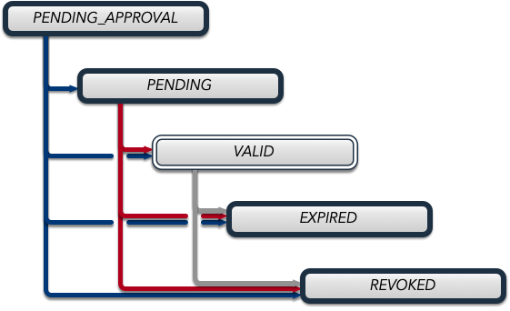

.. _secure_pvaccess:

Secure PVAccess - SPVA
=====================

Secure PVAccess (SPVA) enhances the existing PVAccess protocol by integrating :ref:`transport_layer_security` (TLS)
with comprehensive :ref:`certificate_management`, enabling encrypted communication channels and authenticated connections
between EPICS clients and servers (EPICS agents).

Key Features:

- Encrypted communication using TLS 1.3
- Certificate-based authentication
- Comprehensive certificate lifecycle management
- Backward compatibility with existing PVAccess deployments
- Integration with site authentication systems

In SPVA terminology, an 'EPICS Agent' refers to any PVAccess network client.

Note: This release requires specific unmerged changes to epics-base.

.. _quick_start:

Quick Start Guide
---------------

1. Install Requirements
^^^^^^^^^^^^^^^^^^^^^^^

    .. code-block:: sh

        # For Debian/Ubuntu

        apt-get update
        apt-get install -y \
            build-essential \
            git \
            openssl \
            libssl-dev \
            libevent-dev \
            libsqlite3-dev \
            libcurl4-openssl-dev \
            pkg-config \
            zsh

        # For RHEL/CentOS/Rocky/Alma Linux/Fedora

        dnf install -y \
            gcc-c++ \
            git \
            make \
            openssl-devel \
            libevent-devel \
            sqlite-devel \
            libcurl-devel \
            pkg-config \
            zsh

        # For macOS

        brew update
        brew install \
            openssl@3 \
            libevent \
            sqlite3 \
            curl \
            pkg-config \
            zsh

        # For Alpine Linux

        apk add --no-cache \
            build-base \
            git \
            openssl-dev \
            libevent-dev \
            sqlite-dev \
            curl-dev \
            pkgconfig \
            zsh

        # For RTEMS
        # First install RTEMS toolchain from https://docs.rtems.org/branches/master/user/start/
        # Then ensure these are built into your BSP:
        #   - openssl
        #   - libevent
        #   - sqlite
        #   - libcurl
        # Note: RTEMS support requires additional configuration. See RTEMS-specific documentation.

2. Build epics-base
^^^^^^^^^^^^^^^^^

    .. code-block:: sh

        git clone --branch 7.0-method_and_authority https://github.com/george-mcintyre/epics-base.git
        cd epics-base

        make -j10 all
        cd ..

3. Configure PVXS Build
^^^^^^^^^^^^^^^^^^^^^^^

    .. code-block:: sh

        cat >> RELEASE.local <<EOF
        EPICS_BASE = \$(TOP)/../epics-base
        EOF

        # Optional: To enable appropriate site authentication mechanisms.
        # Note: `authnstd` is always available.

        # cat >> CONFIG_SITE.local <<EOF
        # PVXS_ENABLE_KRB_AUTH = YES
        # PVXS_ENABLE_JWT_AUTH = YES
        # PVXS_ENABLE_LDAP_AUTH = YES
        #EOF

        # find paths to libevent and openssl

        pkg-config --cflags openssl libevent
        pkg-config --libs openssl libevent

        # Set paths to libevent and openssl (if required)

        export C_INCLUDE_PATH=/<path_to_libevent>/libevent/2.1.12_1/include:/<path_to_openssl>/openssl@3/3.2.1/include
        export CPLUS_INCLUDE_PATH=/<path_to_libevent>/libevent/2.1.12_1/include:/<path_to_openssl>/openssl@3/3.2.1/include
        export LIBRARY_PATH=/<path_to_libevent>/libevent/2.1.12_1/lib:/<path_to_openssl>/openssl@3/3.2.1/lib

4. Build PVXS
^^^^^^^^^^^^

    .. code-block:: sh

        git clone --recursive  --branch tls https://github.com/george-mcintyre/pvxs.git
        cd pvxs

        # Build PVXS

        make -j10 all

5. PVACMS Setup
^^^^^^^^^^^^^^^

    .. code-block:: sh

        // TODO FIX LATER!!!!! need a machine location
        #### [optional] Set path and name of the CA database file (default: ./certs.db)

        export EPICS_CONFIG_HOME=${HOME}/.config/epics
        export EPICS_CONFIG_CERTS=${EPICS_CONFIG_HOME}/certs
        export EPICS_CONFIG_KEYS=${EPICS_CONFIG_HOME}/keys

        export EPICS_CA_DB=${EPICS_CONFIG_HOME}/certs.db

        #### Set key paths (keys will be created here if not exists)
        # Place your CA's private key in this file if you have one
        # otherwise the CA will be created by PVACMS

        export EPICS_CA_PKEY=${EPICS_CONFIG_KEYS}/cakey.p12

        # Specify the path to your PVACMS's private key.  It will be created automatically

        export EPICS_PVACMS_TLS_PKEY=${EPICS_CONFIG_KEYS}/pvacmskey.p12

        #### Set certificate paths (certificates will be created here if not exists)
        # Place your CA's certificate in this file if you have one
        # otherwise the CA certificate will be created by PVACMS

        export EPICS_CA_KEYCHAIN=${EPICS_CONFIG_CERTS}/ca.p12

        # Specify the path to your PVACMS's certificate.  It will be created automatically

        export EPICS_PVACMS_TLS_KEYCHAIN=${EPICS_CONFIG_CERTS}/pvacms.p12

        # Specify the name of your CA
        export EPICS_CA_NAME="EPICS Test Root CA"
        export EPICS_CA_ORGANIZATION="ca.epics.org"
        export EPICS_CA_ORGANIZATIONAL_UNIT="EPICS Certificate Authority"

        #### Create root CA
        # - creates root CA if does not exist,
        #   at location specified by EPICS_CA_TLS_KEYCHAIN,
        #   with private key at location specified by EPICS_CA_TLS_KEY
        #   with CN specified by EPICS_CA_NAME (default: EPICS Root CA)
        #   with O specified by EPICS_CA_ORGANIZATION (default: ca.epics.org)
        #   with OU specified by EPICS_CA_ORGANIZATIONAL_UNIT (default: EPICS Certificate Authority)
        #   with C that is the country code based on where the code is running
        #
        # If the root CA does not already exist it will exit here with instructions on what to do to trust the
        # root CA
        # Will continue without exiting if CA already exists

        ./pvxs/bin/*/pvacms

        #### Create the PVACMS server certificate and Start PVACMS service
        # - creates server certificate if does not exist,
        #   at location specified by EPICS_PVACMS_TLS_KEYCHAIN,
        #   with private key at location specified by EPICS_PVACMS_TLS_KEY
        # - creates default ACF file (pvacms.yaml) at location pointed to by EPICS_CA_ACF or in current working directory
        # - creates database (certs.db) if does not exist at location pointed to by EPICS_CA_DB or in current working directory,

        ./pvxs/bin/*/pvacms

6. Install Root Certificate
^^^^^^^^^^^^^^^^^^^^^^^^^

    .. code-block:: sh

        #### Install and Trust Root CA
        # Follow instructions, when command completes, to trust the downloaded CA certificate
        # note: If root cert is signed by a public CA this step is optional

        ./pvxs/bin/*/pvxcert -I

7. Configure EPICS Agent Environment
^^^^^^^^^^^^^^^^^^^^^^^^^^^^^^^^^

    .. code-block:: sh

        #### Set key paths (keys will be created here if they don't already exist)
        # An EPICS client agent key if required
        export EPICS_PVA_TLS_PKEY=~/.epics/client.p12

        # An EPICS server agent key if required
        export EPICS_PVAS_TLS_PKEY=~/.epics/server.p12

        #### Set certificate paths (certificates will be created here if they don't already exist)
        # An EPICS client agent certificate if required
        export EPICS_PVA_TLS_KEYCHAIN=~/.epics/client.pem

        # An EPICS server agent certificate if required
        export EPICS_PVAS_TLS_KEYCHAIN=~/.epics/server.pem

8. Create Certificates
^^^^^^^^^^^^^^^^^^^^

    .. code-block:: sh

        #### 1. Create a new client private key at location specified by EPICS_PVA_TLS_KEY if it does not already exist
        #### 2. Create client certificate at location specified by EPICS_PVA_TLS_KEYCHAIN

        ./pvxs/bin/*/authnstd -u client

        #### 1. Create a new server private key at location specified by EPICS_PVAS_TLS_KEY if it does not already exist
        #### 2. Create server certificate at location specified by EPICS_PVAS_TLS_KEYCHAIN

        ./pvxs/bin/*/authnstd -u server

.. _transport_layer_security:

Transport Layer Security
----------------------

SPVA uses TLS 1.3 to establish secure connections between EPICS agents. Both client and server
can authenticate their peer using X.509 certificates. Key features of the TLS implementation:

- Mutual authentication when both peers present valid certificates
- Server-only authentication when only the server presents a certificate
- Fallback to TCP when TLS is not configured or certificates are invalid
- Certificate status verification during connection establishment

Supported Certificate Formats, Encodings and File Types
^^^^^^^^^^^^^^^^^^^^^^^^^^^^^^^^^^^^^^^^^^^^^^^^^^^^^^^

+-----------+----------------------+-----------+-------------------------+------------------------------+-------------------------+
| File Type | Extension            | Encoding  | Includes Private Key?   | Includes Certificate Chain?  |     Common Usage        |
+===========+======================+===========+=========================+==============================+=========================+
|| PEM      || ``.pem``, ``.crt``, || Base64   || Optional               || Optional (concatenated)     || Web servers, OpenSSL   |
||          || ``.cer``, ``.key``  ||          ||                        ||                             ||                        |
+-----------+----------------------+-----------+-------------------------+------------------------------+-------------------------+
|| PKCS#12  || ``.p12``, ``.pfx``  || Binary   || Optional (password)    || Yes                         || Distributing cert key  |
+-----------+----------------------+-----------+-------------------------+------------------------------+-------------------------+
|| JKS      || ``.jks``            || Binary   || Optional               || Yes                         || Java applications      |
+-----------+----------------------+-----------+-------------------------+------------------------------+-------------------------+

To use any of these formats just use the appropriate file extension when specifying the certificate and key files.

TLS encapsulation of the PVAccess protocol
^^^^^^^^^^^^^^^^^^^^^^^^^^^^^^^^^^^^^^^^^^^^

In network protocols, encapsulation is used to transport a higher layer protocol over a lower layer protocol, e.g., TCP over IP.
In the context of TLS, PVAccess messages are encapsulated within TLS records for secure transport.

Encapsulation involves wrapping the higher-layer protocol's data within the lower-layer protocol's format.
TLS is so named because it wraps all data above the `Transport Layer` in an impermiable `Security` layer.
For SPVA, this means PVAccess messages are wrapped in TLS records that include headers specifying content type, protocol version, and length, followed by the
encrypted PVAccess data as the payload.

.. image:: pvaencapsulation.png
   :alt: TLS Encapsulation of PVAccess
   :align: center

Note: We use TLS version 1.3 for Secure PVAccess. This version deprecates support for connection renegotiation which is a security risk. So any
connections that are established using Secure PVAccess will not be renegotiated but will be closed if a certificate is revoked or needs to be renewed.

.. _environment_variables:

Environment Variables
^^^^^^^^^^^^^^^^^^^
The following environment variables control SPVA behavior:

.. note::
   There is an implied hierarchy to the applicability of the environment variables such that
   the PVAS version supersedes a PVA version.
   So, if an EPICS server agent wants to specify its PKCS#12 keychain file location it can simply
   provide the ``EPICS_PVA_TLS_KEYCHAIN`` environment variable as long as
   ``EPICS_PVAS_TLS_KEYCHAIN`` is not configured.

+--------------------------+----------------------------+-------------------------------------+---------------------------------------------------------------+
| Name                     | Key                        | Value                               | Description                                                   |
+==========================+============================+=====================================+===============================================================+
| EPICS_PVA_TLS_KEYCHAIN   | {fully qualified path  to keychain file}                         | This is the string that determines the fully qualified path   |
+--------------------------+                                                                  | to the PKCS#12 keychain file that contains the certificate,   |
| EPICS_PVAS_TLS_KEYCHAIN  | e.g. ``~/.epics/client.p12``                                     | and private keys used in the TLS handshake.                   |
|                          | e.g. ``~/.epics/server.p12``                                     | Note: If not specified then TLS is disabled                   |
+--------------------------+------------------------------------------------------------------+---------------------------------------------------------------+
| EPICS_PVA_TLS_KEYCHAIN   | {fully qualified path to keychain password file}                 | This is the string that determines the fully qualified path   |
| _PWD_FILE                |                                                                  | to a file that contains the password that unlocks the         |
+--------------------------+ e.g. ``~/.epics/client.pass``                                    | TLS KEYCHAIN file.  This is optional.  If not specified, the  |
| EPICS_PVAS_TLS_KEYCHAIN  | e.g. ``~/.epics/server.pass``                                    | TLS KEYCHAIN file contents will not be encrypted. It is not   |
| _PWD_FILE                |                                                                  | recommended to not specify a password file.                   |
+--------------------------+------------------------------------------------------------------+---------------------------------------------------------------+
| EPICS_PVA_TLS_KEY        | {fully qualified path to key file}                               | This is the string that determines the fully qualified path   |
+--------------------------+                                                                  | to the PKCS#12 keychain file that contains the private key    |
| EPICS_PVAS_TLS_KEY       | e.g. ``~/.ssh/clientkey.p12``                                    | used in the TLS handshake with peers.  Note: This is optional |
|                          | e.g. ``~/.ssh/serverkey.p12``                                    | and if not specified the TLS_KEYCHAIN file is used.           |
+--------------------------+------------------------------------------------------------------+---------------------------------------------------------------+
| EPICS_PVA_TLS_KEY_PWD    | {fully qualified path to key password file}                      | This is the string that determines the fully qualified path   |
| _FILE                    |                                                                  | to a file that contains the password that unlocks the TLS KEY |
+--------------------------+ e.g. ``~/.ssh/clikey.pass``                                      | file.  This is optional.  If not specified, the TLS KEY file  |
| EPICS_PVAS_TLS_KEY_PWD   | e.g. ``~/.ssh/servkey.pass``                                     | contents will not be encrypted. Recommended to not specify a  |
| _FILE                    |                                                                  | password file.                                                |
+--------------------------+----------------------------+-------------------------------------+---------------------------------------------------------------+
| EPICS_PVA_TLS_OPTIONS    | ``client_cert``            | ``optional`` (default)              | Require client certificate to be presented.                   |
|                          |                            |                                     |                                                               |
|                          | Determines whether client  +-------------------------------------+---------------------------------------------------------------+
| Sets the TLS options     | certificates are required  | ``require``                         | Don't require client certificate to be presented.             |
| for clients and servers. +----------------------------+-------------------------------------+---------------------------------------------------------------+
| A string containing      | ``on_expiration``          | ``fallback-to-tcp``  (default)      | For servers only tcp search requests will be responded to.    |
| key/value pairs          |                            |                                     | For clients then no client certificate will be presented      |
| separated by commas,     | Determines what to do when |                                     | in the TLS handshake (but searches will still offer both tls  |
| tabs or newlines         | an EPICS agent's           |                                     | and tcp as supported protocols)                               |
|                          | certificate has expired,   +-------------------------------------+---------------------------------------------------------------+
|                          | and a new one can't be     | ``shutdown``                        | The process will exit gracefully.                             |
|                          | automatically provisioned  +-------------------------------------+---------------------------------------------------------------+
|                          |                            | ``standby``                         | Servers will not respond to any requests until a new          |
|                          |                            |                                     | certificate is successfully provisioned.  It will keep        |
|                          |                            |                                     | retrying the keychain file periodically.  When a valid        |
|                          |                            |                                     | certificate is available it will continue as normal.          |
|                          |                            |                                     |                                                               |
|                          |                            |                                     | For a client standby has the same effect as shutdown.         |
|                          +----------------------------+-------------------------------------+---------------------------------------------------------------+
|                          | ``stop_if_no_cert``        | ``yes``, ``true``, ``1``            | Stop if no certificate is provided                            |
|                          |                            |                                     |                                                               |
|                          | Determines whether server  +-------------------------------------+---------------------------------------------------------------+
|                          | stops if no cert           | ``no``, ``false``, ``0`` (default)  | Don't stop if no certificate is provided                      |
|                          +----------------------------+-------------------------------------+---------------------------------------------------------------+
|                          | ``disable_stapling``       | ``yes``, ``true``, ``1``            | Servers won't staple certificate status, clients won't        |
|                          |                            |                                     | request stapling information during TLS handshake             |
|                          | Determines whether         +-------------------------------------+---------------------------------------------------------------+
|                          | stapling is enabled        | ``no``, ``false``, ``0`` (default)  | Don't disable stapling                                        |
+--------------------------+----------------------------+-------------------------------------+---------------------------------------------------------------+
| EPICS_PVA_TLS_PORT       | {port number} default ``5076``                                   | This is a number that determines the port used for the Secure |
|                          |                                                                  | PVAccess, either as the port on the Secure PVAccess server    |
+--------------------------+ e.g. ``8076``                                                    | for clients to connect to - PVA, or as the local port number  |
| EPICS_PVAS_TLS_PORT      |                                                                  | for Secure PVAccess servers to listen on - PVAS.              |
|                          |                                                                  |                                                               |
+--------------------------+------------------------------------------------------------------+---------------------------------------------------------------+
| SSLKEYLOGFILE            | {fully qualified path to key log file}                           | This is the path to the SSL key log file that, in conjunction |
|                          |                                                                  | with the build-time macro PVXS_ENABLE_SSLKEYLOGFILE,          |
|                          | e.g. ``~/.epics/keylog``                                         | controls where and whether we store the session key for TLS   |
|                          |                                                                  | sessions in a file.  If it is defined, then the code will     |
|                          |                                                                  | contain the calls to save the keys in the file specified      |
|                          |                                                                  | by this variable.                                             |
+--------------------------+------------------------------------------------------------------+---------------------------------------------------------------+

API Configuration Options
^^^^^^^^^^^^^^^^^^^^^^^

The following are new configuration options now available
in both the `pvxs::server::Config` and `pvxs::client::Config` classes,
via their public base `pvxs::impl::CommonConfig` class:

- `pvxs::impl::CommonConfig::expiration_behaviour` - Set certificate expiration behavior
- `pvxs::impl::CommonConfig::tls_cert_filename` - Set certificate file path
- `pvxs::impl::CommonConfig::tls_cert_password` - Set certificate password
- `pvxs::impl::CommonConfig::tls_client_cert_required` - Control client certificate requirements
- `pvxs::impl::CommonConfig::tls_disable_stapling` - Disable certificate status stapling
- `pvxs::impl::CommonConfig::tls_disable_status_check` - Disable certificate status checking
- `pvxs::impl::CommonConfig::tls_disabled` - Disable TLS
- `pvxs::impl::CommonConfig::tls_port` - Set TLS port number
- `pvxs::impl::CommonConfig::tls_private_key_filename` - Set private key file path
- `pvxs::impl::CommonConfig::tls_private_key_password` - Set private key password
- `pvxs::impl::CommonConfig::tls_throw_if_cant_verify` - Control verification failure behavior

Here are server-specific configuration options:

- `pvxs::server::Config::tls_stop_if_no_cert` - Stop server if certificate unavailable
- `pvxs::server::Config::tls_throw_if_no_cert` - Throw exception if certificate unavailable

API Additions for Secure PVAccess
^^^^^^^^^^^^^^^^^^^^^^^^^^^^^^^

Runtime Reconfiguration
~~~~~~~~~~~~~~~~~~~~~

Allows runtime reconfiguration of a TLS connection.  It does this by dropping all TLS connections and
then re-initialising them using the given configuration.  This means checking if the certificates
and keys exist, loading and verifying them, checking for status and status of peers, etc.

`pvxs::client::Context::reconfigure` and `pvxs::server::Server::reconfigure` allow runtime TLS configuration updates:

    .. code-block:: c++

        // Initial client setup with certificate
        auto cli_conf(serv.clientConfig());
        cli_conf.tls_cert_filename = "client1.p12";
        auto cli(cli_conf.build());

        // Later reconfiguration with new certificate
        cli_conf = cli.config();
        cli_conf.tls_cert_filename = "client2.p12";
        cli_conf.tls_cert_password = "pwd";
        cli.reconfigure(cli_conf);

Creation of client to :ref:`pvacms`
~~~~~~~~~~~~~~~~~~~~~~~~~~~~~~~~~

Internally SPVA needs to create a special client when it is connecting to :ref:`pvacms` to check status.  This
client can't work in the normal way, checking for certificate status because it would become
endlessly recursive,

 - An EPICS agent creating a new connection would try try to verify its certificate

   - so it would open a connection to :ref:`pvacms` to try to check status of that certificate,
   - but that connection would need to have its certificate verified

     - so it would open a connection to :ref:`pvacms` to try to check status of that certificate,
     - but that connection would need to have its certificate verified

       - so it would open a connection to :ref:`pvacms` to try to check status of that certificate,
       - ... infinitely

To avoid this a special client can be created with this API.  Normally you won't need to check
certificate status yourself but if you do use this API to create the client context.

`pvxs::client::Context::forCMS` creates an isolated client context appropriately configured to access :ref:`pvacms` without recursion:

    .. code-block:: c++

        Value getPVAStatus(const std::string cert_status_uri) {
            auto client(client::Context::forCMS());
            Value result = client.get(cert_status_uri).exec()->wait();
            client.close();
            return result;
        }

Wildcard PV Support
~~~~~~~~~~~~~~~~

This addition is based on the Wildcard PV support included in epics-base since version 3.  It
extends this support to pvxs allowing PVs to be specified as wildcard patterns.  We use this
to provide individualised PVs for each certificate's status management.

`pvxs::server::SharedWildcardPV` support for pattern-matched PV names:

    .. code-block:: c++

        // Define a server that responds to any SEARCH request with WILDCARD:PV:<4-characters>:<any-string>
        // It will extract the 4-character part of the PV name as the `id` and
        // the last string as the `name`

        SharedWildcardPV wildcard_pv(SharedWildcardPV::buildMailbox());
        wildcard_pv.onFirstConnect( {
            // Extract id and name from parameters
            auto it = parameters.begin();
            const std::string &id = *it;
            const std::string &name = *++it;

            // Process and post value
            if (pv.isOpen(pv_name)) {
                pv.post(pv_name, value);
            } else {
                pv.open(pv_name, value);
            }
        });
        wildcard_pv.onLastDisconnect( {
            pv.close(pv_name);
        });

        // Add wildcard PV to server
        serv.addPV("WILDCARD:PV:????:*", wildcard_pv);

.. _protocol_operation:

Protocol Operation
----------------

.. _connection_establishment:

Connection Establishment
^^^^^^^^^^^^^^^^^^^^^

Connections are established using TLS if at least the server side is configured for TLS.

Prior to the TLS handshake:

- Certificates are loaded and validated
- CA trust is verified all the way down the chain
- Both sides subscribe to certificate status where configured for their own certificate and all those in the chain
- All certificate statues are cached

During the TLS handshake:

- Certificates are exchanged
- Servers staple cached certificate status in handshake
- Both sides validate and verify their peer certificate against trusted root certificates

After the TLS handshake:

- Both sides subscribe to peer certificate status where configured
- Clients may use OCSP stapled status immediately before waiting for status monitoring results

.. _state_machines:

State Machines
^^^^^^^^^^^^

*Server TLS Context State Machine:*

The server transitions based on:

- Certificate validity
- CA trust status
- Certificate status monitoring results
- :ref:`configuration` options (e.g., stop_if_no_cert)

States:

- ``INIT``: Initial state, loads and validates certificates
- ``TCP_READY``: Responds to TCP protocol requests when certificates are valid
- ``TLS_READY``: Responds to both TCP and TLS protocol requests
- ``DEGRADED``: Fallback state for invalid certificates or missing TLS configuration

.. image:: spva_tls_context_state_machine.png
   :alt: SPVA Server TLS Context State Machine
   :align: center

*Client TLS Context State Machine:*

Similar to server state machine but

- Never exits on TLS configuration issues
- Moves to ``DEGRADED`` state and continues with TCP protocol if needed

.. image:: spva_tls_client_context_state_machine.png
   :alt: SPVA Client TLS Context State Machine
   :align: center

.. _tls_context_search_state_machine:

Search Handler State Machines
~~~~~~~~~~~~~~~~~~~~~~~~~~

*Server Search Handler:*

States:

- ``DEGRADED``: Responds only to TCP protocol requests
- ``TCP_READY``: Responds only to TCP protocol requests, ignores TLS
- ``TLS_READY``: Responds to both TCP and TLS protocol requests

.. image:: spva_tls_context_search_states.png
   :alt: SPVA Server TLS Context Search Handler State Machine
   :align: center

*Client Search Handler:*

- Similar to server but from client perspective
- Executes ``TLS_CONNECTOR`` on successful TLS handshake
- Falls back to ``TCP_CONNECTOR`` otherwise

.. image:: spva_tls_client_context_search_states.png
   :alt: SPVA Client TLS Context Search Handler State Machine
   :align: center

.. _connection_state_machine:

Connection State Machines
~~~~~~~~~~~~~~~~~~~~~~~

*Server Connection:*

- Manages TLS handshake and certificate validation
- Monitors peer certificate status
- Continues normal operation only after successful validation

.. image:: spva_connection_state_machines.png
   :alt: SPVA Connection State Machines
   :align: center

*Client Connection:*

- Similar to server but verifies stapled certificates
- Destroys connection on completion

.. image:: spva_client_connection_state_machines.png
   :alt: SPVA Client Connection State Machine
   :align: center

.. _tls_handshake:

TLS Handshake
~~~~~~~~~~~~

The following diagram shows the simplified TLS handshake sequence between server and client:

.. image:: spvaseqdiag.png
   :alt: SPVA Sequence Diagram
   :align: center

1. Each agent uses an X.509 certificate for peer authentication
2. During handshake:

   - Certificates are exchanged
   - Both sides verify peer certificates against trusted root certificates
   - Multiple certificates may be verified in the chain to trusted CA
   - Local verification checks signature, expiration, and usage flags

3. SPVA certificates may include status monitoring extension requiring:

   - Subscription to certificate status from issuing CA's service (:ref:`pvacms`)
   - Receipt of GOOD status before trust

4. Agents subscribe to:

   - Peer's certificate status
   - Own certificate status and certificate chain

5. Servers cache and staple certificate status in handshake

.. _online_certificate_status_protocol_OCSP:

OCSP and Status Verification
^^^^^^^^^^^^^^^^^^^^^^^^^

.. _ocsp_stapling:

OCSP Stapling
^^^^^^^^^^^^

OCSP Stapling optimizes certificate status verification during TLS handshake:

.. figure:: images/ocsp_stapling.png
    :width: 800px
    :align: center
    :name: ocsp-stapling

- Enabled by default with status monitoring extension
- Disable using EPICS_PVAS_TLS_OPTIONS="disable_stapling"

.. _status_verification:

Status Verification
^^^^^^^^^^^^^^^

Certificate status verification occurs at several points:

1. Initial Connection

   - Certificates are verified during TLS handshake
   - Both peers verify against trusted root certificates
   - Basic checks include:

     - Signature validation
     - Expiration dates
     - Usage flags

2. Runtime Monitoring

   - EPICS agents subscribe to:

     - Their own certificate status
     - Their certificate chain status
     - Peer certificate status
     - Peer certificate chain status

3. Status Response Handling

   - If status not received:

     - Search requests are ignored
     - Client retries later

   - If status not GOOD:

     - Server offers only TCP protocol
     - Client fails connection validation

   - If status GOOD:

     - Server offers both TCP and TLS
     - Connection proceeds normally

4. Optimization

   - Servers cache status for stapling
   - Clients can use stapled status
   - Reduces initial :ref:`pvacms` requests

.. _status_caching:

Status Caching
^^^^^^^^^^^^

- Agents subscribe to peer certificate and chain status
- Status transitions trigger connection status re-evaluation
- Cached status used within validity period to reduce :ref:`pvacms` requests
- Servers staple cached status in handshake
- Clients may skip initial :ref:`pvacms` request using stapled status

.. _certificate_file_monitoring:

Certificate File Monitoring
^^^^^^^^^^^^^^^^^^^^^^^^^^^

In addition to monitoring the certificates for validity and status, the EPICS agents also watch for changes to the certificate files they are using.
If a new certificate file is detected then the EPICS agent will reconfigure any existing TLS connections to use the new certificates.

Beacons
^^^^^^^

PVAccess Beacon Messages have not been upgraded to TLS support. Important considerations:

1. Historical Use:
   - Previously used to trigger resend of unanswered Search Messages
   - This practice is now discouraged
   - Other methods should be used to determine server status

2. Current Behavior:
   - Servers broadcast on any configured port
   - Clients should not use ports directly
   - Use only as server availability indicator

3. Security Implications:
   - Beacons remain unencrypted
   - Do not contain sensitive information
   - Cannot be used for secure discovery

.. _protocol_debugging:

Protocol Debugging
----------------

TLS Packet Inspection
^^^^^^^^^^^^^^^^^^^

For detailed TLS traffic analysis:

1. Enable key logging at build time:

   - Set PVXS_ENABLE_SSLKEYLOGFILE during compilation

2. Configure runtime logging:

    .. code-block:: sh

        export SSLKEYLOGFILE=/tmp/sslkeylog.log

3. Configure Wireshark:

   - Edit > Preferences > Protocols > TLS
   - Set "(Pre)-Master-Secret log filename" to match SSLKEYLOGFILE path
   - TLS traffic will now be decrypted in Wireshark

Debug Logging
^^^^^^^^^^^

Enable detailed PVXS debug logging:

1. Environment variable method:

    .. code-block:: sh

        export PVXS_LOG="pvxs.stapling*=DEBUG"

1. Command line option with pvxcert:

    .. code-block:: sh

        pvxcert -d ...

New Debug Categories:

- ``pvxs.certs.auth``          - Authentication mechanisms
- ``pvxs.certs.auth.cfg``      - Authn configuration
- ``pvxs.certs.auth.cms``      - CMS authentication
- ``pvxs.certs.auth.jwt``      - JWT authentication mechanism
- ``pvxs.certs.auth.krb``      - Kerberos authentication mechanism
- ``pvxs.certs.auth.mon``      - Authn monitoring
- ``pvxs.certs.auth.stat``     - Authn status
- ``pvxs.certs.auth.std``      - Basic credentials authentication mechanism
- ``pvxs.certs.auth.tool``     - Authn tools (``pvacert``)
- ``pvxs.certs.status``        - Certificate management
- ``pvxs.ossl.init``           - TLS initialization
- ``pvxs.ossl.io``             - TLS I/O
- ``pvxs.stapling``            - OCSP stapling

Connection Tracing
^^^^^^^^^^^^^^^^

Monitor connection state transitions:

1. Enable connection tracing:

   .. code-block:: sh

       export PVXS_LOG="pvxs.connection=DEBUG"

2. Trace output includes:

   - Connection establishment
   - State transitions
   - Certificate verification
   - Error conditions

.. _authentication_modes_and_identity:

Authentication modes and Identity
-------------------------------

Authentication determines the identity of a client or server. Authorization determines access rights to PV resources.
SPVA enhances :ref:`epics_security` with fine-grained control based on:

- Authentication method - ca, x509, or anonymous
- Certificate authority - CA common name
- TLS encryption status/mode - encrypted or unencrypted (server-only, mutual, or none)
- RPC message type - for RPC messages (Can define rules but control not implemented yet)

AuthN Modes
^^^^^^^^^^^

- `Mutual`: Both client and server authenticated via certificates (Secure PVAccess)
- `Server-only`: Only server authenticated via certificate (Secure PVAccess)
- `Un-authenticated`: Credentials supplied in AUTHZ message (legacy PVAccess)
- `Unknown`: No credentials (legacy PVAccess)

.. _determining_identity:

Determining Identity
^^^^^^^^^^^^^^^^^^^

Legacy PVAccess Identity
~~~~~~~~~~~~~~~~~~~~~

.. image:: pvaident.png
   :alt: Identity in PVAccess
   :align: center

1. Optional AUTHZ message from client:

    .. code-block:: sh

        AUTHZ method: ca
        AUTHZ user: george
        AUTHZ host: McInPro.level-n.com

2. Server uses PeerInfo structure:

    .. code-block:: c++

        struct PeerInfo {
            std::string peer;      // network address
            std::string transport; // protocol (e.g., "pva")
            std::string authority; // auth mechanism
            std::string realm;     // authority scope
            std::string account;   // user name
        }

3. PeerInfo fields map to `asAddClient()` parameters for authorization

Secure PVAccess Identity
~~~~~~~~~~~~~~~~~~~~~

.. image:: spvaident.png
   :alt: Identity in Secure PVAccess
   :align: center

1. Identity established via X.509 certificate during TLS handshake:

    .. code-block:: sh

        CN: greg
        O: SLAC.stanford.edu
        OU: SLAC National Accelerator Laboratory
        C: US

2. EPICS agent verifies certificate via trust chain

3. PeerCredentials structure provides peer information:

    .. code-block:: c++

        struct PeerCredentials {
            std::string peer;      // network address
            std::string iface;     // network interface
            std::string method;    // "anonymous", "ca", or "x509"
            std::string authority; // CA common name for x509
            std::string account;   // Remote user account
            bool isTLS;           // Secure transport status
        };

4. Extended asAddClientX() function provides enhanced authorization control

.. _site_authentication_methods:

Site Authentication Methods
-------------------------

An Authentication Method usually includes a daemon that runs on an EPICS agent machine to
monitor availability and validity of certificates and create/replace them when necessary.
This is why we call these components Authentication Daemons (AD).
Authentication daemons can also run as commandline tools to create one-off certific

Implementing a new authentication method requires:

Authentication Daemon (AD) Implementation
^^^^^^^^^^^^^^^^^^^^^^^^^^^^^^^^^^^^^^^^^

Create under ``/certs/authn/<name>``:

- `authnmain.cpp` - Main runner (copy from template)
- `authn<name>.cpp` - Main implementation subclassing ``Authn``
- `authn<name>.h` - Header file
- `config<name>.cpp` - Configuration interface subclassing ``AuthnConfig``
- `config<name>.h` - Header file
- `Makefile` - Build configuration
- `README.md` - Documentation

CCR Message Verifier
^^^^^^^^^^^^^^^^^^^^

Create under `/certs/authn/<name>`:

- `<name>verifier.cpp` - Verifier implementation for :ref:`pvacms`
- `<name>verifier.h` - Header file with required macros/constants
- `<name>VERIFIER_RULES` - Makefile rules for :ref:`pvacms` integration
- `<name>VERIFIER_CONFIG` - Makefile configuration for :ref:`pvacms`

Authentication Daemon Types
^^^^^^^^^^^^^^^^^^^^^^^^^

.. _pvacms_type_0_auth_methods:

TYPE ``0`` - Basic Credentials
~~~~~~~~~~~~~~~~~~~~~~~

- Uses basic information:

  - Username
  - Hostname
  - Process name
  - Device name
  - IP address

- No verification performed
- Certificates start in ``STATUS_CHECK_APPROVAL`` state
- Requires administrator approval

.. _pvacms_type_1_auth_methods:

TYPE ``1`` - Independently Verifiable Tokens
~~~~~~~~~~~~~~~~~~~~~~~~~~~~~~~~~~~~

- Tokens verified independently or via endpoint (e.g., JWT)
- Verification methods:

  - Token signature verification
  - Token payload validation
  - Verification endpoint calls

.. _pvacms_type_2_auth_methods:

TYPE ``2`` - Source Verifiable Tokens
~~~~~~~~~~~~~~~~~~~~~~~~~~~~~

- Requires programmatic API integration (e.g., Kerberos)
- Adds verifiable data to :ref:`certificate_creation_request_CCR` message
- :ref:`pvacms` uses method-specific libraries for verification

Included Reference Authentication Daemons
^^^^^^^^^^^^^^^^^^^^^^^^^^^^^^^^^^^^^^^^

Though it is recommended that you create your own site-specific authentication methods the following ha been included
as examples of how they can be implemented into the Secure PVAccess framework.  As a norm
you should generate tokens in the ``PENDING_APPROVAL`` state unless the authentication mechanism includes
a verifier.

- ``authnstd`` : Standard - Basic credentials
- ``authnkrb`` : Kerberos - Kerberos credentials
- ``authnldap``: LDAP     - Kerberos credentials verified in LDAP directory
- ``authnjwt`` : JWT      - JWT tokens

authstd Configuration and Usage
~~~~~~~~~~~~~~~~~~~~~~~~~~~~~

This authentication method is used for basic credentials.
It can be used to create a certificate with a username and hostname.

- `CN` field in the certificate will be the logged in username

  - unless the EPICS_AUTH_STD_PROCESS_NAME environment variable is set
  - or the EPICS_AUTH_STD_USE_PROCESS_NAME environment variable is set to ``true``
    in which case the actual process name is used

- `O` field in the certificate will be the hostname

  - unless the EPICS_AUTH_STD_DEVICE_NAME environment variable is set

- `OU` field in the certificate will not be set
- `C` field in the certificate will be set to the local country code

**usage**

Uses the standard ``EPICS_PVA_TLS_<name>`` environment variables to determine the certificate file,
private key, and password file locations.

    .. code-block:: sh

        Usage: authnstd <opts>

          -v         Make more noise.
          -h         Show this help message and exit
          -d         Shorthand for $PVXS_LOG="pvxs.*=DEBUG".  Make a lot of noise.
          -D         Run in Daemon mode.  Monitors and updates certs as needed
          -V         Show version and exit
          -u <use>   Usage. client, server, or gateway
          -N <name>  Name override the CN subject field
          -O <name>  Org override the O subject field
          -o <name>  Override the OU subject field

        ENVIRONMENT VARIABLES: at least one mandatory variable must be set
            EPICS_PVA_TLS_KEYCHAIN              Set name and location of client certificate file (mandatory for clients)
            EPICS_PVAS_TLS_KEYCHAIN             Set name and location of server certificate file (mandatory for server)
            EPICS_PVA_TLS_KEYCHAIN_PWD_FILE     Set name and location of client certificate password file (optional)
            EPICS_PVAS_TLS_KEYCHAIN_PWD_FILE    Set name and location of server certificate password file (optional)
            EPICS_PVA_TLS_PKEY                  Set name and location of client private key file (optional)
            EPICS_PVAS_TLS_PKEY                 Set name and location of server private key file (optional)
            EPICS_PVA_TLS_PKEY_PWD_FILE         Set name and location of client private key password file (optional)
            EPICS_PVAS_TLS_PKEY_PWD_FILE        Set name and location of server private key password file (optional)

**Environment Variables for authnstd**

+----------------------+------------------------------------+-----------------------------------------------------------------------+
| Name                 | Keys and Values                    | Description                                                           |
+======================+====================================+=======================================================================+
|| EPICS_AUTH_STD      || <number of minutes>               || Amount of minutes before the certificate expires.                    |
|| _CERT_VALIDITY_MINS || e.g. ``525960`` for 1 year        ||                                                                      |
+----------------------+------------------------------------+-----------------------------------------------------------------------+
|| EPICS_AUTH_STD      || {string name of device}           || Name of device to use in new certificates                            |
|| _DEVICE_NAME        || e.g. ``KLYS:LI01:01``             ||                                                                      |
+----------------------+------------------------------------+-----------------------------------------------------------------------+
|| EPICS_AUTH_STD      || {name of process}                 || Name of process to use in new certificates                           |
|| _PROCESS_NAME       || e.g. ``archiver``                 ||                                                                      |
+----------------------+------------------------------------+-----------------------------------------------------------------------+
|| EPICS_AUTH_STD      || {``true`` or ``false`` (default)} || If ``true`` use the process name as the CN field in new certificates |
|| _USE_PROCESS_NAME   ||                                   ||                                                                      |
+----------------------+------------------------------------+-----------------------------------------------------------------------+

authkrb Configuration and Usage
~~~~~~~~~~~~~~~~~~~~~~~~~~~~~

This authentication method is a TYPE ``2`` authentication method.
It can be used to create a certificate from a Kerberos ticket.

A user will need to have a Kerberos ticket to use this authentication method typically
using the ``kinit`` command.

    .. code-block:: sh

        kinit -l 24h greg@SLAC.STANFORD.EDU

- `CN` field in the certificate will be kerberos username
- `O` field in the certificate will be the kerberos realm
- `OU` field in the certificate will not be set
- `C` field in the certificate will be set to the local country code

**usage**

Uses the standard ``EPICS_PVA_TLS_<name>`` environment variables to determine the certificate file,
private key, and password file locations.

    .. code-block:: sh

        authnkrb <opts>

        Options:
        -h show help
        -v verbose output
        -t {client | server}     Client or server certificate certificate type
        -C                       Create a certificate and exit
        -D                       Start authentication daemon to monitor certificate files and certificate status.
                                Will attempt to install a new certificate if the existing one expires,
                                or if the kerberos ticket expires and is renewable,
                                or if the certificate file is deleted, or if the certificate is REVOKED.

**Environment Variables for PVACMS AuthnKRB Verifier**

The environment variables in the following table configure the Kerberos
Credentials Verifier for :ref:`pvacms` at runtime.

+-----------------+--------------------------------------+---------------------------------------------------------------------+
| Name            | Keys and Values                      | Description                                                         |
+=================+======================================+=====================================================================+
|| EPICS_AUTH_KRB || {string location of keytab file}    || This is the keytab file shared with :ref:`pvacms` by the KDC so .         |
|| _KEYTAB        || e.g. ``/etc/security/keytab``       || that it can verify kerberos tickets                                |
+-----------------+--------------------------------------+---------------------------------------------------------------------+
|| EPICS_AUTH_KRB || {this is the kerberos realm to use} || This is the kerberos realm to use when verifying kerberos tickets. |
|| _REALM         || e.g. ``SLAC.STANFORD.EDU``          || Overrides the verifier fields if specified.                        |
+-----------------+--------------------------------------+---------------------------------------------------------------------+

authldap Configuration and Usage
~~~~~~~~~~~~~~~~~~~~~~~~~~~~~

This authentication method is a TYPE ``2`` authentication method.
It can be used to create a certificate from a Kerberos ticket that is
verified against an LDAP server.

A user will need to have a Kerberos ticket to use this authentication method typically
using the ``kinit`` command.

    .. code-block:: sh

        kinit -l 24h greg@SLAC.STANFORD.EDU

- `CN` field in the certificate will be kerberos username
- `O` field in the certificate will be the kerberos realm
- `OU` field in the certificate will not be set
- `C` field in the certificate will be set to the local country code

**usage**

Uses the standard ``EPICS_PVA_TLS_<name>`` environment variables to determine the certificate file,
private key, and password file locations.

    .. code-block:: sh

        authnkrb <opts>

    Options:
    -h show help
    -v verbose output
    -t {client | server}     Client or server certificate certificate type
    -C                       Create a certificate and exit
    -D                       Start authentication daemon to monitor certificate files and certificate status.
                             Will attempt to install a new certificate if the existing one expires,
                             or if the kerberos ticket expires and is renewable,
                             or if the certificate file is deleted, or if the certificate is REVOKED.

**Environment Variables for PVACMS AuthnLDAP Verifier**

The environment variables in the following table configure the
LDAP Credentials Verifier for :ref:`pvacms` at runtime in addition to the AuthnKrb environment variables.

+--------------------+---------------------------------------+------------------------------------------------------------+
| Name               | Keys and Values                       | Description                                                |
+====================+=======================================+============================================================+
|| EPICS_AUTH_LDAP   || <account>                            || The admin account to use to access the LDAP server.       |
|| _ACCOUNT          || e.g. ``admin``                       || when verifying LDAP credentials.                          |
+--------------------+---------------------------------------+------------------------------------------------------------+
|| EPICS_AUTH_LDAP   || {location of password file}          || file containing password for the given LDAP admin account |
|| _ACCOUNT_PWD_FILE || e.g. ``~/.ssh/ldap.pass/``           ||                                                           |
+--------------------+---------------------------------------+------------------------------------------------------------+
|| EPICS_AUTH_LDAP   || {hostname of LDAP server}            || Trusted hostname of the LDAP server                       |
|| _HOST             || e.g. ``ldap.stanford.edu``           ||                                                           |
+--------------------+---------------------------------------+------------------------------------------------------------+
|| EPICS_AUTH_LDAP   || <port_number>                        || LDAP server port number. Default is 389                   |
|| _PORT             || e.g. ``389``                         ||                                                           |
+--------------------+---------------------------------------+------------------------------------------------------------+
|| EPICS_AUTH_LDAP   || {LDAP directory name to search from} || LDAP directory name to search from.                       |
|| _SEARCH_ROOT      || e.g. ``dc=slac,dc=stanford,dc=edu``  ||                                                           |
+--------------------+---------------------------------------+------------------------------------------------------------+

authjwt Configuration and Usage
~~~~~~~~~~~~~~~~~~~~~~~~~~~~~

This authentication method is a TYPE ``1`` authentication method.
It can be used to create a certificate from a JWT token.

The daemon will create a rest service that will allow posting of JWT tokens
and create a certificate based on the token's credentials.

Verification of the JWT token is performed by :ref:`pvacms` before exchanging for a certificate.

**JWT Token Post Request**
A web application, python script, java application, etc. can post a JWT token to the authentication daemon
whenever it gets a new token from an authentication service.   The authentication daemon will send
a :ref:`certificate_creation_request_CCR` to :ref:`pvacms` to create a certificate based on the JWT token.  :ref:`pvacms` will verify the token based
on the configuration of the authnjwt verifier.

You could test this by posting a JWT token to the authentication daemon as follows:

    .. code-block:: sh

        authnjwt -D &

        curl -X POST http://localhost:8080 \
        -H "Content-Type: application/json" \
        -H "Authorization: Bearer YOUR_JWT_TOKEN_HERE"

.. note::

    No body is sent in this POST request.

- `CN` field in the certificate will be the username from the JWT token
- `O` field in the certificate will be the issuer from the JWT token
- `OU` field in the certificate will not be set
- `C` field in the certificate will be set to the local country code

**usage**

Uses the standard ``EPICS_PVA_TLS_<name>`` environment variables to determine the certificate file,
private key, and password file locations.

    .. code-block:: sh

        authnjwt <opts>

        Options:
        -h show help
        -v verbose output
        -t {client | server}     Client or server certificate certificate type
        -C                       Create a certificate and exit
        -D                       Start authentication daemon web service to receive
                                JWT tokens and create certificates.

**Environment Variables for PVACMS AuthnJWT Verifier**

The environment variables in the following table configure the JWT
Credentials Verifier for :ref:`pvacms` at runtime.

+---------------------+---------------------------------------------------+-------------------------------------------------------------------------------------+
| Name                | Keys and Values                                   | Description                                                                         |
+=====================+===================================================+=====================================================================================+
|| EPICS_AUTH_JWT     || {string format for verification request payload} || Used to create the verification request payload by substituting the #token#        |
|| _REQUEST_FORMAT    || e.g. ``{ "token": "#token#" }``                  || for the token value, and #kid# for the key id. This is used when the               |
||                    || e.g. ``#token#``                                 || verification server requires a formatted payload for the verification request.     |
+---------------------+---------------------------------------------------+-------------------------------------------------------------------------------------+
|| EPICS_AUTH_JWT     || {string format for verification response value}  || A pattern string that we can use to decode the response from a verification        |
|| _RESPONSE_FORMAT   ||                                                  || endpoint if the response is formatted text. All white space is removed in the      |
||                    ||                                                  || given string and in the response. Then all the text prior to #response# is matched |
||                    ||                                                  || and removed from the response and all the text after the response is likewise      |
||                    ||                                                  || removed, what remains is the response value. An asterisk in the string matches     |
||                    ||                                                  || any sequence of characters in the response. It is converted to lowercase and       |
||                    ||                                                  || interpreted as valid if it equals valid, ok, true, t, yes, y, or 1.                |
+---------------------+---------------------------------------------------+-------------------------------------------------------------------------------------+
|| EPICS_AUTH_JWT     || {uri of JWT validation endpoint}                 || Trusted URI of the validation endpoint  the substring that starts the URI         |
|| _TRUSTED_URI       ||                                                  || including the http://, https:// and port number.                                   |
+---------------------+---------------------------------------------------+-------------------------------------------------------------------------------------+
|| EPICS_AUTH_JWT_USE || case insensitive: ``YES``, ``TRUE``, or ``1``    || If set this tells :ref:`pvacms` that when it receives a 200 HTTP-response code from       |
|| _RESPONSE_CODE     ||                                                  || the HTTP request then the token is valid, and invalid for any other response code. |
+---------------------+---------------------------------------------------+-------------------------------------------------------------------------------------+
|| EPICS_AUTH_JWT     || {``POST`` (default) or ``GET``}                  || This determines whether the endpoint will be called with HTTP GET or POST.         |
|| _REQUEST_METHOD    ||                                                  ||                                                                                    |
+---------------------+---------------------------------------------------+-------------------------------------------------------------------------------------+

.. _epics_security:

EPICS Security
--------------

New AUTHORIZATION mechanisms integrate with EPICS Security through four access control mechanisms:

METHOD
^^^^^^

Defines access permissions based on authentication method:

- ``x509``: Certificate-based authentication
- ``ca``: Legacy PVAccess AUTHZ with user-specified account
- ``anonymous``: Access without specified name

AUTHORITY
^^^^^^^^^

Defines access permissions based on certificate authority:

- Uses CA name from ``CN`` field of CA certificate's subject
- Only applicable for X.509 certificate authentication

RPC Permission
^^^^^^^^^^^^^^^

New rule permission for RPC message access control:

- Supplements existing ``NONE``, ``READ`` (`GET`), and ``WRITE`` (`PUT`)
- Controls access to `RPC` PVAccess messages

ISTLS Option
^^^^^^^^^^^^^

New rule option for TLS-based access control:

- Requires server connection with trusted CA-signed certificate
- Enables READ access restriction to certified PVs only

.. _access_control_file_ACF:

Access Control File (ACF)
^^^^^^^^^^^^^^^^^^^^^^^^^

Example ACF showing new security features:

    .. code-block:: text

        UAG(bar) {boss}
        UAG(foo) {testing}
        UAG(ops) {geek}

        ASG(DEFAULT) {
            RULE(0,NONE,NOTRAPWRITE)
        }

        ASG(ro) {
            RULE(0,NONE,NOTRAPWRITE)
            RULE(1,READ,ISTLS) {
                UAG(foo,ops)
                METHOD("ca")
            }
        }

        ASG(rw) {
            RULE(0,NONE,NOTRAPWRITE)
            RULE(1,WRITE,TRAPWRITE) {
                UAG(foo)
                METHOD("x509")
                AUTHORITY("Epics Org CA")
            }
        }

        ASG(rwx) {
            RULE(0,NONE,NOTRAPWRITE)
            RULE(1,RPC,NOTRAPWRITE) {
                UAG(bar)
                METHOD("x509")
                AUTHORITY("Epics Org CA","ORNL Org CA")
            }
        }

.. _new_epics_yaml_acf_file_format:

EPICS YAML ACF Format
^^^^^^^^^^^^^^^^^^^

Alternative YAML format for improved readability:

    .. code-block:: yaml

        # EPICS YAML
        version: 1.0

        uags:
        - name: bar
        users: [boss]
        - name: foo
        users: [testing]
        - name: ops
        users: [geek]

        asgs:
        - name: ro
        rules:
        - level: 0
            access: NONE
            trapwrite: false
        - level: 1
            access: READ
            isTLS: true
            uags: [foo, ops]
            methods: [ca]

        - name: rw
        rules:
        - level: 0
            access: NONE
            trapwrite: false
        - level: 1
            access: WRITE
            trapwrite: true
            uags: [foo]
            methods: [x509]
            authorities: ["SLAC Certificate Authority"]

        - name: rwx
        rules:
        - level: 0
            access: NONE
            trapwrite: false
        - level: 1
            access: RPC
            trapwrite: true
            uags: [bar]
            methods: [x509]
            authorities:
            - "SLAC Certificate Authority"
            - "ORNL Org CA"

.. _certificate_management:

Certificate Management
--------------------

Certificate States
^^^^^^^^^^^^^^^^^

- ``PENDING_APPROVAL``: Certificate awaiting administrative approval
- ``PENDING``: Certificate not yet valid (before notBefore date)
- ``VALID``: Certificate currently valid and usable
- ``EXPIRED``: Certificate expired (after notAfter date)
- ``REVOKED``: Certificate permanently revoked by administrator

.. _certificate_status_message:

Certificate Status Message
^^^^^^^^^^^^^^^^^^^^^^^^^

Status response structure:

    .. code-block:: console

        Structure
            enum_t     status               # PENDING_APPROVAL, PENDING, VALID, EXPIRED, REVOKED
            UInt64     serial               # Certificate serial number
            string     state                # String representation of status
            enum_t     ocsp_status          # GOOD, REVOKED, UNKNOWN
            string     ocsp_state           # OCSP state string
            string     ocsp_status_date     # Status timestamp
            string     ocsp_certified_until # Validity period end
            string     ocsp_revocation_date # Revocation date if applicable
            UInt8A     ocsp_response        # Signed PKCS#7 encoded OCSP response

.. _certificate_creation_request_CCR:

Certificate Creation Request (CCR)
^^^^^^^^^^^^^^^^^^^^^^^^^^^^^^^^^

This message is sent to :ref:`pvacms` to create a new certificate. It is a PVStructure with the following fields:

Request structure:

    .. code-block:: console

        Structure
            string     type               # std, krb, ldap, jwt
            string     name               # Certificate subject name
            string     country            # Optional: Country code
            string     organization       # Optional: Organization name
            string     organization_unit  # Optional: Unit name
            UInt16     usage              # Certificate usage flags:
                                            #   0x01: Client
                                            #   0x02: Server
                                            #   0x03: Client and Server
                                            #   0x04: Intermediate CA
                                            #   0x08: CMS
                                            #   0x0A: Any Server
                                            #   0x10: CA
            UInt32     not_before         # Validity start time (epoch seconds)
            UInt32     not_after          # Validity end time (epoch seconds)
            string     pub_key            # Public key data
            enum_t     status_monitoring_extension  # Include status monitoring
            structure  verifier           # Optional: Authentication data

The ``verifier`` sub-structure is only present if the ``type`` field references a
 :ref:`pvacms_type_1_auth_methods`, or :ref:`pvacms_type_2_auth_methods` authentication mechanism.

Certificate Management Operations
^^^^^^^^^^^^^^^^^^^^^^^^^^^^^^

``pvacert`` can be used to `APPROVE`, `DENY`, and `REVOKE` certificates as follows.

Approval:

    .. code-block:: sh

        pvxcert -A <certid>    # Approve certificate

Denial:

    .. code-block:: sh

        pvxcert -D <certid>    # Deny certificate (sets REVOKED)

Revocation:

    .. code-block:: sh

        pvxcert -R <certid>    # Permanently revoke certificate

It achieves this by using `PUT` to send a PVStructure with the following fields, to :ref:`pvacms`
on the PV associated with the certificate:

    .. code-block:: console

        Structure
            string     state    # APPROVE, DENY, REVOKE

.. _certificates_and_private_keys:

Certificates and Private Keys
^^^^^^^^^^^^^^^^^^^^^^^^^^^

EPICS Agents maintain public/private key pairs for identification:

- Public key identifies agent to peers (8-character SKID)
- Private key must be protected like a password

Identity Assertion Process:

1. Agent presents certificate to peer
2. Agent signs data with private key
3. Peer verifies signature using public key
4. Peer validates certificate trust chain to CA
5. Identity confirmed through successful verification

Key Security:

- Private key protection is critical
- Store in protected PKCS#12 file
- Use separate PKCS#12 files for each certificate

Certificate Management Tools
^^^^^^^^^^^^^^^^^^^^^^^^^^^

pvxcert
^^^^^^^

    .. code-block:: console

        Usage: pvxcert [OPTIONS] [cert_id]
            pvxcert [OPTIONS] -f [cert-file] [-p]
            pvxcert -I

        POSITIONALS:
          cert_id TEXT                Certificate ID

        OPTIONS:
          -h,     --help              Print this help message and exit
          -w,     --timeout FLOAT [5] Operation timeout in seconds
          -v,     --verbose           Make more noise
          -d,     --debug             Shorthand for $PVXS_LOG="pvxs.*=DEBUG". Make a lot of noise.
          -f,     --file TEXT         The certificate file to read if no Certificate ID specified
          -p,     --password          Prompt for password
          -V,     --version           Print version and exit.
          -#,     --limit UINT [20]   Maximum number of elements to print for each array field. Set to
                                      zero 0 for unlimited
          -F,     --format TEXT       Output format mode: delta, tree
          -I,     --install           Download and install the root certificate
          -A,     --approve           APPROVE the certificate (ADMIN ONLY)
          -R,     --revoke            REVOKE the certificate (ADMIN ONLY)
          -D,     --deny              DENY the pending certificate (ADMIN ONLY)

Key Operations:

- Install root certificates in trusted store
- Check certificate status
- Approve/deny STATUS_CHECK_APPROVAL certificates (admin)
- Revoke certificates in any state (admin)

Certificate Usage
^^^^^^^^^^^^^^^^^

Network clients can request new certificates from :ref:`pvacms` using their public key. The process:

1. Generate key pair
2. Submit certificate request
3. Receive signed certificate
4. Install in configured location

.. _pvacms:

PVACMS
^^^^^^

The :ref:`pvacms` is the Certificate Authority Service for the EPICS Secure PVAccess Network.

.. _pvacms_usage:

PVACMS Usage
~~~~~~~~~~~~

    .. code-block:: console

        Usage: pvacms -a <acf> <opts>

        -a <acf>             Access Security configuration file
        -c <CA P12 file>     Specify CA certificate file location
                            Overrides xTLS_KEYCHAIN
                            environment variables.
                            Default ca.p12
        -e <CA key file>     Specify CA private key file location
                            Overrides EPICS_CA_TLS_PKEY
                            environment variables.
        -d <cert db file>    Specify cert db file location
                            Overrides EPICS_CA_DB
                            environment variable.
                            Default certs.db
        -h                   Show this message.
        -k <P12 file>        Specify certificate file location
                            Overrides EPICS_PVACMS_TLS_KEYCHAIN
                            environment variable.
                            Default server.p12
        -l <P12 file>        Specify private key file location
                            Overrides EPICS_PVACMS_TLS_PKEY
                            environment variable.
                            Default same as P12 file
        -n <ca_name>         To specify the CA's name if we need
                            to create a root certificate.
                            Defaults to the CA
        -m <pvacms org>      To specify the pvacms organization name if
                            we need to create a server certificate.
                            Defaults to the name of this executable (pvacms)
        -o <ca_org>          To specify the CA's organization if we need
                            to create a root certificate.
                            Defaults to the hostname.
                            Use '-' to leave unset.
        -p <password file>   Specify certificate password file location
                            Overrides EPICS_PVACMS_TLS_KEYCHAIN_PWD_FILE
                            environment variable.
                            '-' sets no password
        -q <password file>   Specify private key password file location
                            Overrides EPICS_PVACMS_TLS_PKEY_PWD_FILE
                            environment variable.
                            '-' sets no password
        -s <CA secret file>  Specify CA certificate password file
                            Overrides EPICS_CA_KEYCHAIN_PWD_FILE
                            environment variables.
                            '-' sets no password
        -t <CA secret file>  Specify CA private key password file
                            Overrides EPICS_CA_PKEY_PWD_FILE
                            environment variables.
                            '-' sets no password
        -u <ca_org_unit>     To specify the CA's organizational unit
        -v                   Make more noise.
        -V                   Print version and exit.

.. _pvacms_configuration:

PVACMS Configuration
~~~~~~~~~~~~~~~~~~~

The environment variables in the following table configure the :ref:`pvacms` at runtime.

.. note::
   There is also an implied hierarchy to their applicability such that :ref:`pvacms`
   supersedes the PVAS version which in turn, supersedes the PVA version.
   So, if a :ref:`pvacms` wants to specify its PKCS#12 keychain file location it can simply
   provide the ``EPICS_PVA_TLS_KEYCHAIN`` environment variable as long as neither
   ``EPICS_PVACMS_TLS_KEYCHAIN`` nor ``EPICS_PVAS_TLS_KEYCHAIN`` are configured.

+------------------------+--------------------------------------------+--------------------------------------------------------------------------+
| Name                   | Keys and Values                            | Description                                                              |
+========================+============================================+==========================================================================+
|| EPICS_CA_ACF          || <path to ACF file>                        || fully qualified path to a file that will be used as the                 |
||                       || e.g. ``~/.ssh/pvacms.acf``                || ACF file that configures the permissions of :ref:`pvacms` peers.        |
+------------------------+--------------------------------------------+--------------------------------------------------------------------------+
|| EPICS_CA_DB           || <path to DB file>                         || fully qualified path to a file that will be used as the                 |
||                       || e.g. ``~/.epics/certs.db``                || CA database file.                                                       |
+------------------------+--------------------------------------------+--------------------------------------------------------------------------+
|| EPICS_CA_KEYCHAIN     || <path to CA PKCS#12 keychain file>        || fully qualified path to a file that will be used as the                 |
||                       || e.g. ``~/.epics/cacert.p12``              || CA PKCS#12 keychain file.                                               |
+------------------------+--------------------------------------------+--------------------------------------------------------------------------+
|| EPICS_CA_KEYCHAIN     || <path to CA password text file>           || fully qualified path to a file that will be used as the                 |
|| _PWD_FILE             || e.g. ``~/.ssh/cacert.pass``               || CA password file.                                                       |
+------------------------+--------------------------------------------+--------------------------------------------------------------------------+
|| EPICS_CA_PKEY         || <path to PKCS#12 CA private key file>     || fully qualified path to a file that will be used as the                 |
||                       || e.g. ``~/.ssh/cakey.p12``                 || CA private key file.                                                    |
+------------------------+--------------------------------------------+--------------------------------------------------------------------------+
|| EPICS_CA_PKEY         || <path to CA private key password file>    || fully qualified path to a file that will be used as the                 |
|| _PWD_FILE             || e.g. ``~/.ssh/cakey.pass``                || CA private key password file.                                           |
+------------------------+--------------------------------------------+--------------------------------------------------------------------------+
|| EPICS_CA_NAME         || <name of the Certificate Authority>       || To provide the name (CN) to be used in the subject of the               |
||                       || e.g. ``Epics Root CA``                    || CA's certificate if :ref:`pvacms` creates it. default: "EPICS Root CA"  |
+------------------------+--------------------------------------------+--------------------------------------------------------------------------+
|| EPICS_CA              || <name of the CA organisation>             || To provide the name (O) to be used in the subject of the CA's           |
|| _ORGANIZATION         || e.g. ``ca.epics.org``                     || certificate if :ref:`pvacms` creates it. default: "ca.epics.org"        |
+------------------------+--------------------------------------------+--------------------------------------------------------------------------+
|| EPICS_CA              || <name of the CA organisation unit>        || To provide the name (OU) to be used in the subject of the CA's          |
|| _ORGANIZATIONAL_UNIT  || e.g. ``EPICS Certificate Authority``      || certificate if :ref:`pvacms` creates it.                                |
||                       ||                                           || default: "EPICS Certificate Authority"                                  |
+------------------------+--------------------------------------------+--------------------------------------------------------------------------+
|| EPICS_PVACMS_CERT     || <number of minutes>                       || Minutes that the ocsp status response will                              |
|| _STATUS_VALIDITY_MINS || e.g. ``30``                               || be valid before a client must re-request an update                      |
+------------------------+--------------------------------------------+--------------------------------------------------------------------------+
|| EPICS_PVACMS_CERTS    || {``true`` (default) or ``false``}         || For authnstd: ``true`` if we require peers to                           |
|| _REQUIRE_SUBSCRIPTION ||                                           || subscribe to certificate status for certificates to                     |
||                       ||                                           || be deemed VALID. Adds extension to new certificates                     |
+------------------------+--------------------------------------------+--------------------------------------------------------------------------+
|| EPICS_PVACMS_REQUIRE  || {``true`` (default) or ``false``}         || For authnstd: ``true`` if we require APPROVAL before                    |
|| _CLIENT_APPROVAL      ||                                           || new client certificates are VALID                                       |
+------------------------+--------------------------------------------+--------------------------------------------------------------------------+
|| EPICS_PVACMS_REQUIRE  || {``true`` (default) or ``false``}         || For authnstd: ``true`` if we require APPROVAL before                    |
|| _SERVER_APPROVAL      ||                                           || new server certificates are VALID                                       |
+------------------------+--------------------------------------------+--------------------------------------------------------------------------+
|| EPICS_PVACMS_STATUS   || {string prefix for certificate status PV} || This replaces the default ``CERT:STATUS`` prefix.                       |
|| _PV_ROOT              || e.g. ``:ref:`pvacms`:STATUS``             || will be followed by ``:????????:*`` pattern                             |
+------------------------+--------------------------------------------+--------------------------------------------------------------------------+
|| EPICS_PVACMS_TLS      || <path to PKCS#12 certificate file>        || The location of the :ref:`pvacms` PKCS#12 keychain file.                |
|| _KEYCHAIN             || e.g. ``~/.epics/pvacms.p12``              ||                                                                         |
+------------------------+--------------------------------------------+--------------------------------------------------------------------------+
|| EPICS_PVACMS_TLS      || <path to password text file>              || Location of a password file for :ref:`pvacms` PKCS#12 keychain file.    |
|| _KEYCHAIN_PWD_FILE    || e.g. ``~/.ssh/pvacms.pass``               ||                                                                         |
+------------------------+--------------------------------------------+--------------------------------------------------------------------------+
|| EPICS_PVACMS_TLS      || <path to PKCS#12 private key file>        || The location of the :ref:`pvacms` PKCS#12 private key file.             |
|| _PKEY                 || e.g. ``~/.ssh/pvacmskey.p12``             ||                                                                         |
+------------------------+--------------------------------------------+--------------------------------------------------------------------------+
|| EPICS_PVACMS_TLS      || <path to password text file>              || Location of a password file for :ref:`pvacms` PKCS#12 private key file. |
|| _PKEY_PWD_FILE        || e.g. ``~/.ssh/pvacmskey.pass``            ||                                                                         |
+------------------------+--------------------------------------------+--------------------------------------------------------------------------+
|| EPICS_PVACMS_TLS      || {``true`` or ``false`` (default) }        || ``true`` if server should stop if no cert is available or can be        |
|| _STOP_IF_NO_CERT      ||                                           || verified if status check is enabled                                     |
+------------------------+--------------------------------------------+--------------------------------------------------------------------------+

Extensions to Config for :ref:`pvacms`
~~~~~~~~~~~~~~~~~~~~~~~~~~~~~~

- `cert_status_validity_mins`
    - The number of minutes that the certificate status is valid for.
    - Default: 30
- `cert_client_require_approval`
    - If ``true`` then authstd (basic authentication) generated client certificates must be approved before they can be used.
    - Default: ``true``
- `cert_server_require_approval`
    - If ``true`` then authstd (basic authentication) generated server certificates must be approved before they can be used.
    - Default: ``true``
- `cert_status_subscription`
    - If ``Yes`` then the :ref:`pvacms` will embed the certificate status monitoring extension in all certificates it issues by default.
    - If ``Always`` then force ``Yes`` irrespective of the :ref:`certificate_creation_request_CCR` ``status_monitoring_extension`` field.
    - If ``No`` then do not embed the certificate status monitoring extension in certificates it issues by default.
    - If ``Never`` then force ``No`` irrespective of the :ref:`certificate_creation_request_CCR` ``status_monitoring_extension`` field.
    - Default: ``Yes`` - overrides ``EPICS_PVACMS_STATUS_SUBSCRIPTION`` environment variable.
- `ca_db_filename`
    - The CA database file location.
    - Default: ``certs.db``
- `ca_cert_filename`
    - The CA certificate file location.
- `ca_cert_password`
    - The CA certificate password.
- `ca_private_key_filename`
    - The CA private key file location.
- `ca_private_key_password`
    - The CA private key password.
- `ca_acf_filename`
    - The CA access control file location.  This file protects the :ref:`pvacms` administrator access.
- `ca_name`
    - The CA name - used to create the CA certificate if it does not already exist.
    - Default: ``"EPICS Root CA``
- `ca_organization`
    - The CA organization - used to create the CA certificate if it does not already exist
    - Default: ``ca.epics.org``
- `ca_organization_unit`
    - The CA organizational unit - used to create the CA certificate if it does not already exist
    - Default: ``EPICS Certificate Authority``

.. _network_deployment:

Network Deployment
----------------

Deployment Patterns
^^^^^^^^^^^^^^^^^

1. Standard Network Deployment

   - Agents run on networked hosts with local storage
   - Certificates stored in local protected directories
   - Standard TLS configuration applies

2. Diskless Network Deployment

   - Agents run on hosts without local storage
   - Certificates stored on network-mounted storage
   - Special considerations for certificate protection

3. Hybrid Deployment

   - Mix of standard and diskless nodes
   - Common trust anchor required
   - Consistent :ref:`certificate_management` across node types

Certificate Storage
^^^^^^^^^^^^^^^^

Standard Nodes:

- Store certificates in local protected directory
- Monitor certificate files for changes
- Automatic reconfiguration on certificate updates

Diskless Nodes:

- Use network-mounted storage (NFS, SMB/CIFS, AFP)
- Protected certificate storage location
- Optional password protection via diskless server
- Authentication Daemon manages certificate lifecycle

Trust Establishment
^^^^^^^^^^^^^^^

1. Root Certificate Distribution:

   - Install during node boot process, or
   - Use publicly signed root certificates
   - Consistent across all deployment types

2. Certificate Authority:

   - :ref:`pvacms` serves as site CA
   - Common trust anchor for all nodes
   - Handles certificate lifecycle management

.. _glossary:

Glossary
--------

.. _glossary_auth_vs_authz:

- Auth or AuthN (Authentication) vs AuthZ (Authorization).
    In cybersecurity, these abbreviations are commonly used to differentiate between two distinct aspects of the security process.

    - ``Authentication`` refers to the process of verifying the validity of the credentials and claims presented within a security token, ensuring that the entity is who or what it claims to be.
    - ``Authorization``, on the other hand, is the process of determining and granting the appropriate access permissions to resources based on the authenticated entity's credentials and associated privileges.

.. _glossary_certificate_authority:

- CA  Certificate Authority.
    An entity that signs, and issues digital certificates.  Each site where EPICS is installed will use the proposed PVACMS as their CA.

.. _glossary_certificate_subject:

- Certificates Subject.
    This is a way of referring to all the fields in the X.509 certificate that identify the entity.  These are:-

    - ``CN``: common name e.g. ``slac.stanford.edu``;
    - ``O``: organization e.g. ``Stanford National Laboratory``;
    - ``OU``: organizational unit e.g. ``SLAC Certificate Authority``;
    - ``C``: country e.g. ``US``.

    In Secure PVAccess:

    - the ``CN`` common name stores
        - the device name e.g. ``KLYS:LI16:21``,
        - or username e.g. ``greg``,
        - or process name  e.g. ``archiver``.

      For Certificate Authorities the ``CN`` field will be
        - the name of the CA, e.g. ``SLAC Certificate Authority`` or ``ORNL CA``.
          This field value is used in an ASG AUTHORITY rule to identify the certificate issuer.

    - the ``O`` organization field stores
        - the hostname e.g. ``centos01``,
        - the IP Address e.g. ``192.168.3.2``,
        - the realm e.g. ``SLAC.STANFORD.EDU``,
        - or another domain identifier.

    - the ``OU`` organizational unit field stores
        - is optional but can be used to store the organizational unit e.g. ``PEP II``, or ``LCLS``.

    - the ``C`` country field stores
        - the country e.g. ``US``

.. _glossary_client_certificate:

- Client Certificate, Server Certificate, X.509.
    In cryptography, a client certificate is a type of digital certificate that is used by client systems to make authenticated requests to a remote server which itself has a server certificate.
    They contain claims that are signed by a CA that is trusted by the peer certificate user.
    All Secure PVAccess certificates are X.509 certificates.

.. _glossary_custom_extension:

- Custom Extension, for X.509 Certificates.
    The `X.509` certificate format allows for the inclusion of custom extensions, (RFC 5208),
    which are data blobs encoded within certificates and signed alongside other certificate claims.
    In Secure PVAccess, we use a custom extension ``status_monitoring_extension``.
    If present, the extension mandates that a certificate shall only be considered valid only if
    its status is successfully verified retrieved from the PV provided within the extension and that the certificate status received is ``VALID``.

.. _glossary_diskless_server:
.. _glossary_diskless_node:
.. _glossary_network_computer:
.. _glossary_hybrid_client:

- Diskless Server, Diskless Node, Network Computer, Hybrid Client.
    A network device without disk drives, which employs network booting to load its operating system from a server, and network mounted drives for storage.

.. _glossary_epics_agents:

- EPICS Agents.
    Refers to any EPICS client, server, gateway, or tool.

.. _glossary_epics_security:

- EPICS Security.
    The EPICS technology that provides user Authorization.  It is configured using an :ref:`access_control_file_ACF`.

.. _glossary_jwt:

- JWT - JSON Web Token.
    (RFC 7519) - A compact URL-safe means of representing claims to be transferred between two parties.
    The token is signed to certify its authenticity.
    It will generally contain a claim as to the identity of the bearer (sub) as well as validity date ranges (nbf, exp).

.. _glossary_kerberos:
.. _glossary_kerberos_ticket:

- Kerberos, Kerberos Ticket.
    A protocol for authenticating service requests between trusted hosts across an untrusted network, such as the internet.
    Kerberos support is built into all major computer operating systems, including Microsoft Windows, Apple macOS, FreeBSD and Linux.
    A Kerberos ticket is a certificate issued by an authentication server (Key Distribution Center - KDC) and encrypted using that servers key.
    Two ticket types: A Ticket Granting Ticket (TGT) allows clients to subsequently request Service Tickets which are then passed to servers as the clients credentials.
    An important distinction with Kerberos is that it uses a symmetric key system where the same key used to encode data is used to decode it therefore that key is never shared and so only the KDC can verify a Kerberos ticket that it has issued  clients or servers cant independently verify that a ticket is valid.
    An EPICS agent needing to get a certificate will need to contact PVACMS using GSSAPI to be authenticated.

.. _glossary_ocsp:

- OCSP - Online Certificate Status Protocol.
    A modern alternative to the Certificate Revocation List (CRL) that is used to check whether a digital certificate is valid or has been revoked.
    While OCSP requests and responses are typically served over HTTP, we use PVACS to request, and receive, OCSP responses over the Secure PVAccess Protocol.

.. _glossary_pkcs12:

- PKCS#12 - Public Key Cryptography Standard.
    In cryptography, PKCS#12 defines an archive file format for storing many cryptography objects as a single file.
    It is commonly used to bundle a private key with its X.509 certificate and/or to bundle all the members of a chain of trust.
    It is defined in ``RFC 7292``.
    We use PKCS#12 files to store the EPICS agent's public / private key pair, and recommend using a separate PKCS#12 file for each EPICS agent certificate created using the public key.
    The PKCS#12 files are referenced by environment variables described in the :ref:`secure_pvaccess_configuration`.

.. _glossary_pvacms_stapling:

- PVACS Stapling.
    This is the equivalent of OCSP stapling but implemented using PVACS.

.. _glossary_skid:

- SKID - Subject Key Identifier.

    - The SKID identifies the subject of the certificate.
      In simple terms the subject key identifier of a certificate is nothing more than a mechanism for certifying
      that the bearer of the certificate has the private corresponding to the certificate's public key.
    - so, the SKID is a way of identifying the private key so that if it is used to generate a new certificate
      the bearer is identified as the same.  Its saying This is my X where X can be
      a process, machine, IOC, service, or anything that can participate in a Secure
      EPICS network.
    - In practice it simply makes a hash of the public key,
      as the public key has a one-to-one relationship to the private key.
    - An EPICS agent keeps the private key in a separate PKCS#12 file to
      the certificate so that it can be used to generate new certificate when
      the old one expires and will retain the same SKID on the network.  You cant
      generate a new certificate with the same SKID while a prior one has not ``EXPIRED`` or been ``REVOKED``.
    - when we show the SKID of a certificate issuer we use only the first 8 characters of the hexadecimal hash.

