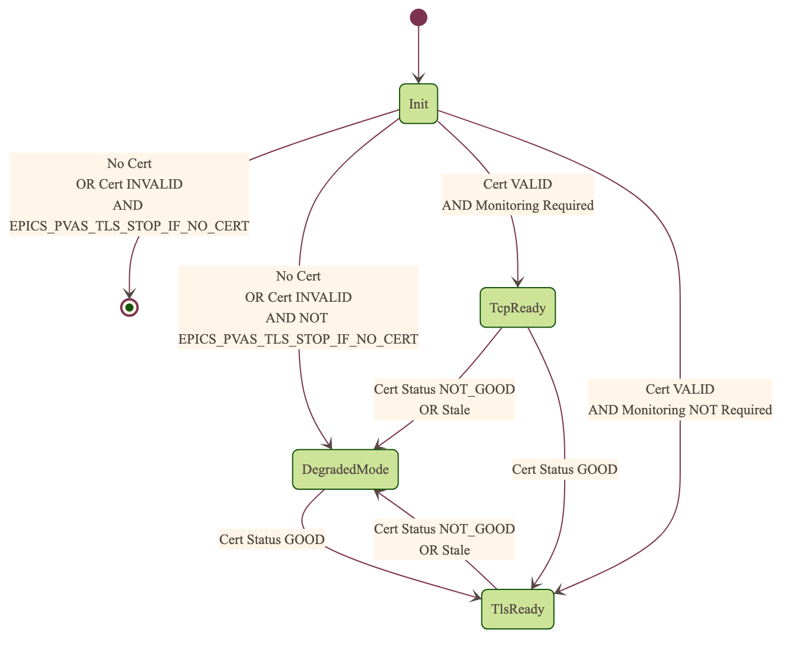
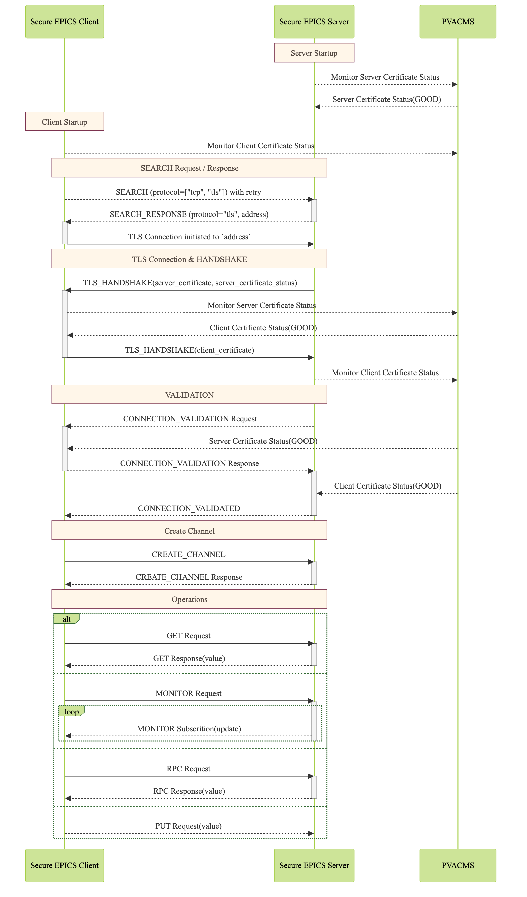

.. _secure_pvaccess:

|security| Secure PVAccess
============================

Secure PVAccess (SPVA) enhances the existing PVAccess protocol by integrating :ref:`transport_layer_security` (TLS)
with comprehensive :ref:`certificate_management`, enabling encrypted communication channels and authenticated connections
between EPICS clients and servers (EPICS agents) - see :ref:`authn_and_authz`.

For a glossary of terms see: :ref:`glossary`

Key Features:

- Encrypted communication using ``TLS 1.3``
- Certificate-based authentication
- Comprehensive certificate lifecycle management
- Backward compatibility with existing PVAccess deployments
- Integration with site authentication systems

Note: This release requires specific unmerged changes to epics-base.

See :ref:`quick_start` to get started.

.. _transport_layer_security:

Transport Layer Security
------------------------

``SPVA`` uses ``TLS 1.3`` to establish secure connections between EPICS agents. Both client and server
can authenticate their peer using ``X.509`` certificates. Key features of the TLS implementation:

- Mutual authentication when both peers present valid certificates
- Server-only authentication when only the server presents a certificate
- Fallback to ``TCP`` when ``TLS`` is not configured or certificates are invalid
- Certificate status verification during connection establishment

Supported Keychain-File Formats, Encodings and File Types
^^^^^^^^^^^^^^^^^^^^^^^^^^^^^^^^^^^^^^^^^^^^^^^^^^^^^^^^^

+-----------+----------------------+-----------+-------------------------+------------------------------+-------------------------+
| File Type | Extension            | Encoding  | Includes Private Key?   | Includes Certificate Chain?  |     Common Usage        |
+===========+======================+===========+=========================+==============================+=========================+
|| PKCS#12  || ``.p12``, ``.pfx``  || Binary   || Optional (password)    || Yes                         || Distributing cert key  |
+-----------+----------------------+-----------+-------------------------+------------------------------+-------------------------+

To use any of these formats just use the appropriate file extension when specifying the keychain file.

Unsupported Certificate Formats, Encodings and File Types
^^^^^^^^^^^^^^^^^^^^^^^^^^^^^^^^^^^^^^^^^^^^^^^^^^^^^^^^^

+-----------+----------------------+-----------+-------------------------+------------------------------+-------------------------+
| File Type | Extension            | Encoding  | Includes Private Key?   | Includes Certificate Chain?  |     Common Usage        |
+===========+======================+===========+=========================+==============================+=========================+
|| PEM      || ``.pem``, ``.crt``, || Base64   || Optional               || Optional (concatenated)     || Web servers, OpenSSL   |
||          || ``.cer``, ``.key``  ||          ||                        ||                             ||                        |
+-----------+----------------------+-----------+-------------------------+------------------------------+-------------------------+
|| JKS      || ``.jks``            || Binary   || Optional               || Yes                         || Java applications      |
+-----------+----------------------+-----------+-------------------------+------------------------------+-------------------------+

TLS encapsulation of the PVAccess protocol
^^^^^^^^^^^^^^^^^^^^^^^^^^^^^^^^^^^^^^^^^^

In network protocols, encapsulation is used to transport a higher layer protocol over a lower layer protocol, e.g., ``TCP`` over ``IP``.
In the context of TLS, PVAccess messages are encapsulated within ``TLS`` records for secure transport.

Encapsulation involves wrapping the higher-layer protocol's data within the lower-layer protocol's format.
TLS is so named because it wraps all data above the ``Transport Layer`` in an impermeable ``Security`` layer.
For SPVA, this means PVAccess messages are wrapped in TLS records that include headers specifying
content type, protocol version, and length, followed by the encrypted PVAccess data as the payload.

.. image:: pvaencapsulation.png
   :alt: TLS Encapsulation of PVAccess
   :align: center

Note: We use ``TLS version 1.3`` for Secure PVAccess. This version deprecates support for connection renegotiation which is a security risk. So any
connections that are established using Secure PVAccess will not be renegotiated but will be closed if a certificate is revoked or needs to be renewed

.. _environment_variables:

Environment Variables
^^^^^^^^^^^^^^^^^^^^^
The following environment variables control SPVA behavior:

.. note::

   There is an implied hierarchy to the applicability of the environment variables such that
   the PVAS version supersedes a PVA version.
   So, if an EPICS server agent wants to specify its keychain file location it can simply
   provide the ``EPICS_PVA_TLS_KEYCHAIN`` environment variable as long as
   ``EPICS_PVAS_TLS_KEYCHAIN`` is not configured.

+--------------------------+----------------------------+-------------------------------------+---------------------------------------------------------------+
| Name                     | Key                        | Value                               | Description                                                   |
+==========================+============================+=====================================+===============================================================+
| EPICS_PVA_CERT_PV_PREFIX | {string prefix for certificate management PVs}                   | This replaces the default ``CERT`` prefix.  Followed by       |
|                          | e.g. ``ORNL_CERTS``                                              | ``:STATUS:...``, ``:ROOT``, or ``:CREATE`` to form PV names   |
+--------------------------+------------------------------------------------------------------+---------------------------------------------------------------+
| EPICS_PVA_TLS_KEYCHAIN   | {fully qualified path  to keychain file}                         | This is the string that determines the fully qualified path   |
+--------------------------+                                                                  | to the keychain file that contains the certificate,           |
| EPICS_PVAS_TLS_KEYCHAIN  | e.g. ``~/.config/client.p12``,                                   | and private keys used in the TLS handshake.                   |
|                          | ``~/.config/server.p12``                                         | Note: If not specified then TLS is disabled                   |
+--------------------------+------------------------------------------------------------------+---------------------------------------------------------------+
| EPICS_PVA_TLS_KEYCHAIN   | {fully qualified path to keychain password file}                 | This is the string that determines the fully qualified path   |
| _PWD_FILE                |                                                                  | to a file that contains the password that unlocks the         |
+--------------------------+ e.g. ``~/.config/client.pass``,                                  | keychain file.  This is optional.  If not specified, the      |
| EPICS_PVAS_TLS_KEYCHAIN  | ``~/.config/server.pass``                                        | keychain file contents will not be encrypted. It is not       |
| _PWD_FILE                |                                                                  | recommended to not specify a password file.                   |
+--------------------------+----------------------------+-------------------------------------+---------------------------------------------------------------+
| EPICS_PVA_TLS_OPTIONS    | ``client_cert``            | ``optional`` (default)              | During TLS handshake require client certificate to be         |
|                          |                            |                                     | presented                                                     |
|                          | Determines whether client  +-------------------------------------+---------------------------------------------------------------+
| Sets the TLS options     | certificates are required  | ``require``                         | Don't require client certificate to be presented.             |
| for clients and servers. +----------------------------+-------------------------------------+---------------------------------------------------------------+
| A string containing      | ``on_expiration``          | ``fallback-to-tcp``  (default)      | For servers only tcp search requests will be responded to.    |
| key/value pairs          |                            |                                     | For clients then no client certificate will be presented      |
| separated by commas,     | Determines what to do when |                                     | in the TLS handshake (but searches will still offer both tls  |
| tabs or newlines         | an EPICS agent's           |                                     | and tcp as supported protocols)                               |
|                          | certificate has expired,   +-------------------------------------+---------------------------------------------------------------+
|                          | and a new one can't be     | ``shutdown``                        | The process will exit gracefully.                             |
|                          | automatically provisioned  +-------------------------------------+---------------------------------------------------------------+
|                          |                            | ``standby``                         | Servers will not respond to any requests until a new          |
|                          |                            |                                     | certificate is successfully provisioned.  It will keep        |
|                          |                            |                                     | retrying the keychain file periodically.  When a valid        |
|                          |                            |                                     | certificate is available it will continue as normal.          |
|                          |                            |                                     |                                                               |
|                          |                            |                                     | For a client standby has the same effect as shutdown.         |
|                          +----------------------------+-------------------------------------+---------------------------------------------------------------+
|                          | ``on_no_cms``              | ``fallback-to-tcp`` (default)       | If revocation status check is required but CMS cannot         |
|                          |                            |                                     | degrade connections to tcp mode                               |
|                          | Determines what to do when +-------------------------------------+---------------------------------------------------------------+
|                          | CMS is unavailable         | ``throw``                           | Otherwise throw an exception                                  |
|                          +----------------------------+-------------------------------------+---------------------------------------------------------------+
|                          | ``no_revocation_check``    |                                     | This flag, if present, disables certificate revocation status |
|                          |                            |                                     | monitoring meaning that this certificate will not be able to  |
|                          | Determines whether cert    |                                     | be revoked.                                                   |
|                          | status is monitored        |                                     | Default: revocation status monitoring is not disabled         |
|                          +----------------------------+-------------------------------------+---------------------------------------------------------------+
|                          | ``no_stapling``            | ``yes``, ``true``, ``1``            | Servers won't staple certificate status, clients won't        |
|                          |                            |                                     | request stapling information during TLS handshake             |
|                          | Determines whether         +-------------------------------------+---------------------------------------------------------------+
|                          | stapling is enabled        | ``no``, ``false``, ``0`` (default)  | Don't disable stapling                                        |
+--------------------------+----------------------------+-------------------------------------+---------------------------------------------------------------+
| EPICS_PVA_TLS_PORT       | {port number} default ``5076``                                   | This is a number that determines the port used for the Secure |
|                          |                                                                  | PVAccess, either as the port on the Secure PVAccess server    |
+--------------------------+ e.g. ``8076``                                                    | for clients to connect to - PVA, or as the local port number  |
| EPICS_PVAS_TLS_PORT      |                                                                  | for Secure PVAccess servers to listen on - PVAS.              |
+--------------------------+----------------------------+-------------------------------------+---------------------------------------------------------------+
| EPICS_PVAS_TLS_STOP      | ``yes``, ``true``, ``1``                                         | For servers only. Stop if no certificate is provided.         |
| _IF_NO_CERT.             +------------------------------------------------------------------+                                                               |
|                          | ``no``, ``false``, ``0`` (default)                               |                                                               |
+--------------------------+------------------------------------------------------------------+---------------------------------------------------------------+
| SSLKEYLOGFILE            | {fully qualified path to key log file}                           | This is the path to the SSL key log file that, in conjunction |
|                          |                                                                  | with the build-time macro `PVXS_ENABLE_SSLKEYLOGFILE`,        |
|                          | e.g. ``~/.config/keylog``                                        | controls where and whether we store the session key for TLS   |
|                          |                                                                  | sessions in a file.  If it is defined, then the code will     |
|                          |                                                                  | contain the calls to save the keys in the file specified      |
|                          |                                                                  | by this variable.                                             |
+--------------------------+------------------------------------------------------------------+---------------------------------------------------------------+

.. _configuration:

API Configuration Options
^^^^^^^^^^^^^^^^^^^^^^^^^

The following are new configuration options now available
in both the `pvxs::server::Config` and `pvxs::client::Config` classes,
via their public base `pvxs::impl::ConfigCommon` class:

- `pvxs::impl::ConfigCommon::expiration_behaviour` - Set certificate expiration behavior
- `pvxs::impl::ConfigCommon::tls_keychain_file` - Set keychain file path
- `pvxs::impl::ConfigCommon::tls_keychain_pwd` - Set keychain file password
- `pvxs::impl::ConfigCommon::tls_client_cert_required` - Control client certificate requirements
- `pvxs::impl::ConfigCommon::tls_disable_stapling` - Disable certificate status stapling
- `pvxs::impl::ConfigCommon::tls_disable_status_check` - Disable certificate status checking
- `pvxs::impl::ConfigCommon::tls_disabled` - Disable TLS
- `pvxs::impl::ConfigCommon::tls_port` - Set TLS port number
- `pvxs::impl::ConfigCommon::tls_throw_if_cant_verify` - Control verification failure behavior

Here are server-specific configuration options:

- `pvxs::server::Config::tls_stop_if_no_cert` - Stop server if certificate unavailable
- `pvxs::server::Config::tls_throw_if_no_cert` - Throw exception if certificate unavailable

API Additions for Secure PVAccess
^^^^^^^^^^^^^^^^^^^^^^^^^^^^^^^^^

Runtime Reconfiguration
~~~~~~~~~~~~~~~~~~~~~~~

Allows runtime reconfiguration of a TLS connection.  It does this by dropping all TLS connections and
then re-initialising them using the given configuration.  This means checking if the certificates
and keys exist, loading and verifying them, checking for status and status of peers, etc.

- `pvxs::client::Context::reconfigure` and
- `pvxs::server::Server::reconfigure`

Example of TLS configuration reconfiguration:

.. code-block:: c++

    // Initial client setup with certificate
    auto cli_conf(serv.clientConfig());
    cli_conf.tls_keychain_file = "client1.p12";
    auto cli(cli_conf.build());

    // Later reconfiguration with new certificate
    cli_conf = cli.config();
    cli_conf.tls_keychain_file = "client2.p12";
    cli_conf.tls_keychain_pwd = "pwd";
    cli.reconfigure(cli_conf);

Wildcard PV Support
~~~~~~~~~~~~~~~~~~~

This addition is based on the Wildcard PV support included in epics-base since version 3.  It
extends this support to pvxs allowing PVs to be specified as wildcard patterns.  We use this
to provide individualised PVs for each certificate's status management.

- `pvxs::server::SharedWildcardPV`

Example of support for pattern-matched PV names:

.. code-block:: c++

    // Define a server that responds to any SEARCH request with WILDCARD:PV:<4-characters>:<any-string>
    // It will extract the 4-character part of the PV name as the `id` and
    // the last string as the `name`

    SharedWildcardPV wildcard_pv(SharedWildcardPV::buildMailbox());
    wildcard_pv.onFirstConnect( {
        // Extract id and name from parameters
        auto it = parameters.begin();
        const std::string &id = *it;
        const std::string &name = *++it;

        // Process and post value
        if (pv.isOpen(pv_name)) {
            pv.post(pv_name, value);
        } else {
            pv.open(pv_name, value);
        }
    });
    wildcard_pv.onLastDisconnect( {
        pv.close(pv_name);
    });

    // Add wildcard PV to server
    serv.addPV("WILDCARD:PV:????:*", wildcard_pv);

.. _protocol_operation:

Protocol Operation
------------------

.. _connection_establishment:

Connection Establishment
^^^^^^^^^^^^^^^^^^^^^^^^

Connections are established using TLS if at least the server side is configured for TLS.

Prior to the TLS handshake:

- Certificates are loaded and validated
- Certificate authority trust is verified all the way down the chain
- Both sides subscribe to certificate status where configured for their own certificate and all those in the chain
- All certificate statues are cached

During the TLS handshake:

- Certificates are exchanged
- Servers staple cached certificate status in handshake
- Both sides validate and verify their peer certificate against trusted root certificates

After the TLS handshake:

- Both sides subscribe to peer certificate status where configured
- Clients may use stapled server certificate status

Connection Types
^^^^^^^^^^^^^^^^

There are three types of possible connections

- tcp / tcp : TCP only connection, legacy ``ca``
- tcp / tls : server-only authenticated TLS
- tls / tls : mutually authenticated TLS

If an EPICS agent finds a certificate, trust anchor, and private key at the location specified by ``EPICS_PVA_TLS_KEYCHAIN`` then it will use that certificate for the handshake.
This includes the default location that the variable points to even if its is not set.

- ``~/.config/pva/1.3/client.p12`` - for clients
- ``~/.config/pva/1.3/server.p12`` - for servers

For a server-only authenticated TLS connection two things are required:

- The server must be configured to allow server-only authenticated TLS connections by setting the ``EPICS_PVA_TLS_OPTIONS`` option ``client_cert`` to ``optional``
- The client must have a keychain file containing a trust anchor alone, at the location specified by ``EPICS_PVA_TLS_KEYCHAIN``.
  - The p12 file can be created using ``authnstd`` with the ``-t`` option.

.. _state_machines:

State Machines
^^^^^^^^^^^^^^

*Server TLS Context State:*

The state transitions based on:

- Certificate validity and configuration
- Certificate status monitoring results
- :ref:`configuration` options (e.g., ``EPICS_PVAS_TLS_STOP_IF_NO_CERT``)

States:

- ``Init``: Initial state, loads and validates certificates
- ``TcpReady``: Responds to TCP protocol requests when certificates are valid
- ``TlsReady``: Responds to both TCP and TLS protocol requests
- ``DegradedMode``: Fallback state for invalid certificates, missing TLS configuration, or revoked certificates

*Client TLS Context State:*

Similar to server but with key differences:

- Never exits on TLS configuration issues
- Trust Anchor validation affects initial state transitions

States:

- ``Init``: Initial state, loads and validates certificates
- ``TcpReady``: Responds to TCP protocol requests when certificates are valid
- ``TlsReady``: Responds to both TCP and TLS protocol requests
- ``DegradedMode``: Fallback state for invalid certificates, missing TLS configuration, or revoked certificates

*Peer Certificate Status State Machine:*

Shows the possible states and transitions for a peer's certificate status.
Applies equally to EPICS Clients, and Servers.

States:

- ``UNKNOWN``: Initial state before status is determined
- ``GOOD``: Certificate is valid and trusted
- ``NOT GOOD``: Certificate is not currently trusted

Pseudo States:

- ``STALE``: Status information is outdated.  State transitions immediately to UNKNOWN
- ``REVOKED``: Certificate has been permanently revoked. No way back from this status
- ``EXPIRED``: Certificate has passed its validity period. No way back from this status

State transitions occur based on:

- Subscribed-to status updates from PVACMS
    - Certificate expiration
    - Certificate revocation
- PVACMS availability

.. _tls_handshake:

PVAccess Sequence Diagram
~~~~~~~~~~~~~~~~~~~~~~~~~

The following diagram shows the PVAccess connection establishment sequence:

Secure PVAccess Sequence Diagram
~~~~~~~~~~~~~~~~~~~~~~~~~~~~~~~~

The following diagram shows how the Secure PVAccess protocol establishes a secure connection between an EPICS client and server:

Click for a detailed diagram `with <_images/h_spva_seq.png>`_
or `without <_images/h_tls_seq.png>`_ certificate status monitoring

1. Each agent uses an ``X.509`` certificate for peer authentication

   - Certificate is verified against own trust anchor (stored in same keychain file as certificate)
   - Multiple certificates may be verified in the chain to trust anchor
   - Verification checks the signature, expiration, and usage flags
   - If certificate is configured for status monitoring, subscribes to status updates from PVACMS
   - Certificate status is verified and cached

2. During handshake:

   - Certificates are exchanged
   - Both sides verify peer certificates against their own trust anchor
   - Multiple peer certificates may be verified in the chain to own trust anchor
   - Verification checks the signature, expiration, and usage flags
   - If peer certificate is configured for status monitoring, subscribes to status updates from PVACMS
   - Peer certificate status is verified and cached
   - Server may staple its own certificate status in handshake
   - Client may use stapled status immediately, instead of waiting for status monitoring results

3. SPVA certificates may include status monitoring extension requiring:

   - Subscription to certificate status from issuing Certificate Authority's service (:ref:`pvacms`)
   - Receipt of ``GOOD`` status before trust

4. Agents subscribe to:

   - Own certificate status
   - Peer's certificate status

5. Servers cache and staple certificate status in handshake

.. _status_verification:

Certificate Status Verification
^^^^^^^^^^^^^^^^^^^^^^^^^^^^^^^

Certificate Status received from the PVACMS for a certificate returns a ``GOOD`` status
if, and only if,

- the certificate status is GOOD and
- so is that of its trust anchor certificate chain
- all the way back to the root certificate

In this way agents need monitor only their own entity certificate and that of their peer.

Certificate status verification occurs at several points:

1. Initial Connection

   - Certificates are verified during TLS handshake
   - Both peers verify against a trusted root certificate that they have loaded from their own keychain file
   - Basic checks include:

     - Signature validation
     - Expiration dates
     - Usage flags

2. Runtime Monitoring

   - EPICS agents subscribe to:

     - Their own certificate status
     - Peer entity certificate status

3. Status Response Handling

   - If status not received:

     - Search requests are ignored
     - Client retries later

   - If status not ``GOOD``:

     - Server offers only TCP protocol
     - Client fails connection validation

   - If status ``GOOD``:

     - Server offers both TCP and TLS
     - Connection proceeds normally

4. Optimization

   - Servers cache status for stapling
   - Clients can use stapled status
   - Reduces initial :ref:`pvacms` requests

.. _status_caching:

Status Caching
^^^^^^^^^^^^^^

- Agents subscribe to peer certificate status
- Status transitions trigger connection status re-evaluation
- Cached status are reused within validity period to reduce :ref:`pvacms` requests
- Servers staple cached status in handshake
- Clients may skip initial :ref:`pvacms` request using stapled status

Beacons
^^^^^^^

PVAccess Beacon Messages have not been upgraded to TLS support. Important considerations:

1. Historical Use:
   - Previously used to trigger resend of unanswered Search Messages
   - This practice is now discouraged
   - Other methods should be used to determine server status

2. Current Behavior:
   - Servers broadcast on any configured port
   - Clients should not use ports directly
   - Use only as server availability indicator

3. Security Implications:
   - Beacons remain unencrypted
   - Do not contain sensitive information
   - Cannot be used for secure discovery

.. _protocol_debugging:

Protocol Debugging
------------------

TLS Packet Inspection
^^^^^^^^^^^^^^^^^^^^^

For detailed TLS traffic analysis:

1. Enable key logging at build time:

   - Set PVXS_ENABLE_SSLKEYLOGFILE during compilation

2. Configure runtime logging:

.. code-block:: shell

    export SSLKEYLOGFILE=/tmp/sslkeylog.log

3. Configure Wireshark:

   - Edit > Preferences > Protocols > TLS
   - Set "(Pre)-Master-Secret log filename" to match SSLKEYLOGFILE path
   - TLS traffic will now be decrypted in Wireshark

Debug Logging
^^^^^^^^^^^^^

Enable detailed PVXS debug logging:

1. Environment variable method:

.. code-block:: shell

    export PVXS_LOG="pvxs.stapling*=DEBUG"

New Debug Categories:

- ``pvxs.certs.auth``          - Authenticators
- ``pvxs.auth.cfg``            - Authn configuration
- ``pvxs.auth.cms``            - CMS
- ``pvxs.auth.jwt``            - JWT Authenticator
- ``pvxs.auth.krb``            - Kerberos Authenticator
- ``pvxs.auth.mon``            - Certificate Status Monitoring
- ``pvxs.auth.stat``           - Certificate Status
- ``pvxs.auth.std``            - Standard Authenticator
- ``pvxs.auth.tool``           - Certificate Management Tools (``pvacert``)
- ``pvxs.certs.status``        - Certificate Status Management
- ``pvxs.ossl.init``           - TLS initialization
- ``pvxs.ossl.io``             - TLS I/O
- ``pvxs.stapling``            - OCSP stapling

.. _network_deployment:

Network Deployment
------------------

Deployment Patterns
^^^^^^^^^^^^^^^^^^^

1. Standard Network Deployment

   - Agents run on networked hosts with local storage
   - Certificates stored in local protected directories
   - Standard TLS configuration applies

2. Diskless Network Deployment

   - Agents run on hosts without local storage
   - Certificates stored on network-mounted storage
   - Special considerations for certificate protection

3. Hybrid Deployment

   - Mix of standard and diskless nodes
   - Common trust anchor required
   - Consistent :ref:`certificate_management` across node types

Keychain-File Storage
^^^^^^^^^^^^^^^^^^^^^

Standard Nodes:

- `XDG_CONFIG_HOME <https://specifications.freedesktop.org/basedir-spec/latest/>`_ standard is used by default to locate keychain files for clients and servers

  - default, if not set, is ``~/.config``
  - we append ``/pva/1.3/`` to make the full path default to ``~/.config/pva/1.3/``
  - client keychain files are, by default, ``client.p12``
  - server keychain files are, by default, ``server.p12``

- Store certificates in local protected directory

  - keychain files contain
    - the certificate
    - the private key
    - the certificate authority chain including the root certificate

  - the files are protected with ``400`` so that only the owner can read

- Automatic reconfiguration on certificate updates

Diskless Nodes:

- Use network-mounted storage (NFS, SMB/CIFS, AFP)
- Protected certificate storage location
- Optional password protection via diskless server

Trust Establishment
^^^^^^^^^^^^^^^^^^^

1. Trust Anchor Distribution:

   - Administrators must distribute PKCS#12 files containing the Root Certificate Authority certificate to all clients
   - These files must be stored at the location pointed to by EPICS_PVA_TLS_KEYCHAIN or equivalent
   - These files are replaced with any new certificates that are generated for the user but
     the trust anchor certificate is preserved
   - Use of publicly signed trust anchor certificates is not supported at present

2. Trust Anchor Distribution with Authenticators:

   - The trust anchor certificate is delivered with the entity certificate.
   - Users must verify that the issuer of the certificate matches the Root Certificate Authority they are expecting.
   - To control the selection of PVACMS service and thus the trust anchor certificate, users verify their PVAccess configuration.

      -  ``EPICS_PVA_ADDR_LIST``
      -  ``EPICS_PVA_AUTO_ADDR_LIST``

   - Consistent across all deployment types

3. Getting Trust Anchor from PVACMS

   - Use ``authnstd`` to get the trust anchor certificate from PVACMS
   - The p12 file created can be used by a client to create a server-only authenticated TLS connection

.. code-block:: shell

    # Get the trust anchor certificate from PVACMS and save to the location specified by ``EPICS_PVA_TLS_KEYCHAIN``
    authnstd --trust-anchor

    # Get the trust anchor certificate from PVACMS and save to the location specified by ``EPICS_PVAS_TLS_KEYCHAIN``
    authnstd -u server -a

4. Certificate Authority = Trust Anchor

   - :ref:`pvacms` serves as site Certificate Authority
   - Common trust anchor for all nodes
   - Handles certificate lifecycle management

