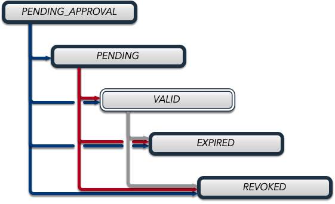

.. _certificate_management:

|security| Cert Management
===========================

.. _certificates_and_private_keys:

Public and Private Keys
-----------------------------------

EPICS Agents maintain public/private key pairs for identification:

- Public key identifies agent to peers (shorthand representation: 8-character SKID)
- Private key must be protected like a password
- The Key pair are stored in the keychain file.
- If the referenced keychain file does not contain a key pair then any of the authnxxx tools will automatically generate a new key pair and store it in the keychain file.
- Once a key pair has been established, it will be reused for each certificate request.

Identity Assertion Process:

1. Each peer presents a certificate
2. Each peer signs some data with his private key
3. Peer verifies signature using the public key in the certificate
4. Peer validates certificate by checking the signature and the certificate chain of trust.
5. The chain of trust is validated back to the Peer's own Trust Anchor (Root Certificate Authority).
6. The peer's identity is confirmed through successful verification

Key Security:

- Keeping a private key secure is critical
- Store it in a keychain file that is not accessible by other users or programs
- Use separate keychain files for each certificate

Trust Establishment
--------------------------------

Secure PVAccess relies on each EPICS agent having a copy of the Root Certificate Authority certificate in
a referenced keychain file so that it can verify certificates presented to it by other agents.

If a peer presents a certificate that is not signed by a certificate authority that is trusted by the
agent, the agent will reject the certificate.

Even if the EPICS client does not want its own certificate it must still have a copy of the Root Certificate Authority.
This copy is referred to in this document as the ``Trust Anchor``.

1. Trust Anchor Distribution:

   - Administrators must distribute PKCS#12 files containing the Root certificate to all clients
   - These files must be stored at the location pointed to by EPICS_PVA_TLS_KEYCHAIN or equivalent

Certificates
-----------------------------------

A certificate is the document that is exchanged with a peer that identifies an agent.  It contains the name of the agent (subject) and the public key of the agent so that the peer can verify the agent's identity.

- A certificate is not private.  It can safely be shared with any peer.

  - Care must be taken when sharing a certificate as it is stored in the same file as the private key. Do not share the keychain file with others.

- A certificate is valid for a specific period of time.
- A certificate can be revoked by an administrator (if the status monitoring extension is addded to the certificate - by default it is)

Certificate Attributes
----------------------

The following attributes are used to describe a certificate:

- ``subject``: The entity to which the certificate was issued

  - ``name``: The common name of the entity to which the certificate was issued. Username, application name, or other identifier.
  - ``organization``: The organization of the entity to which the certificate was issued.  Hostname, institution, domain, realm, etc.
  - ``organizational unit``: The organizational unit of the entity to which the certificate was issued.  Optional.
  - ``country``: The country of the entity to which the certificate was issued.  Two letter country code. Default `US`.

- ``issuer``: The certificate authority that issued the certificate
- ``serial number``: A unique serial number for the certificate
- ``validity period``: The period of time for which the certificate is valid

  - ``notBefore``: The date and time before which the certificate is not valid.
  - ``notAfter``: The date and time after which the certificate is not valid.

- ``public key``: The public key of the entity to which the certificate was issued
- ``private key``: The private key of the entity to which the certificate was issued.  This is not stored in the certificate but it is stored in the keychain file.
- ``SPVA certificate status extension``: A string representing the PV name where the certificate status can be monitored.
- ``SPVA config uri extension``: A string representing the PV name where the certificate configuration can be monitored.

Certificate States
----------------------

- ``PENDING_APPROVAL``: Certificate awaiting administrative approval
- ``PENDING``: Certificate not yet valid (before notBefore date)
- ``VALID``: Certificate currently valid and usable
- ``EXPIRED``: Certificate expired (after notAfter date)
- ``REVOKED``: Certificate permanently revoked by administrator

.. _certificate_status_message:

Certificate Status Message
--------------------------------

Status response structure:

.. code-block:: console

    Structure
        enum_t     status               # PENDING_APPROVAL, PENDING, VALID, EXPIRED, REVOKED
        UInt64     serial               # Certificate serial number
        string     state                # String representation of status
        enum_t     ocsp_status          # GOOD, REVOKED, UNKNOWN
        string     ocsp_state           # OCSP state string
        string     ocsp_status_date     # Status timestamp
        string     ocsp_certified_until # Validity period end
        string     ocsp_revocation_date # Revocation date if applicable
        UInt8A     ocsp_response        # Signed PKCS#7 encoded OCSP response

.. _certificate_creation_request_CCR:

Certificate Creation Request (CCR)
------------------------------------------

This message is sent to :ref:`pvacms` to create a new certificate. It is a PVStructure with the following fields:

Request structure:

.. code-block:: console

    Structure
        string     type               # std, krb, ldap, jwt
        string     name               # Certificate subject name
        string     country            # Optional: Country code
        string     organization       # Optional: Organization name
        string     organization_unit  # Optional: Unit name
        UInt16     usage              # Certificate usage flags:
                                        #   0x01: Client
                                        #   0x02: Server
                                        #   0x03: Client and Server
                                        #   0x04: Intermediate Certificate Authority
                                        #   0x08: CMS
                                        #   0x0A: Any Server
                                        #   0x10: Certificate Authority
        UInt32     not_before         # Validity start time (epoch seconds)
        UInt32     not_after          # Validity end time (epoch seconds)
        string     pub_key            # Public key data
        enum_t     status_monitoring_extension  # Include status monitoring
        structure  verifier           # Optional: Authenticator specific data

The ``verifier`` sub-structure is only present if the ``type`` field references a
 :ref:`pvacms_type_1_auth_methods`, or :ref:`pvacms_type_2_auth_methods` Authenticator.

Certificate Management Operations
---------------------------------------

``pvacert`` can be used to `APPROVE`, `DENY`, and `REVOKE` certificates as follows.

Approval:

.. code-block:: shell

    pvxcert -A <certid>    # Approve certificate

Denial:

.. code-block:: shell

    pvxcert -D <certid>    # Deny certificate (sets REVOKED)

Revocation:

.. code-block:: shell

    pvxcert -R <certid>    # Permanently revoke certificate

It achieves this by using `PUT` to send a PVStructure with the following fields, to :ref:`pvacms`
on the PV associated with the certificate:

.. code-block:: console

    Structure
        string     state    # APPROVE, DENY, REVOKE

Certificate Management Tools
-----------------------------------

pvxcert
----------

.. code-block:: console

    Certificate management utility for PVXS

    Gets the STATUS of a certificate, REVOKES a certificate, or APPROVES or DENIES a pending certificate approval.

      Get certificate status from serial number: The certificate ID is specified as <issuer>:<serial>,
      where <issuer> is the first 8 hex digits of the subject key identifier of the issuer and <serial>
      is the serial number of the certificate. e.g. 27975e6b:7246297371190731775.

      Get certificate status from keychain file: The keychain file must be a PKCS#12 file.

      APPROVAL and DENIAL of pending certificate approval requests: Can only be made by administrators.

      REVOCATION of a certificate: Can only be made by an administrator.

    usage:
      pvxcert [options] <cert_id> Get certificate status
      pvxcert [file_options] [options] (-f | --file) <cert_file>
                                                 Get certificate information from the specified cert file
      pvxcert [options] (-A | --approve) <cert_id>
                                                 APPROVE pending certificate approval request (ADMIN ONLY)
      pvxcert [options] (-D | --deny) <cert_id>  DENY pending certificate approval request (ADMIN ONLY)
      pvxcert [options] (-R | --revoke) <cert_id>
                                                 REVOKE certificate (ADMIN ONLY)
      pvxcert (-h | --help)                      Show this help message and exit
      pvxcert (-V | --version)                   Print version and exit

    file_options:
      (-p | --password)                          Prompt for password

    options:
      (-w | --timeout) <timout_secs>             Operation timeout in seconds.  Default 5.0s
      (-d | --debug)                             Debug mode: Shorthand for $PVXS_LOG="pvxs.*=DEBUG"
      (-v | --verbose)                           Verbose mode

Key Operations:

- Check certificate status
- Approve/deny ``PENDING_APPROVAL`` certificates (admin)
- Revoke certificates in any state (admin/self)

Certificate Usage
----------------------

Network clients can request new certificates from :ref:`pvacms` using their public key. The process:

1. Generate key pair
2. Submit certificate request
3. Receive signed certificate
4. Install in configured location

.. _pvacms:

PVACMS
---------

The :ref:`pvacms` is the Certificate Authority Service for the EPICS Secure PVAccess Network.

.. _pvacms_usage:

PVACMS Usage
^^^^^^^^^^^^

.. code-block:: console

    PVACMS: PVAccess Certificate Management Service

    Manages Certificates for a Secure PVAccess network.  The Certificate Authority.  Handles Create
    and Revoke requests.  Manages Certificate lifecycles and provides live OCSP certificate status.

    Also can be used to re-generate the admin certificate that is required to administer the certificates.

    usage:
      pvacms [admin options] [options]           Run PVACMS.  Interrupt to quit
      pvacms (-h | --help)                       Show this help message and exit
      pvacms (-V | --version)                    Print version and exit
      pvacms [admin options] --admin-keychain-new <new_name>
                                                 Generate a new Admin User's keychain file, update the ACF file, and exit

    options:
      (-c | --cert-auth-keychain) <cert_auth_keychain>
                                                  Specify Certificate Authority keychain file location. Default ${XDG_CONFIG_HOME}/pva/1.3/cert_auth.p12
            --cert-auth-keychain-pwd <file>       Specify location of file containing Certificate Authority keychain file's password
            --cert-auth-name <name>              Specify name (CN) to be used for certificate authority certificate. Default ``EPICS Root Certificate Authority``
            --cert-auth-org <name>               Specify organisation (O) to be used for certificate authority certificate. Default ``certs.epics.org``
            --cert-auth-org-unit <name>          Specify organisational unit (OU) to be used for certificate authority certificate. Default ``EPICS Certificate Authority``
            --cert-auth-country <name>           Specify country (C) to be used for certificate authority certificate. Default `US`
      (-d | --cert-db) <db_name>                 Specify cert db file location. Default ${XDG_DATA_HOME}/pva/1.3/certs.db
      (-p | --pvacms-keychain) <pvacms_keychain> Specify PVACMS keychain file location. Default ${XDG_CONFIG_HOME}/pva/1.3/pvacms.p12
            --pvacms-keychain-pwd <file>         Specify location of file containing PVACMS keychain file's password
            --pvacms-name <name>                  Specify name (CN) to be used for PVACMS certificate. Default `PVACMS Service`
            --pvacms-org <name>                   Specify organisation (O) to be used for PVACMS certificate. Default ``certs.epics.org``
            --pvacms-org-unit <name>              Specify organisational unit (OU) to be used for PVACMS certificate. Default ``EPICS PVA Certificate Management Service``
            --pvacms-country <name>               Specify country (C) to be used for PVACMS certificate. Default US
            --client-dont-require-approval        Generate Client Certificates in VALID state
            --ioc-dont-require-approval           Generate IOC Certificates in VALID state
            --server-dont-require-approval        Generate Server Certificates in VALID state
            --certs-dont-require-approval         Generate All Certificates in VALID state
            --cert_validity-client <duration>     Default duration for client certificates
            --cert_validity-server <duration>     Default duration for server certificates
            --cert_validity-ioc <duration>        Default duration for IOC certificates
            --cert_validity <duration>            Default duration for all certificates
            --disallow-custom-durations-client    Disallow custom durations for client certificates
            --disallow-custom-durations-server    Disallow custom durations for server certificates
            --disallow-custom-durations-ioc       Disallow custom durations for IOC certificates
            --disallow-custom-durations           Disallow custom durations
            --status-monitoring-enabled <YES|NO>  Require Peers to monitor Status of Certificates Generated by this
                                                  server by default. Can be overridden in each CCR
            --status-validity-mins                Set Status Validity Time in Minutes
      (-v | --verbose)                            Verbose mode

    admin options:
            --acf <acf_file>                      Specify Admin Security Configuration File. Default ${XDG_CONFIG_HOME}/pva/1.3/pvacms.acf
      (-a | --admin-keychain) <admin_keychain>    Specify Admin User's keychain file location. Default ${XDG_CONFIG_HOME}/pva/1.3/admin.p12
            --admin-keychain-pwd <file>          Specify location of file containing Admin User's keychain file password

.. _pvacms_configuration:

PVACMS Configuration
^^^^^^^^^^^^^^^^^^^^^

The environment variables in the following table configure the :ref:`pvacms` at runtime.

.. note::

   There is also an implied hierarchy to their applicability such that :ref:`pvacms`
   supersedes the PVAS version which in turn, supersedes the PVA version.
   So, if a :ref:`pvacms` wants to specify its keychain file location it can simply
   provide the ``EPICS_PVA_TLS_KEYCHAIN`` environment variable as long as neither
   ``EPICS_PVACMS_TLS_KEYCHAIN`` nor ``EPICS_PVAS_TLS_KEYCHAIN`` are configured.

+--------------------------+--------------------------------------------+--------------------------------------------------------------------------+
| Name                     | Keys and Values                            | Description                                                              |
+==========================+============================================+==========================================================================+
|| EPICS_ADMIN_TLS         || <path to ADMIN user keychain file>        || The location of the :ref:`pvacms` ADMIN user keychain file.             |
|| _KEYCHAIN               || e.g. ``~/.config/pva/1.3/admin.p12``      ||                                                                         |
+--------------------------+--------------------------------------------+--------------------------------------------------------------------------+
|| EPICS_ADMIN_TLS         || <path to ADMIN user password text file>   || Location of a password file for :ref:`pvacms` ADMIN user keychain file. |
|| _KEYCHAIN_PWD_FILE      || e.g. ``~/.config/pva/1.3/admin.pass``     ||                                                                         |
+--------------------------+--------------------------------------------+--------------------------------------------------------------------------+
|| EPICS_CERT_AUTH_NAME    || <name of the certificate authority>       || To provide the name (CN) to be used in the subject of the               |
||                         || e.g. ``Epics Root Certificate Authority`` || certificate authority's Certificate if :ref:`pvacms` creates it.        |
||                         ||                                           || default: "EPICS Root Certificate Authority"                             |
+--------------------------+--------------------------------------------+--------------------------------------------------------------------------+
|| EPICS_CERT_AUTH         || <certificate authority organisation name> || To provide the name (O) to be used in the subject of the certificate    |
|| _ORGANIZATION           || e.g. ``certs.epics.org``                  || authority's certificate if :ref:`pvacms` creates it.                    |
||                         ||                                           || default: "cert.authority.epics.org"                                     |
+--------------------------+--------------------------------------------+--------------------------------------------------------------------------+
|| EPICS_CERT_AUTH         || <certificate authority org unit name>     || To provide the name (OU) to be used in the subject of the Certificate   |
|| _ORGANIZATIONAL_UNIT    || e.g. ``EPICS Certificate Authority``      || Authority's certificate if :ref:`pvacms` creates it.                    |
||                         ||                                           || default: "EPICS Certificate Authority"                                  |
+--------------------------+--------------------------------------------+--------------------------------------------------------------------------+
|| EPICS_CERT_AUTH         || <certificate authority keychain file>     || fully qualified path to a file that will be used as the                 |
|| _TLS_KEYCHAIN           || e.g.                                      || certificate authority keychain file.                                    |
||                         || ``~/.config/pva/1.3/cert_auth.p12``       ||                                                                         |
+--------------------------+--------------------------------------------+--------------------------------------------------------------------------+
|| EPICS_CERT_AUTH_        || <certificate authority password file>     || fully qualified path to a file that will be used as the                 |
|| TLS_KEYCHAIN_PWD_FILE   || e.g. ``~/.config/pva/1.3/cert_auth.pass`` || certificate authority keychain password file.                           |
+--------------------------+--------------------------------------------+--------------------------------------------------------------------------+
|| EPICS_PVACMS_ACF        || <path to ACF file>                        || fully qualified path to a file that will be used as the                 |
||                         || e.g. ``~/.config/pva/1.3/pvacms.acf``     || ACF file that configures the permissions of :ref:`pvacms` peers.        |
+--------------------------+--------------------------------------------+--------------------------------------------------------------------------+
|| EPICS_PVACMS_CERT       || <number of minutes>                       || Minutes that the ocsp status response will                              |
|| _STATUS_VALIDITY_MINS   || e.g. ``30`` or ``1d``                     || be valid before a client must re-request an update                      |
+--------------------------+--------------------------------------------+--------------------------------------------------------------------------+
|| EPICS_PVACMS_CERTS      || {``true`` (default) or ``false``}         || ``true`` if we require peers to                                         |
|| _REQUIRE_SUBSCRIPTION   ||                                           || subscribe to certificate status for certificates to                     |
||                         ||                                           || be deemed VALID. Adds extension to new certificates                     |
+--------------------------+--------------------------------------------+--------------------------------------------------------------------------+
|| EPICS_PVACMS_DB         || <path to DB file>                         || fully qualified path to a file that will be used as the                 |
||                         || e.g. ``~/.local/share/pva/1.3/certs.db``  || Certificate database file.                                              |
+--------------------------+--------------------------------------------+--------------------------------------------------------------------------+
|| EPICS_PVACMS_REQUIRE    || {``true`` (default) or ``false`` }        || ``true`` if server should generate all new certificates in the          |
|| _APPROVAL               ||                                           || ``PENDING_APPROVAL`` state ``false`` to generate in the ``VALID`` state |
+--------------------------+--------------------------------------------+--------------------------------------------------------------------------+
|| EPICS_PVACMS_REQUIRE    || {``true`` (default) or ``false`` }        || ``true`` if server should generate new client certificates in the       |
|| _CLIENT_APPROVAL        ||                                           || ``PENDING_APPROVAL`` state ``false`` to generate in the ``VALID`` state |
+--------------------------+--------------------------------------------+--------------------------------------------------------------------------+
|| EPICS_PVACMS_REQUIRE    || {``true`` (default) or ``false`` }        || ``true`` if server should generate new IOC certificates in the          |
|| _IOC_APPROVAL           ||                                           || ``PENDING_APPROVAL`` state ``false`` to generate in the ``VALID`` state |
+--------------------------+--------------------------------------------+--------------------------------------------------------------------------+
|| EPICS_PVACMS_REQUIRE    || {``true`` (default) or ``false`` }        || ``true`` if server should generate new server certificates in the       |
|| _SERVER_APPROVAL        ||                                           || ``PENDING_APPROVAL`` state ``false`` to generate in the ``VALID`` state |
+--------------------------+--------------------------------------------+--------------------------------------------------------------------------+
|| EPICS_PVACMS_DISALLOW   || {``true`` (default) or ``false`` }        || ``true`` if client provided certificate durations should be ignored     |
|| _CUSTOM_DURATION        ||                                           ||                                                                         |
+--------------------------+--------------------------------------------+--------------------------------------------------------------------------+
|| EPICS_PVACMS_DISALLOW   || {``true`` (default) or ``false`` }        || ``true`` if client provided certificate durations should be ignored     |
|| _CLIENT_CUSTOM_DURATION ||                                           || for Client certificate requests                                         |
+--------------------------+--------------------------------------------+--------------------------------------------------------------------------+
|| EPICS_PVACMS_DISALLOW   || {``true`` (default) or ``false`` }        || ``true`` if client provided certificate durations should be ignored     |
|| _IOC_CUSTOM_DURATION    ||                                           || for IOC certificate requests                                            |
+--------------------------+--------------------------------------------+--------------------------------------------------------------------------+
|| EPICS_PVACMS_DISALLOW   || {``true`` (default) or ``false`` }        || ``true`` if client provided certificate durations should be ignored     |
|| _SERVER_CUSTOM_DURATION ||                                           || for Server certificate requests                                         |
+--------------------------+--------------------------------------------+--------------------------------------------------------------------------+
|| EPICS_PVACMS_CERT       || <duration of the certificate>             || The duration of the certificate.  All certificates will be              |
|| _VALIDITY               || e.g. ``30`` or ``1d``  or ``1y6M``        || generated with this amount of time unless overridden                    |
+--------------------------+--------------------------------------------+--------------------------------------------------------------------------+
|| EPICS_PVACMS_CERT       || <duration of the certificate>             || The duration of the certificate.  All Client certificates will be       |
|| _VALIDITY_CLIENT        || e.g. ``30`` or ``1d``  or ``1y6M``        || generated with this amount of time unless overridden                    |
+--------------------------+--------------------------------------------+--------------------------------------------------------------------------+
|| EPICS_PVACMS_CERT       || <duration of the certificate>             || The duration of the certificate.  All IOC certificates will be          |
|| _VALIDITY_IOC           || e.g. ``30`` or ``1d``  or ``1y6M``        || generated with this amount of time unless overridden                    |
+--------------------------+--------------------------------------------+--------------------------------------------------------------------------+
|| EPICS_PVACMS_CERT       || <duration of the certificate>             || The duration of the certificate.  All Server certificates will be       |
|| VALIDITY_SERVER         || e.g. ``30`` or ``1d``  or ``1y6M``        || generated with this amount of time unless overridden                    |
+--------------------------+--------------------------------------------+--------------------------------------------------------------------------+
|| EPICS_PVACMS_TLS        || <path to keychain file>                   || The location of the :ref:`pvacms` keychain file.                        |
|| _KEYCHAIN               || e.g. ``~/.config/pva/1.3/pvacms.p12``     ||                                                                         |
+--------------------------+--------------------------------------------+--------------------------------------------------------------------------+
|| EPICS_PVACMS_TLS        || <path to password text file>              || Location of a password file for :ref:`pvacms` keychain file.            |
|| _KEYCHAIN_PWD_FILE      || e.g. ``~/.config/pva/1.3/pvacms.pass``    ||                                                                         |
+--------------------------+--------------------------------------------+--------------------------------------------------------------------------+
|| EPICS_PVACMS_TLS        || {``true`` or ``false`` (default) }        || ``true`` if server should stop if no cert is available or can be        |
|| _STOP_IF_NO_CERT        ||                                           || verified if status check is enabled                                     |
+--------------------------+--------------------------------------------+--------------------------------------------------------------------------+

Extensions to Config for PVACMS
^^^^^^^^^^^^^^^^^^^^^^^^^^^^^^^^^

- `cert_status_validity_mins`
    - The number of minutes that the certificate status is valid for.
    - Default: 30
- `cert_client_require_approval`
    - If ``true`` then authstd (Standard Authenticator) generated client certificates must be approved before they can be used.
    - Default: ``true``
- `cert_server_require_approval`
    - If ``true`` then authstd (Standard Authenticator) generated server certificates must be approved before they can be used.
    - Default: ``true``
- `cert_status_subscription`
    - If ``Yes`` then the :ref:`pvacms` will embed the certificate status monitoring extension in all certificates it issues by default.
    - If ``Always`` then force ``Yes`` irrespective of the :ref:`certificate_creation_request_CCR` ``status_monitoring_extension`` field.
    - If ``No`` then do not embed the certificate status monitoring extension in certificates it issues by default.
    - If ``Never`` then force ``No`` irrespective of the :ref:`certificate_creation_request_CCR` ``status_monitoring_extension`` field.
    - Default: ``Yes`` - overrides ``EPICS_PVACMS_STATUS_SUBSCRIPTION`` environment variable.
- `certs_db_filename`
    - The certificate database file location.
    - Default: ``certs.db``
- `cert_auth_keychain_file`
    - The certificate authority keychain file location.
- `cert_auth_keychain_pwd`
    - The certificate authority keychain file password.
- `pvacms_acf_filename`
    - The PVACMS access control file location.  This file protects the :ref:`pvacms` administrator access.
- `cert_auth_name`
    - The certificate authority name - used to create the certificate authority certificate if it does not already exist.
    - Default: ``"EPICS Root Certificate Authority``
- `cert_auth_organization`
    - The certificate authority organization - used to create the certificate authority certificate if it does not already exist
    - Default: ``certs.epics.org``
- `cert_auth_organizational_unit`
    - The certificate authority organizational unit - used to create the certificate authority certificate if it does not already exist
    - Default: ``EPICS Certificate Authority``

PVACMS Authorization
^^^^^^^^^^^^^^^^^^^^^^^^^^^^^^

A default ACF file is generated when PVACMS starts up for the first time.
It contains a user group named `CMS_ADMIN`.  It has one single user called `admin`.
It defines an access rule that allows users in this group `WRITE` access
to the Certificate Status PVs. Only users from this group that have been authenticated using
an X.509 certificate issued by the certificate authority that the PVACMS manages, are authorized.

.. code-block:: text

    AUTHORITY(AUTH_EPICS_ROOT, "EPICS Root Certificate Authority")

    UAG(CMS_ADMIN) {admin}

    ASG(DEFAULT) {
        RULE(0,READ)
        RULE(1,WRITE) {
            UAG(CMS_ADMIN)
            METHOD("x509")
            AUTHORITY(AUTH_EPICS_ROOT)
        }
    }

Equivalent YAML format:

.. code-block:: yaml

    # EPICS YAML
    version: 1.0

    authorities:
      - id: AUTH_EPICS_ROOT
        name: EPICS Root Certificate Authority

    uags:
      - name: CMS_ADMIN
      users:
        - admin

    asgs:
      - name: DEFAULT
        rules:
          - level: 0
            access: READ
          - level: 1
            access: WRITE
            uags:
              - CMS_ADMIN
            methods:
              - x509
            authorities:
              - AUTH_EPICS_ROOT

A default client certificate is generated that matches this security privilege.
This certificate has the subject CN name `admin` and is generated by the certificate authority
associated with this PVACMS.  By default the certificate and key are stored in the file admmin.p12
in the current working directory.

.. code-block:: console

    2025-06-08T18:00:49.487647000 INFO pvxs.certs.cms X.509 certificate authority certificate
    2025-06-08T18:00:49.487665000 INFO pvxs.certs.cms    CERT ID: fedcba98:13822586378443716801
    2025-06-08T18:00:49.487693000 INFO pvxs.certs.cms SUBJECT  C: admin
    2025-06-08T18:00:49.487746000 INFO pvxs.certs.cms     STATUS: VALID
    2025-06-08T18:00:49.487758000 INFO pvxs.certs.cms VALID FROM: Sun Jun  8 18:00:49 2025
    2025-06-08T18:00:49.487758000 INFO pvxs.certs.cms EXPIRES ON: Fri Jun  8 18:00:49 2029

    admin.p12

Using this certificate an administrator can ``Approve`` or ``Deny``
certificates in the ``PENDING_APPROVAL`` state and `Revoke` ``VALID`` ones.

.. code-block:: shell

    # Approve PENDING_APPROVAL certificate 3519231305961542464
    pvxcert fedcba98:3519231305961542464 -A

    # Deny PENDING_APPROVAL certificate 3519231305961542464
    pvxcert fedcba98:3519231305961542464 -D

    # Revoke VALID certificate 3519231305961542464
    pvxcert fedcba98:3519231305961542464 -R
